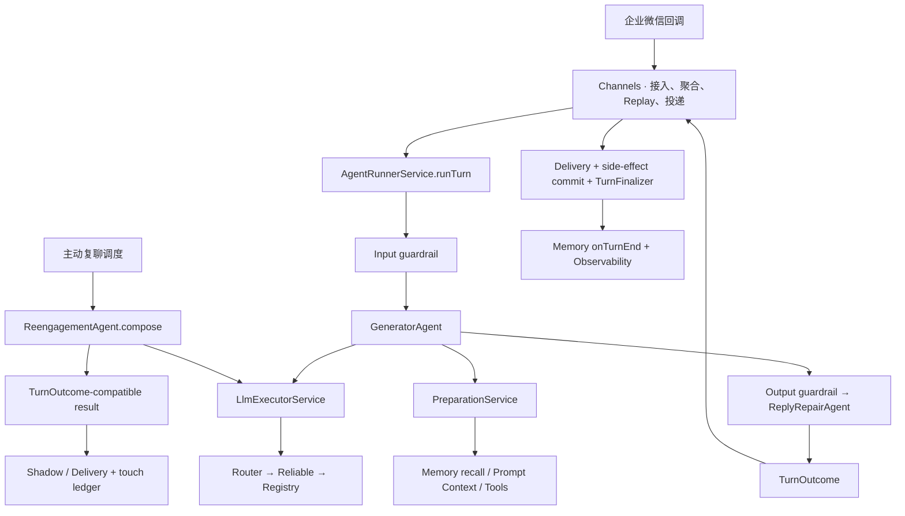

# Agent 运行时架构

**最后更新**：2026-09-01（按当前工作区生产调用链复核）

**面向**：研发、测试与运行时排障

**运营/产品视角**：[Agent 面向运营的说明](../product/agent-for-operations.md)

> 本文描述 Agent 从触发到投递结局的当前运行时，并给出跨模块边界。领域细节以各自权威文档为准：
> 记忆看 [`src/memory/README.md`](../../src/memory/README.md)，Prompt 规则看
> [Prompt 规则台账](../prompt-rule-ledger.md)，消息可靠性看
> [消息服务架构](./message-service-architecture.md)，守卫看
> [安全护栏说明](./security-guardrails.md)。代码与本文冲突时，以代码和领域权威文档为准。

---

## 1. 运行时总览

Cake Agent Runtime 是面向招聘咨询的 NestJS Agent 服务。生产主链路当前来自企业微信消息回调，
系统同时支持测试套件、调试接口和主动复聊。Vercel AI SDK 负责多步模型/工具循环；业务状态、
动作门禁、投递可靠性和记忆收尾由确定性运行时控制。



企业微信 inbound 主链的一轮核心模型是：

```text
触发 → 入站预检 → prepare → LLM/Tools → 出站审查/一次修复 → TurnOutcome
     → Replay 定局 → 副作用提交/投递 → TurnFinalizer → onTurnEnd
```

这里有三个重要边界：

- `AgentRunnerService` 负责渠道无关的回合判定，但不发送消息。
- `GeneratorAgent` 负责 prepare、模型工具循环和生成结果归一化，不决定最终投递。
- 渠道在 Replay 和投递结局确定后才提交 outcome 副作用、结算记忆并确认 pending 消息。

当前并非所有调用方都经过完整 `runTurn`：

- WeCom 生产入站调用 `AgentRunnerService.runTurn()`，执行完整的输入守卫、生成、输出守卫和终态分类。
- Test Suite / Debug 直接调用 `invokeReviewed()`（流式测试调用 `stream()`），复用生成与输出审查，但不自动获得 `runTurn` 的输入预检、统一 `TurnOutcome` 分类和渠道 Replay / 投递语义。
- 主动复聊使用独立的 `ReengagementAgent.compose()` + `generateStructured()`，不复用主链 Generator、Preparation、Output Guardrail 或 `TurnFinalizer`；它只复用 LLM 执行层、部分记忆读取能力和 `TurnOutcome` 数据契约。

Runner 的接口已经渠道中立；Nest 模块依赖尚未完全端口化：`AgentModule` 仍引用 WeCom 的
`CustomerModule` / `MessageModule`，`ToolModule` 仍引用 `RoomModule` / `MessageSenderModule`。
因此不能把当前物理依赖图描述为“Agent 已完全渠道无关”。

---

## 2. 分层与所有权

| 层                 | 当前职责                                              | 主要入口                                          |
| ------------------ | ----------------------------------------------------- | ------------------------------------------------- |
| Channels           | 回调适配、过滤、去重、聚合、per-chat 锁、Replay、投递 | `src/channels/wecom/message/`                     |
| Agent runner       | 入站预检、已审生成、终态分类、副作用意图              | `src/agent/runner/agent-runner.service.ts`        |
| Agent generator    | prepare、AI SDK 多步循环、空文本恢复、turn-end 闭包   | `src/agent/generator/generator.agent.ts`          |
| Preparation        | 当轮备料、记忆召回、工具集、TurnLedger                | `src/agent/generator/preparation/`                |
| Prompt / Context   | system sections 编译与生成侧首版防线                  | `src/agent/generator/context/`                    |
| Guardrail / Repair | input、tool、output 执行守卫；受控文本修复            | `src/agent/guardrail/`、`src/agent/reply-repair/` |
| Memory             | 两层召回、会话状态收尾、闲置沉淀                      | `src/memory/`                                     |
| Tools              | 工具注册、工具业务流程、动作门禁、收资单据            | `src/tools/`                                      |
| LLM / Providers    | 统一执行、角色路由、重试/降级、SDK 实例               | `src/llm/`、`src/providers/`                      |
| Reengagement       | 主动调度、专用结构化生成、频控、shadow/outbox 与底账  | `src/agent/reengagement/`                         |
| Biz                | 策略、托管、监控、人工介入、测试套件等业务域          | `src/biz/`                                        |
| Infrastructure     | Redis、Supabase、Bull、HTTP、飞书、地理编码、Web      | `src/infra/`                                      |
| Observability      | 请求上下文、Agent 事件、incident 与组合 observer      | `src/observability/`                              |

依赖纪律：

- `resolution/` 是零 IO 的确定性判定层。
- `tools/` 拥有工具调用期动作与业务单据；收资表单不属于 memory。
- `memory/` 只拥有消息窗口、session hash 和候选人 × bot 长期关系档。
- `sections/` 负责模型可见呈现与排布，不直接写存储。
- Agent、Memory、Evaluation、Reply Repair 需要模型能力时统一调用 `LlmExecutorService`，不直接操作 provider SDK。
- `biz/**` 的 Controller / Service / Repository 纪律见 [Biz 分层边界规范](./biz-layer-boundaries.md)。

---

## 3. Runner：统一回合入口

### 3.1 TurnRequest

`AgentRunnerService.runTurn(req)` 的类型契约同时支持被动消息和主动触发；当前生产调用者是 WeCom
被动消息链路，主动复聊生产链使用独立的 `ReengagementAgent`（见第 10 节）：

```typescript
type TurnTrigger =
  | { kind: 'inbound'; userMessage: string; images?: string[] }
  | { kind: 'proactive'; directive: string; scenarioCode: string };

interface TurnRequest {
  sessionRef: { corpId: string; userId: string; sessionId: string };
  trigger: TurnTrigger;
  context?: TurnContext;
  toolMode?: 'scenario' | 'readonly' | 'none';
  modelId?: string;
}
```

`sessionId` 在生产链路中就是 `chatId`。稳定的 `botUserId` 用于长期关系档隔离；可能轮换的
`botImId` 用于渠道调用和血缘排障，不能替代长期主键。

完整 `runTurn` 契约里，`callerKind` 与 trigger 是两根独立的语义轴。直接调用
`invokeReviewed()` 时只有 `callerKind` 和 Generator messages，并不存在 `TurnTrigger`；后两行当前
就是这种直接调用路径：

| callerKind   | `messages` 的含义 | short-term 消息窗口                  |
| ------------ | ----------------- | ------------------------------------ |
| `WECOM`      | 当前轮 user 输入  | 从 Memory 读取，并受本批时间上界约束 |
| `TEST_SUITE` | 完整测试对话      | 不从生产聊天历史加载                 |
| `DEBUG`      | 完整调试对话      | 不从生产聊天历史加载                 |

### 3.2 TurnOutcome

Runner 不返回“随便一段文本”，而是返回明确终态：

| kind                | 渠道动作                                      | 典型来源                           |
| ------------------- | --------------------------------------------- | ---------------------------------- |
| `reply`             | 可进入投递；投递后提交随 reply 携带的副作用   | 正常生成或修复后通过               |
| `skipped`           | 不投递、不告警                                | `skip_reply`、无文本、普通短路     |
| `guardrail_blocked` | 不投递；按 `sideEffects` / `disposition` 处置 | 入站风险或出站 veto                |
| `handoff`           | 不投递；统一执行暂停、告警和底账              | `request_handoff` 或工具 hard gate |

`TurnOutcome` 还携带 `toolCalls`、usage、`agentSteps`、memory snapshot、guardrail trace、
`sideEffects` 和 `runTurnEnd`。副作用意图与副作用执行分离：守卫和分类器只声明，渠道在 Replay
定局后调用 `TurnOutcomeInterventionService.commit()`，防止被丢弃的首版误触发暂停或告警。

### 3.3 runTurn 时序

```text
runTurn
  ├─ 建立 RequestContext
  └─ runTurnObserved()
       ├─ agent_start 事件
       ├─ runTurnInternal()
       │    ├─ inbound：precheckInboundOutcome()
       │    │    └─ InputGuardrailService.evaluate()
       │    │         └─ 命中 → guardrail_blocked（不进入 Generator）
       │    ├─ proactive trigger：默认 toolMode=readonly
       │    ├─ 构造 GeneratorInvokeParams + ReviewContext
       │    ├─ invokeReviewed()
       │    │    ├─ GeneratorAgent.invoke()
       │    │    ├─ OutputGuardrailService.check()
       │    │    └─ 必要时 ReplyRepairAgent 修复一次并二审
       │    └─ classifyReviewedOutcome()
       └─ agent_end / agent_error 事件
```

`invokeReviewedTurn()` 仍保留为“已审生成 + 终态分类 + `TurnFinalizer` 包装”的便利入口，但当前
`src/` 内没有生产调用方；WeCom 主链直接调用 `runTurn()`，再在 `ReplyWorkflowService.callAgent()`
中把 outcome 上的 `runTurnEnd` 接管为 `TurnFinalizer`。因此不能把 `invokeReviewedTurn()` 画进
`runTurn()` 的内部生产时序。

`runTurn` 的 proactive 分支发生生成异常时收敛为 `skipped`；当前独立复聊 Agent 也按自己的协议将
单会话生成失败收敛为 `skipped`。被动 inbound 异常则抛回 WeCom 链路，由消息失败处理器给出
降级回复并告警。

---

## 4. Generator：prepare 与模型工具循环

### 4.1 执行链

```text
GeneratorAgent.invoke(params)
  ├─ LlmExecutorService.supportsVisionInput()
  ├─ PreparationService.prepare()
  ├─ LlmExecutorService.generate()
  │    instructions = workingMemory.finalPrompt
  │    messages    = workingMemory.normalizedMessages
  │    tools       = workingMemory.tools
  │    stopWhen    = 步数上限 / skip_reply / 任一 shortCircuited tool result
  │    prepareStep = 每步动态收紧 activeTools
  ├─ retryTextualToolCall()（模型把工具调用写成文本时，仅纠正重试一次）
  ├─ recoverEmptyTextResult()（仅兜底一次、禁用工具）
  └─ attachTurnEnd()（总是挂载 runTurnEnd）
```

`GeneratorRunResult` 的主要观测字段：

- `text`、`reasoning`、`responseMessages`；
- `steps`、`agentSteps[]`、扁平 `toolCalls[]`；
- `usage.inputTokens / outputTokens / totalTokens / cachedInputTokens`；
- `agentRequest`、`memorySnapshot`、`turnLedger`；
- `runTurnEnd({ includeAssistantText, assistantTextOverride })`。

`runTurnEnd` 是硬契约，不再有“生成结束即 fire-and-forget”的默认分支。非流式生产入站必须让
`TurnFinalizer` 在结局确定后执行或丢弃它；`stream()` 则在 `onFinish` 内自行触发。

### 4.2 每步工具收紧

`buildPrepareStep()` 会根据已经完成的 steps 动态调整工具集合：

- 同名工具单轮最多 3 次；`duliday_interview_precheck` 最多 2 次；
- 已成功执行的副作用工具本轮不再暴露，防止重复提交；
- 发生业务工具调用后屏蔽 `skip_reply`；
- `readonly` 模式物理移除主动回合禁止的副作用工具；
- 工具返回 `shortCircuited: true` 时立即结束 loop。

空文本恢复只把已执行结果压成 transcript，关闭工具后补一条回复；它不会重新执行业务动作。

### 4.3 出站审查与修复

`invokeReviewed()` 调用当前只含确定性规则的 `OutputGuardrailService`，裁决为
`pass | observe | revise | block`。出站审查不调用第二个模型，也不运行 shadow reviewer；只有
`revise` / `block` 需要改写时，才最多调用一次 `ReplyRepairAgent`：

- 唯一写手是 `ReplyRepairAgent`，不重新取数、不重进 Generator；
- 代码围栏、内部 reasoning、JSON 信封等封闭形态优先确定性剥壳；
- 修复后必须二审；repair 硬上限为 1；
- 已提交的工具副作用被保留，修复阶段不再暴露副作用工具；
- 最终投递文本还会经过 `OutboundReplySanitizer`。

完整规则和 fail-open / fail-close 策略见
[Guardrail 质量体系](./guardrail-quality-system.md)。

---

## 5. Preparation：单轮备料编译器

`PreparationService.prepare()` 返回 `WorkingMemory`，它是本轮初始工作记忆，不是持久层：

```typescript
interface WorkingMemory {
  finalPrompt: string;
  promptBlocks: PromptCorpusBlock[];
  normalizedMessages: ModelMessage[];
  conversationCorpusBlocks: CorpusBlock[];
  memoryLoadWarning?: string;
  tools: ToolSet;
  corpId: string;
  userId: string;
  sessionId: string;
  botUserId?: string;
  botImId?: string;
  maxSteps: number;
  entryStage: string | null;
  ledger: TurnLedger;
  memorySnapshot?: AgentMemorySnapshot;
  contactName?: string;
  toolExecutionTimings: Map<string, number>;
}
```

### 5.1 当前 prepare 顺序

1. 按 `AGENT_MAX_INPUT_CHARS` 裁剪传入消息，并从末尾连续 user 块得到本轮文本。
2. 对逐条本轮 user 文本运行确定性 `turnHints` producer，同时判定用工形式 set/clear/ignore。
3. 并行读取两层记忆、当前预约实时上下文、实时群成员状态和托管账号身份；有身份锚时执行
   `SnapshotEnrichmentService` 当轮补料。
4. 归一化为 AI SDK `ModelMessage[]` 与旁路 `conversationCorpusBlocks`；按模型能力保留图片输入。
5. 扫 Prompt Injection；命中时告警并准备 `input-guard` system 尾块，不修改 user messages。
6. 派生当前品牌状态；调用 `adjudicatePromptMemory()` 一次生成 memory / turn-hints 共享裁决视图。
7. 渲染记忆块，调用 `ContextService.compose()` 生成结构化 `promptBlocks`。
8. 解析入口阶段：持久化 stage > 有长期 profile 的老用户兜底阶段 > 策略首阶段。
9. 创建 `TurnLedger` 和 `ToolBuildContext`，按场景与 `toolMode` 构建工具并挂耗时 wrapper。
10. 插入条件式 `input-guard` / `proactive-directive`，唯一一次降维为 `finalPrompt`。
11. 构造 `memorySnapshot`；`finalPrompt` 超过 60,000 字符时发 `agent.prompt_bloat` 告警。

外部补料、共享裁决和 `TurnLedger` 都只活在当轮；它们不能绕过候选人档案域的来源和置信度纪律。

### 5.2 Prompt section 终序与 block 展开

`candidate-consultation` 的 section 终序到 `final-check` 为止：

```text
identity
→ base-manual
→ channel
→ stage-overview
→ red-lines
→ thresholds
→ memory
→ turn-hints
→ hard-constraints
→ datetime
→ group-inventory
→ stage-strategy
→ final-check（复合 section）
```

`critical-turn-guard` 不是另一个 section，也不占用场景清单中的新位置。它是
`FinalCheckSection.buildBlocks()` 按命中追加的子块；因此 `promptBlocks` 的末尾在
命中时会展开为 `final-check → critical-turn-guard`，未命中时只有 `final-check`。

| 区段          | 内容                                                                          | 稳定性                           |
| ------------- | ----------------------------------------------------------------------------- | -------------------------------- |
| 开篇/静态前缀 | identity、手册、渠道规范、全阶段一览                                          | 极低频变化                       |
| 配置段        | red-lines、thresholds                                                         | 随 released/testing 策略配置变化 |
| 动态段        | memory、turn-hints、hard-constraints、datetime、group inventory、当前阶段策略 | 随轮变化                         |
| 发送前收口    | final-check 复合 section（命中时内部追加 critical-turn-guard 子块）           | 常驻 recitation + 条件式动态禁令 |

`final-check` 是复合 `PromptSection`：一个常驻块和一个命中才产生的动态子块共同消费
`FINAL_CHECK_RULES`。为保持观测契约和模型可见字节不变，两个 block id 仍分别为 `final-check`
与 `critical-turn-guard`；这不代表后者仍是独立 section。

条件块位置：

- `input-guard` 位于 `final-check` 之后；若本轮有 `critical-turn-guard`，则插在它之前；
- `proactive-directive` 始终是主动回合的 system 尾块；
- 全部动态信息继续保持 system 语义，一个字节也不会迁入 `normalizedMessages`。

### 5.3 结构化语料与缓存

`promptBlocks` 在 `WorkingMemory` 降维前保留 `id / domain / role / content`。封闭的
`PROMPT_SECTION_DOMAIN_REGISTRY` 把叶子块标为 `teaching | evidence | tool_result`，用于审计
指令与数据边界；这根轴与 procedural / semantic / working 的知识类型轴正交。

当前生产观测尚未把 `promptBlocks` 作为独立字段持久化：Agent 的 LLM 请求快照记录的是降维后的
`agentRequest.instructions`、messages 和 tool names。结构化 blocks 目前主要由 compose/preparation 测试和
进程内调试消费；若要在 MPR 中逐块检索，需要另行把该字段从 `WorkingMemory` 透传到观测层，不能把
“进程内保留”误写成“已经落库”。

当前没有 Anthropic `cacheControl` 等显式缓存断点，也没有 provider 缓存适配层。稳定前缀和稳定的
tools 序列用于获得 Qwen 的隐式前缀缓存；命中量从 AI SDK
`usage.inputTokenDetails.cacheReadTokens` 汇总为 `cachedInputTokens` 并进入 Agent 观测。

真实形态和维护注释见
[最终 Prompt 示例](../../src/agent/generator/context/final-prompt-example.md)。

---

## 6. 工具系统

### 6.1 candidate-consultation 常挂工具

`ToolRegistryService` 当前按以下顺序构建场景工具：

| 类别      | 工具                                                                          |
| --------- | ----------------------------------------------------------------------------- |
| 流程/回忆 | `advance_stage`、`recall_history`                                             |
| 岗位/报名 | `duliday_job_list`、`duliday_interview_precheck`、`duliday_interview_booking` |
| 工单      | `duliday_cancel_work_order`、`duliday_modify_interview_time`                  |
| 地理/位置 | `geocode`、`send_store_location`                                              |
| 群邀请    | `invite_to_group`                                                             |
| 介入/沉默 | `raise_risk_alert`、`request_handoff`、`skip_reply`                           |

此外按本轮输入动态注入：

- 有图片或表情：`save_image_description`；
- 有可读简历附件：`read_resume_attachment`；
- 已连接 MCP server：将其运行时工具叠加到场景集合。

工具 description 是程序性规则的一种正式居所，新增或修改必须同步
[Prompt 规则台账](../prompt-rule-ledger.md)。

### 6.2 工具上下文与 TurnLedger

`ToolBuildContext` 包含 session 身份、归一化消息、结构化语料、当前阶段、策略目标、记忆投影、
品牌/地点/预约上下文和本轮 `TurnLedger`。工具执行结果先写 ledger，成功采纳的回合再由
`onTurnEnd()` 选择性持久化；阶段推进和已邀群确认有各自的即时写路径。

副作用集合包括报名、拉群、取消、改约、发位置、风险告警和转人工。是否“成功提交”必须看正向
结果信号，不能仅因工具被调用就判定副作用已经发生。

### 6.3 Replay 与工具动作

`REPLAY_BLOCKING_TOOLS` 当前只有：

```typescript
new Set(['invite_to_group', 'duliday_interview_booking']);
```

这两类成功动作会阻止渠道丢弃当前回合。取消、改约等动作虽是副作用，也由单轮工具屏蔽和 outcome
保护，但不在这份 Replay blocking 集合中。报名类副作用提交前还会调用
`hasNewerUserInput()`；发现更晚消息时返回 stale-input 短路，让渠道吸收新消息后重跑，而不是用旧资料下单。

---

## 7. Memory：两层记忆与结算边界

运行时记忆只有 short-term 和 long-term 两层：

| 作用域              | 当前内容                            | 生命周期 / 边界                              | 存储                     |
| ------------------- | ----------------------------------- | -------------------------------------------- | ------------------------ |
| short-term 消息窗口 | 原始对话                            | 查询最近 7 天，再按 120 条 / 24,000 字符裁剪 | Supabase；Redis 热缓存   |
| short-term 会话状态 | facts、岗位工作台、阶段指针         | 3 天；facts hash 多 12 小时沉淀余量          | Redis                    |
| episode             | 连续咨询切片                        | 闲置 3 天划界，不是独立层                    | 无独立 key/表            |
| long-term 关系档    | profile、job intent、最多 20 段摘要 | 持久；候选人 × bot 隔离                      | Supabase + 2h Redis 缓存 |

`turnHints`、snapshot enrichment、Prompt 裁决视图和 ledger 都是当轮 sidecar，不是额外记忆层。

### 7.1 onTurnStart

`MemoryLifecycleService.onTurnStart()` 并行读：

- 最近 7 天消息窗口；
- `factsv2:{corpId}:{userId}:{sessionId}`；
- 独立 `stage:{corpId}:{userId}:{sessionId}`；
- `long-term:{corpId}:{userId}:{botUserId}` 对应的 profile / job intent。

episodic summaries 不进默认 Prompt，只允许 `recall_history` 显式读取。可降级读取失败通过
`_warnings` 进入 `memoryLoadWarning`，不能把空值直接解释成“用户从未提供”。

### 7.2 onTurnEnd 与 TurnFinalizer

`GeneratorAgent` 只创建一次性 `runTurnEnd` 闭包。渠道用 `TurnFinalizer` 表达结局：

| 结局                           | finalizer 动作                 | 记忆语义                            |
| ------------------------------ | ------------------------------ | ----------------------------------- |
| Replay 丢弃首版                | `discard()`                    | 首版不写任何记忆                    |
| 回复真实送达                   | `settle({ delivered: true })`  | 记 user 侧并投影真实 assistant 文本 |
| 守卫拦截、沉默、暂停或投递失败 | `settle({ delivered: false })` | 记 user 侧，不投影未送达回复        |

`whenSettled()` 必须在释放 per-chat 锁前完成，保证相邻 job 的 session 读写串行。

回合末依次保存岗位池、查询签名、助手投影、失效岗位、确权城市、事实提取和品牌 reducer；同时刷新
闲置 3 天后的 consolidation job。consolidation 分别以守卫合并、整组覆盖、追加淘汰写入
profile、job intent 和单层 episodic summaries。

完整数据模型、Redis key 和排障矩阵见：

- [Memory 当前实现权威](../../src/memory/README.md)
- [记忆系统架构与数据流](./memory-architecture.md)
- [记忆与状态全局视图](./memory-and-state.md)

---

## 8. LLM 与 Provider

### 8.1 统一执行入口

`LlmExecutorService` 是 AI SDK 的统一调用边界：

```typescript
generate(options);
generateStructured({ schema, ...options });
stream(options);
generateSimple(options);
supportsVisionInput(options);
```

当前 `ModelRole` 为：`chat`、`extract`、`vision`、`evaluate`、`repair`。Memory 的事实抽取和
摘要、Evaluation 的评分、`ReplyRepairAgent` 的受控改写都必须经过这个入口。当前 Output
Guardrail 不调用模型，因此没有 `review` 角色的线上审查调用。

### 8.2 路由、可靠性、注册

```text
LlmExecutorService
  ├─ RouterService   ：role → primary + fallbacks
  ├─ ReliableService ：可用性、错误分类、重试、退避
  └─ RegistryService ：provider/model → AI SDK LanguageModel
```

模型选择优先级：

1. 调用方显式 `modelId`；
2. Dashboard `ROLE_MODEL_OVERRIDES` / `agent_reply_config`；
3. `AGENT_{ROLE}_MODEL` 环境变量。

调用方显式 fallbacks > Dashboard fallback chain > `AGENT_{ROLE}_FALLBACKS` >
`AGENT_DEFAULT_FALLBACKS`；`disableFallbacks=true` 会清空降级链。每个候选模型先做 vision 能力和
provider 注册检查，再在模型内重试，耗尽后切下一模型。

Registry 按 API key 条件注册：

- 原生 SDK：Anthropic、Google、DeepSeek；
- 自定义接入：OpenAI 代理、OpenRouter；
- OpenAI-compatible：Qwen、Moonshot、OhMyGPT 和自定义 Gateway。

Provider 专属 `providerOptions` 当前只承载 thinking / reasoning 配置；不承载显式 Prompt 缓存断点。

---

## 9. WeCom 消息链路

### 9.1 接入与聚合

当前公开回调入口是 `POST /message`：

```text
MessageIngressController
  └─ MessageCallbackAdapterService.normalizeCallback()
      └─ MessageService.handleMessage() 立即 ACK
          └─ 异步 MessagePipelineService.execute()
              ├─ 过滤（来源、托管、黑名单、消息类型等）
              ├─ Redis 原子去重（默认 300s）
              ├─ 写 chat_messages 与处理流水
              └─ 运行时开关：聚合或直发
```

聚合路径由 Bull `message-merge` 队列驱动。`MessageProcessor` 对每个 chat 获取短租约锁并续心跳，
复查 quiet window，claim pending 快照但不提前删除；成功终态才 ack，异常和进程退出时保留 pending
供 stalled retry / 新实例接管。SIGTERM 会停止领取新任务并等待 in-flight，默认最多 60 秒。

合并窗口、AI 开关、分段发送、模型和 thinking 均从托管运行时配置读取；读取失败才使用环境默认。
`initialMergeWindowMs` 的托管配置默认值为 3,000ms；运行时配置应用器还保留 2,000ms 的防御性
空值回落。不再存在“最大合并条数”口径。

### 9.2 Reply workflow 与 Replay

```text
ReplyWorkflowService.processMessageCore()
  ├─ 解析稳定 botUserId、模型/思考配置、图片集合、本批消息时间上界
  ├─ runner.runTurn(defer 语义由 TurnFinalizer 接管)
  ├─ 检查运行期间的新 pending 消息
  │    ├─ 可 replay：discard 当前 finalizer，合入新消息重跑
  │    └─ 非 reply / 待提交副作用 / blocking tool：采用当前 outcome
  ├─ 最多 Replay 3 次
  ├─ 非 reply：commit sideEffects，记录 skipped，settle(delivered=false)
  ├─ reply：投递、commit reply sideEffects、写复聊锚点
  ├─ settle(delivered=真实投递结果)
  ├─ 标记源消息处理完成并 ack pending
  └─ finally: await finalizer.whenSettled()
```

图片主路径优先让可 vision 模型直接看图，并动态提供 `save_image_description`。全链纯文本或模型漏调
工具时，渠道还有兼容描述/异步补写，保证下一轮至少有文字记忆；补写不会改变已经定局的本轮回复。

### 9.3 失败与降级

被动消息生成失败时，`MessageProcessingFailureService` 负责：

- 发送 `AGENT_FALLBACK_MESSAGE` 或内置降级话术；
- 记录失败流水和 trace；
- 按错误类型发送告警。

pending 只在成功终态后裁掉；处理异常会让 Bull retry 继续消费同一快照。去重、pending、per-chat 锁和
TurnFinalizer 共同保证“快速 ACK 不丢消息、Replay 不写幽灵记忆、相邻回合不并发覆盖”。

---

## 10. 主动复聊

主动触达位于 `src/agent/reengagement/`：

```text
业务锚点 / onboarding sweep
  → FollowUpSchedulerService
  → Bull reengagement queue
  → FollowUpProcessor
  → 确定性停止条件 / 冷却 / 频控 / 投递窗口复检
  → ReengagementAgent.compose()
      ├─ MemoryService.recallForProactiveFollowUp()
      ├─ 构造复聊专用 system prompt + 原生对话 messages
      ├─ LlmExecutorService.generateStructured(zod schema，无工具)
      ├─ 协议不一致时最多纠正重试一次
      └─ 时间事实 / 重复回复 / 候选人姓名等确定性校验
  → TurnOutcome-compatible reply / skipped
  → shadow 观测，或 outbox reserve → 真实投递 → touch ledger
```

主动复聊不复用主链 `GeneratorAgent`、`PreparationService`、Prompt sections、Output Guardrail、
`AgentRunnerService.runTurn()` 或 `TurnFinalizer`。它与被动链路当前共享的是
`LlmExecutorService`、主动复聊专用记忆读取、`TurnOutcome` 数据形态和部分投递基础设施；等价保障由
复聊侧显式实现：

- `ReengagementAgent` 完全不注册工具，报名、改约、拉群等动作在模型侧物理不可达；
- 结构化 schema 同时返回 `reason / blockReason / decision / message`，协议冲突时只允许一次纠正重试；
- `FollowUpProcessor` 在模型前执行停止条件、真人介入、候选人待答、冷却、频控和投递窗口复检；
- shadow 只记录本应发送的结果；真实投递走 reserve / sent / failed / unknown 触达底账；
- 单会话生成失败收敛为 `skipped`，不让队列批次整体失败；
- 该链路不创建 `runTurnEnd`，也不通过主链 `onTurnEnd` 投影生成文本。

具体场景、锚点、停止条件和 shadow 开关见
[主动复聊与二次触达流水线](./reengagement-pipeline.md)。

---

## 11. 四个防线作用位：Input / Prompt / Tool / Output

运行时防线共有四个作用位。Prompt 是生成侧防线；Input / Tool / Output 是具有确定性判定、动作拒绝
或最终 veto 权的执行 guardrail。不能因为 Prompt 不负责最终拦截，就把它从架构防线中省略。

| 防线   | 时机                      | 职责                                                                               | 权限边界                                |
| ------ | ------------------------- | ---------------------------------------------------------------------------------- | --------------------------------------- |
| Input  | Generator 前 / prepare 内 | 高危风险短路；Prompt Injection 追加 system 防护                                    | 可阻断整轮或硬化 system，不决定工具准入 |
| Prompt | prepare / 模型生成前      | 用 identity、手册、渠道规范、策略红线、阶段策略、证据块和 final-check 引导首版生成 | 负责“教”和预防，不作为最终放行依据      |
| Tool   | 工具执行前                | jobId provenance、precheck、身份、硬筛、拉群城市/时机等确定性门禁                  | 可拒绝动作或短路 loop，不审查最终文案   |
| Output | 生成后、投递前            | 确定性规则 + 必要时一次受控 repair                                                 | 最终出站验收，可 revise / block         |

四个作用位不是“都写一遍同一条规则”。Prompt 负责降低首次违规率，Tool 负责守住业务动作，Output 只拦
可从生成结果与证据确定性判断的错误；同一约束若存在教/拦配对，必须在
[Prompt 规则台账](../prompt-rule-ledger.md) 中互链，禁止多处漂移。

本表描述 WeCom 主 Generator 链。独立主动复聊不自动继承这四层实现，必须在复聊 pipeline 中逐项
提供等价的确定性停止条件、无工具物理边界、结构化输出协议和投递底账。

运行时必须保持以下不变量：

1. **模型参数不是权威 evidence**：jobId、姓名、报名条件等必须通过确定性来源门禁。
2. **gate 只判定，outcome 提交副作用**：hard reject 返回 short-circuit / side-effect intent，不能靠模型自行执行转人工。
3. **副作用后只允许无工具文本修复**：不能重进 Generator 重做业务动作。
4. **投递结局决定 assistant 记忆**：未送达、被拦或被 Replay 丢弃的文本不能投影为“已对用户说过”。
5. **成功副作用必须看正向信号**：工具调用存在不等于外部动作已完成。
6. **Replay 有界且输入新鲜**：最多三次；报名等不可逆动作提交前还要检查更新消息。
7. **模型可见内层标签是契约**：section 重排不能随意改名或把动态 system 内容搬进 messages。

守卫目录、规则 catalog 和裁决细节见
[安全护栏说明](./security-guardrails.md)；转人工提交链见
[Gate 拒绝与人工介入流水线](./handoff-gate-and-intervention-pipeline.md)。

---

## 12. 可观测性与评估

### 12.1 生产观测

| 观测载体                     | 主要内容                                                                                                        |
| ---------------------------- | --------------------------------------------------------------------------------------------------------------- |
| `message_processing_records` | 入站/AI/投递阶段、agent request（含降维 instructions）、memory snapshot、tool calls、guardrail、post-processing |
| `agent_execution_events`     | `agent_start/end/error`、model call/fallback、tool call/error、缓存 token 等细粒度事件                          |
| `guardrail_review_records`   | 确定性规则证据、首版/修复版、首审/二审决策与 override 标记                                                      |
| `AgentTracerService`         | 用 request context 把 Agent、模型、工具事件关联到 trace                                                         |
| `IncidentReporterService`    | memory consolidation 等跨模块失败事件                                                                           |

生产排查 Prompt 先看 `agent_invocation.request.agentRequest.instructions`；若需要 section 级归因，再用同轮
输入复现 `ContextService.compose()` 或查看 compose/preparation 测试中的 `promptBlocks`。排查成本与缓存时
同时看 `inputTokens` 和 `cachedInputTokens`；排查工具延迟要区分 step 墙钟与 tool execute 的真实耗时。

### 12.2 Test Suite 与 Evaluation

- `src/evaluation/` 只提供通用 LLM 评分和对话解析，无 DB / HTTP。
- `src/biz/test-suite/` 负责单条、多轮、批次、Bull 执行、fixture、导入回写、lineage 和流式观测。
- 非流式 test-suite 通过 `callerKind=TEST_SUITE` 调用 `runner.invokeReviewed()`；可指定模型并
  `disableFallbacks=true` 保证模型保真。它不自动执行 `runTurn` 的 input guard / outcome 分类，也不
  经过 WeCom Replay 与真实投递。
- 流式 test-suite 调用 `runner.stream()`；Debug Controller 调用 `runner.invokeReviewed()` 并手动挂
  `agent_start/end` 观测。调试结果不能当作完整生产消息闭环的等价验证。

详见 [测试套件架构](./test-suite-architecture.md)。

---

## 13. Nest 模块图

```text
AppModule
├─ Infrastructure
│  ├─ Config / HTTP / WebEntry
│  ├─ Redis / Supabase / Bull
│  └─ Feishu / Geocoding
├─ AI infrastructure
│  ├─ ProvidersModule
│  ├─ LlmModule
│  ├─ MemoryModule
│  ├─ ToolModule / McpModule
│  └─ SpongeModule
├─ AgentModule
│  ├─ AgentRunnerService / GeneratorAgent
│  ├─ PreparationModule / ContextService
│  ├─ GuardrailModule / ReplyRepairAgent
│  └─ reengagement scheduler / processor / agent
├─ WecomModule
│  └─ MessageModule + Bot/Chat/Contact/Customer/Group/Room/Sender
├─ Business
│  ├─ BizModule
│  ├─ OpsEvents / HandoffEvents / HostingMemberConfig
│  └─ Huajune / TestSuite
└─ Cross-cutting
   ├─ Observability / Analytics / Notification
   └─ Evaluation
```

`ProvidersModule` 是全局模块；业务模块仍应通过 `LlmModule` 消费执行能力，而不是借全局可见性直接
调用 `RegistryService`。`TestSuiteModule` 在根模块单独挂载，因为它同时组合 Agent、Biz、
Evaluation、Memory、Tool 和 Feishu Sync。

---

## 14. 完整 inbound 生命周期

以候选人连续发送“我在徐汇，想找收银员”“周末可以，工资多少？”为例：

```text
1. POST /message
   └─ 标准化企业/小组回调，立即返回 200

2. 异步 intake
   ├─ 过滤、Redis 去重、写 chat_messages、创建 MPR trace
   └─ 放入 message-merge pending + Bull delayed job

3. MessageProcessor
   ├─ 获取 chat 短租约锁并续心跳
   ├─ 复查 quiet window 与托管状态
   └─ claim 两条 pending 快照（暂不删除）

4. ReplyWorkflowService
   └─ runner.runTurn(inbound)
       ├─ 入站风险预检
       ├─ PreparationService.prepare()
       │   ├─ 规则识别 turnHints
       │   ├─ Memory.onTurnStart + 预约/群/账号并行备料
       │   ├─ 共享裁决 + 13 个常驻 system blocks（另有条件式动态块）
       │   ├─ entryStage + TurnLedger
       │   └─ 构建场景工具
       ├─ LLM step 1：geocode / duliday_job_list
       ├─ LLM step 2：生成候选人回复
       ├─ 确定性 output guardrail；必要时一次文本修复并二审
       └─ 返回 reply / skipped / guardrail_blocked / handoff

5. Replay 定局
   ├─ Agent 运行中无新消息：采用本版
   ├─ 有新消息且可重跑：discard 本版 finalizer，合并后重跑
   └─ 非 reply / 待提交副作用 / blocking tool：不丢弃本版

6. 终态
   ├─ reply：分段投递，提交 reply sideEffects，settle(delivered=真实结果)
   └─ 非 reply：提交 outcome sideEffects，跳过投递，settle(delivered=false)

7. 回合收尾
   ├─ Memory.onTurnEnd 更新事实、工作台、品牌并刷新 consolidation job
   ├─ MPR / Agent events / guardrail records 写入
   ├─ 标记源消息已处理并 ack pending
   └─ await finalizer.whenSettled() 后释放 chat 锁
```

如果处理在成功终态前抛错，pending 不 ack，Bull 可重试；如果生成失败，渠道负责降级回复和告警；
如果投递未确认成功，仍提取候选人本轮事实，但不会投影 assistant 文本。

---

## 15. 扩展指南

### 15.1 新增 Provider 或模型

1. 在 `RegistryService` 注册原生/自定义 provider，或更新 `providers/types.ts` 的 compatible 配置。
2. 在 `providers/models.ts` 登记模型能力，尤其是 multimodal。
3. 配置 provider API key 与 `AGENT_{ROLE}_MODEL` / fallbacks。
4. 为路由、provider options、结构化输出和 fallback 补测试。

### 15.2 新增工具

1. 在 `src/tools/` 的所属域创建工具工厂和 description。
2. 在 `ToolRegistryService` 注册，并加入目标 `scenarioToolMap`。
3. 若有外部副作用，更新 side-effect、单轮重复屏蔽和 Replay 语义；不能只加工具名。
4. 将确定性动作门禁放在工具执行边界，并登记 tool guardrail catalog。
5. 更新 Prompt 规则台账和相关回归测试。

### 15.3 新增 Prompt section

1. 放到 `sections/procedural|semantic|working/` 的主类型目录；基础设施接口留根目录。
2. 实现 `PromptSection`，procedural 内容添加 `prompt-rule-ledger` 锚点。
3. 在 `ContextService.registerSections()` 注册。
4. 在 `SCENARIO_SECTIONS` 指定精确顺序。
5. 在 `PROMPT_SECTION_DOMAIN_REGISTRY` 登记 teaching/evidence/tool_result。
6. 补 block 顺序、模型可见标签和静态纯净性测试。

### 15.4 新增场景

1. 在 `SCENARIO_SECTIONS` 定义 Prompt 组合。
2. 在 `scenarioToolMap` 定义物理工具集。
3. 明确 trigger、callerKind、toolMode 和 strategySource。
4. 用 `promptBlocks`、tool list、TurnOutcome 和 turn-end 结局测试锁定契约。

### 15.5 新增渠道

渠道适配器至少需要完成：

```text
接收/标准化 → 构造 TurnRequest → runner.runTurn()
→ Replay 或等价的新消息仲裁 → commit outcome sideEffects
→ 投递 → TurnFinalizer.settle() → 观测/去重确认
```

仅调用 `GeneratorAgent.invoke()` 并发送文本是不完整实现，会绕过入站/出站守卫、统一终态、
副作用提交和记忆结算。

---

## 16. 关键配置口径

下表只列运行时架构会直接用到的默认值；必填项以
`src/infra/config/env.validation.ts` 和部署配置为准。

| 配置                                      | 当前默认 | 作用                                            |
| ----------------------------------------- | -------- | ----------------------------------------------- |
| `AGENT_MAX_OUTPUT_TOKENS`                 | `4096`   | 单次模型输出上限                                |
| `AGENT_THINKING_BUDGET_TOKENS`            | `0`      | 环境默认关闭；WeCom deep 模式可由运行时配置开启 |
| `AGENT_MAX_INPUT_CHARS`                   | `24000`  | 消息窗口字符预算                                |
| `MAX_HISTORY_PER_CHAT`                    | `120`    | 单轮历史消息上限                                |
| `MEMORY_SESSION_TTL_DAYS`                 | `3`      | session stage / 状态业务生命周期                |
| `MEMORY_SETTLEMENT_GAP_DAYS`              | `3`      | episode 闲置边界和 consolidation delay          |
| `MEMORY_HISTORY_WINDOW_DAYS`              | `7`      | DB 消息回看窗口                                 |
| `SESSION_EXTRACTION_INCREMENTAL_MESSAGES` | `10`     | 已有 facts 时的增量提取窗口                     |
| `GROUP_MEMBER_LIMIT`                      | `200`    | 群容量判断                                      |
| `MESSAGE_DEDUP_TTL_SECONDS`               | `300`    | 回调 messageId 去重 TTL                         |
| `SHUTDOWN_DRAIN_TIMEOUT_MS`               | `60000`  | SIGTERM 等待 in-flight 上限                     |

托管 `agent_reply_config` / system config 动态控制：AI 回复开关、消息聚合开关、
`initialMergeWindowMs`、分段/打字策略、WeCom 模型、thinking、角色模型覆盖、fallback 链以及部分
output guardrail 开关。运行时配置优先，环境变量主要负责启动基线和故障回退。

启动时硬校验的核心项包括 `NODE_ENV`、`PORT`、Stride API、`AGENT_CHAT_MODEL`、Upstash Redis 和
DuLiDay token；所选 provider 还必须有对应 API key。Supabase、飞书及各外部集成的完整部署要求
以环境模板和相应基础设施文档为准，本文不复制易漂移的全量变量表。

---

## 相关文档

- [最终 Prompt 示例](../../src/agent/generator/context/final-prompt-example.md)
- [Prompt 规则台账](../prompt-rule-ledger.md)
- [记忆系统架构与数据流](./memory-architecture.md)
- [记忆与状态全局视图](./memory-and-state.md)
- [候选人档案域架构](./candidate-profile-domain.md)
- [消息服务架构](./message-service-architecture.md)
- [安全护栏说明](./security-guardrails.md)
- [Guardrail 质量体系](./guardrail-quality-system.md)
- [Gate 拒绝与人工介入流水线](./handoff-gate-and-intervention-pipeline.md)
- [主动复聊与二次触达流水线](./reengagement-pipeline.md)
- [测试套件架构](./test-suite-architecture.md)
- [监控系统架构](./monitoring-system-architecture.md)
- [Biz 分层边界规范](./biz-layer-boundaries.md)

## 相关代码

| 模块              | 入口                                                                                                  |
| ----------------- | ----------------------------------------------------------------------------------------------------- |
| Runner            | [`agent-runner.service.ts`](../../src/agent/runner/agent-runner.service.ts)                           |
| Generator         | [`generator.agent.ts`](../../src/agent/generator/generator.agent.ts)                                  |
| Preparation       | [`preparation.service.ts`](../../src/agent/generator/preparation/preparation.service.ts)              |
| Context           | [`context.service.ts`](../../src/agent/generator/context/context.service.ts)                          |
| Scenario sections | [`scenario.registry.ts`](../../src/agent/generator/context/scenarios/scenario.registry.ts)            |
| LLM               | [`llm-executor.service.ts`](../../src/llm/llm-executor.service.ts)                                    |
| Providers         | [`router.service.ts`](../../src/providers/router.service.ts)                                          |
| Memory            | [`memory.service.ts`](../../src/memory/memory.service.ts)                                             |
| Tools             | [`tool-registry.service.ts`](../../src/tools/tool-registry.service.ts)                                |
| WeCom reply       | [`reply-workflow.service.ts`](../../src/channels/wecom/message/application/reply-workflow.service.ts) |
| Reengagement flow | [`follow-up.processor.ts`](../../src/agent/reengagement/follow-up.processor.ts)                       |
| Reengagement LLM  | [`reengagement.agent.ts`](../../src/agent/reengagement/reengagement.agent.ts)                         |
| Evaluation        | [`llm-evaluation.service.ts`](../../src/evaluation/llm-evaluation.service.ts)                         |
| Test Suite        | [`test-execution.service.ts`](../../src/biz/test-suite/services/test-execution.service.ts)            |
