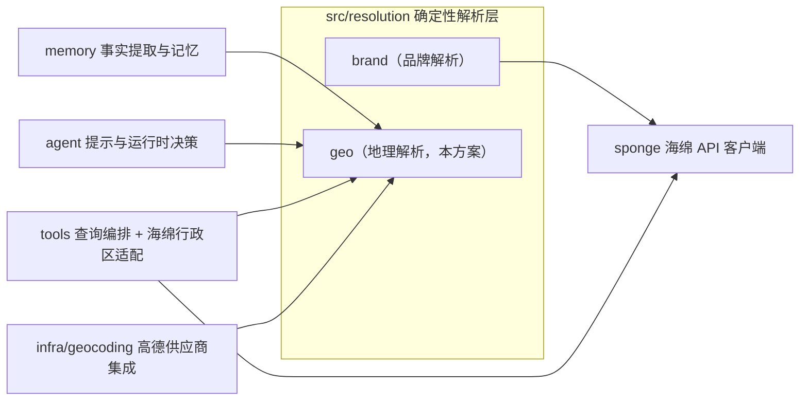
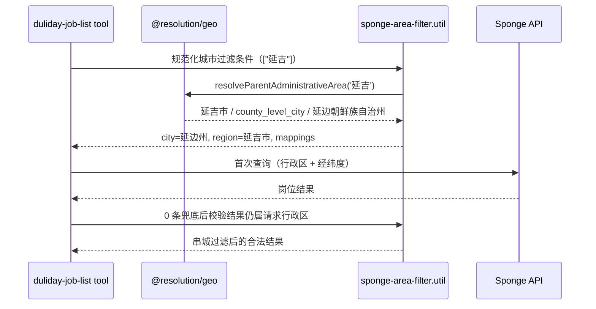

# Geo 领域改造方案：地理解析迁入 `src/resolution/geo`

> 状态：提案 v2（评审后修订，待终审）
> 适用仓库：`cake-agent-runtime`
> 编写日期：2026-07-15（v1 同日评审，v2 落实评审结论）
> 关联问题：候选人输入"延吉市/延吉"时岗位查询返回 0 条。点位修复已随 2026-07-10 PR #499（`dd85c550`）上线；本方案收口领域边界，并泛化处理同类隐患（如余姚/慈溪，见 8.2）。

**v2 修订要点**（相对 v1）：

1. 落位从顶层 `src/geo` 改为 **`src/resolution/geo`**，与本迭代刚建立的 `resolution/brand` 同居所（见 1、5.3）；
2. 海绵行政区适配器从 `src/sponge/geo` 改落 **tools 层**（分层规则禁止 sponge 反向 import resolution，见 10.2、11）；
3. 校正叙事：延吉点位修复**已上线**，本方案是收口与泛化，不重做修复（见 2.1）；
4. 三轮白名单扫描的**编排**明确归属 geo，新增公共 API `scanGeoSignalsFromText`，解决"index 不导出数据表"与"门面必须兜住现有导入"的矛盾（见 7.1、7.4）;
5. 可观测性改为复用现有观测栈（queryMeta 落库 + 飞书告警），不引入 Prometheus 类指标系统（见 15）；
6. Phase 4（全国数据生成化）降级为独立后续项；新增业务足迹县级市验证与补录作为近期闭环（见 8.2、Phase 3）。

## 1. 结论

将 `src/memory/facts/geo-mappings.ts` 的地理知识和确定性算法迁入 **`src/resolution/geo`**，成为地理解析域的唯一真相源。

落位裁决：

- **不放顶层 `src/geo`**：仓库已建立 `src/resolution` 确定性解析层（首个子域 `resolution/brand`），其定义——纯确定性、零 LLM、"用户表达 → 标准实体 + 证据/置信度"——与地理解析完全同构；本方案 7.2 的 `GeoResolution` 契约就是品牌 `resolve()` 契约的地理版。同一概念只设一个居所，避免"品牌解析在 resolution、地理解析在顶层"的双轨，也为后续解析域（薪资、排班等）立下先例。
- **不留 memory**：该文件被 memory 之外的 agent、infra、tools 三个顶层模块共 6 个文件依赖（见 3），infra 反向依赖 memory 内部实现是当前最刺眼的边界破坏。
- **不放 utils**：见 5.3。
- **工程红利**：`@resolution/*` 路径别名在 tsconfig paths 与 jest `moduleNameMapper` 中均已存在，Phase 1 无需任何 alias 接线（v1 的顶层方案漏了 jest 侧配置，会在迁移首日挂测试）。

依赖方向：



硬约束（详见 11）：

- `resolution/geo` **零出向依赖**：不 import memory / agent / tools / infra / sponge，也不 import `resolution/brand`；
- sponge **禁止** import resolution（现行"禁止反向 import"规则保持），因此海绵行政区适配器落 tools 层，不落 `src/sponge`；
- CLAUDE.md 的 resolution 允许依赖方名单需补入 `infra`（geocoding classifier/ranker 需要）。

## 2. 背景与现状

### 2.1 "延吉市"问题与已上线的点位修复

消息处理流水中出现了三套都合理、但曾经没有被显式转换的口径：

| 环节 | 字段/含义 | 实际值示例 |
| --- | --- | --- |
| 用户表达 | 求职目标城市 | `延吉市` / `延吉` |
| 地理编码 | 地级行政区 + 区县 | `延边朝鲜族自治州` + `延吉市` |
| 海绵岗位检索 | `cityNameList` + region | `延边朝鲜族自治州` + `延吉市` |

直接把用户的 `延吉` 作为海绵 `cityNameList`，即使经纬度完全正确，服务端行政区过滤也会先把岗位排除，返回 0 条（生产 badcase `6a4f83a5ce406a6aeeeab4b2`）。

**点位修复已随 2026-07-10 PR #499（`dd85c550`）上线**，包含：

- 工具边界规范化 `normalizeSpongeCityFilters`：`cityNameList=["延吉"]` 转换为 `city=延边朝鲜族自治州 + region=延吉市`，无坐标的全城查询也能命中；
- 数据表 `COUNTY_LEVEL_CITY_TO_PREFECTURE`（当前含延边州六个县级市）；
- 0 条且有坐标时的 location-only 恢复查询，结果强制经 `filterJobsToRequestedAdministrativeArea` 串城过滤；
- `cityFilterRecovery` 观测字段（attempted / applied / 过滤前后数量）随工具结果记录。

**本方案不重做以上行为**——它们全部转为 Phase 0 的回归基线。

### 2.2 点位修复之后仍需改造的理由

1. 修复以 tools 直接 import memory 内部数据表的方式落地，跨层依赖进一步加深；
2. 行政区层级关系仍未成为独立领域知识，同类隐患没有收口——余姚/慈溪疑似同一类问题（见 8.2）；
3. `geo-mappings.ts` 同时承担数据、匹配算法、歧义策略和供应商相关映射，职责持续混合；
4. infra/geocoding 的 classifier/ranker 反向依赖 memory 的内部实现。

### 2.3 现有设计的演进史

从提交历史看，现有设计经历了四次演进，"集中管理地理映射"这个方向本身是正确的：

1. 2026-04-16（`ed0cc59e`）：把散落在事实提取和 `LocationCityResolver` 的规则合并为单一真相源；
2. 2026-05-18（`f6a12905`）：引入"白名单驱动、最长优先"扫描，解决 `浦东新区航头镇` 被贪婪正则吞并；
3. 2026-05-26（`77622daa`）：引入全国显式"XX市"表，替代宽泛正则，避免"大超市、夜市"误识别为城市；
4. 2026-07-10（`dd85c550`）：引入县级市→地级行政区映射与工具边界转换，修复延吉查询。

现在要修正的是**所有权和内部边界**，而不是回到规则分散的状态。

## 3. 当前职责盘点

`src/memory/facts/geo-mappings.ts`（671 行）当前混合了以下职责：

| 当前内容 | 正确归属 |
| --- | --- |
| 直辖市、全国显式城市名、业务城市前缀 | `resolution/geo/admin` 行政区数据 |
| 县级市/区县 → 上级地级行政区映射 | `resolution/geo/admin` 行政区关系 |
| 热门地点、商圈、地标 → 城市映射 | `resolution/geo/places` 地点别名数据 |
| 城市、区县名称归一化 | `resolution/geo/normalization` |
| 最长优先白名单扫描（原语） | `resolution/geo/matching` |
| 三轮扫描编排（现内嵌 high-confidence extractor） | `resolution/geo/matching` 公共 API（见 7.4） |
| 通用地点后缀歧义判断 | `resolution/geo/policy` |
| 海绵 `cityNameList + region` 转换（现内嵌岗位工具） | tools 层海绵行政区适配 util（见 10.2） |
| 高德请求、候选排序和响应解释 | `infra/geocoding` 供应商集成（不动） |
| 从会话事实补全城市 | memory 消费 geo，不再拥有规则 |

当前直接依赖者（与代码逐一核对过）：

- `src/memory/facts/high-confidence-facts.ts`（导入五张数据表 + 扫描原语，见 7.1）
- `src/memory/services/session.service.ts`
- `src/agent/generator/geocode-location-anchor.util.ts`
- `src/infra/geocoding/geocoding-query-classifier.util.ts`
- `src/infra/geocoding/geocoding-candidate-ranker.util.ts`
- `src/tools/geocode.tool.ts`
- `src/tools/invite-to-group.tool.ts`
- `src/tools/duliday-job-list.tool.ts`

一个 memory 内部文件被 memory 之外三个顶层模块依赖，已具备独立领域特征。

## 4. 设计目标与非目标

### 4.1 目标

1. 建立 `src/resolution/geo`，成为地理确定性知识和纯算法的唯一真相源；
2. 消除 agent、infra、tools 对 memory 内部文件的依赖；
3. 明确行政区领域模型，区分用户表达、标准行政区和供应商查询口径；
4. 保留白名单最长匹配、三轮扫描顺序、歧义策略和事实提取行为，迁移阶段不改变线上语义；
5. 海绵行政区转换从岗位工具抽为独立适配 util（tools 层）；
6. 验证并补录业务足迹内的县级市映射（余姚类），闭环延吉同类隐患；
7. 支持可回滚的渐进迁移。

### 4.2 非目标

1. 不自研完整 GIS 或地址解析引擎；
2. 不把高德 SDK/API 调用迁入 geo；
3. 不把所有地点都自动推断到城市，跨城同名保持保守；
4. 不替换 LLM 对开放世界地点的理解能力；
5. 不让 geo 知道 `sessionFacts`、岗位 DTO 或海绵请求 DTO；
6. 不把适配器放入 `src/sponge`（分层规则禁止 sponge → resolution）；
7. 不以一次大提交删除所有旧入口，先兼容门面再逐步清理；
8. 全国行政区数据生成化不阻塞本方案主线（降级为独立后续项，见 Phase 4）。

## 5. 领域边界

### 5.1 `resolution/geo` 负责什么

- 行政区层级和标准名称；
- 城市、区县、地点别名的确定性归一化；
- 高置信白名单匹配：原语（最长优先扫描）与编排（三轮扫描顺序、字符覆盖继承）；
- 跨城同名和通用后缀的歧义策略；
- 从多个地理信号解析标准城市，并返回证据；
- 与供应商无关的地理值对象和解析结果类型。

### 5.2 `resolution/geo` 不负责什么

- 网络请求、缓存、重试和限流；
- 高德的 `adcode`、返回 DTO 或错误码；
- 海绵的 `cityNameList`、`regionNameList`、岗位响应 DTO；
- memory 的事实合并和置信度生命周期；
- tool 的重试策略、用户话术或最终岗位排序。

### 5.3 为什么不是 utils，也不是顶层 `src/geo`

**不是 utils**：utils 适合无领域所有权、可在任意上下文复用的机械函数。"延吉市属于延边州""万达广场是高歧义地点""区县白名单最长优先"都是会随业务和行政区数据演进的领域决策，放 utils 会隐藏决策所有权。

**不是顶层 `src/geo`**：brand 与 geo 是同一个架构概念（确定性解析域）的两个实例——输入用户表达，输出标准实体加证据。为地理另立顶层目录意味着同一概念两个居所、两套分层规则、两份工具链配置，且下一个解析域出现时还要再裁决一次。resolution 层现行规则（"只依赖 sponge，可被 memory/agent/tools/guardrail 依赖"）对 geo 完全适用：geo 取"零依赖"，是"至多依赖 sponge"的子集；唯一需要的修订是允许依赖方补入 infra（见 11）。

两个子域的差异不构成分家理由：brand 目录数据是动态的（来自 SpongeService，故有 DI 门面 `brand-resolution.service.ts`），geo 数据是静态的（纯数据 + 纯函数，不需要 NestJS module）。resolution 层容纳"带 DI 门面的子域"和"纯函数子域"没有任何障碍。

## 6. 目标目录结构

```text
src/resolution/geo/
├── index.ts                                # 稳定出口（见 7.1）
├── geo.types.ts                            # GeoResolution 等与供应商无关的类型
├── admin/
│   ├── administrative-division.data.ts     # 直辖市/县级市映射/区县映射/业务城市前缀
│   ├── explicit-city.data.ts               # 全国显式 "XX市" 表
│   └── administrative-area.resolver.ts     # resolveCityFromDistrict / resolveParentAdministrativeArea / resolveCityFromGeoSignals
├── normalization/
│   └── geo-name.normalizer.ts              # normalizeCityName / normalizeDistrictForLookup
├── matching/
│   ├── whitelist-scanner.ts                # scanWhitelistKeysByLongest / matchInUncoveredSegments（原语）
│   └── geo-text-scan.ts                    # scanGeoSignalsFromText（三轮扫描编排，见 7.4）
├── places/
│   ├── place-alias.data.ts                 # 地标/商圈 → 城市
│   └── place-alias.resolver.ts             # resolveCityFromLocation
└── policy/
    └── ambiguous-place.policy.ts           # GENERIC_AMBIGUOUS_SUFFIXES / hasGenericAmbiguousSuffix

src/tools/duliday/job-list/
└── sponge-area-filter.util.ts              # 海绵行政区适配（自岗位工具抽出，见 10.2）

scripts/geo/                                 # Phase 4 独立后续项，主线不建
├── generate-administrative-divisions.ts
└── validate-administrative-divisions.ts
```

说明：

- `resolution/geo` 保持纯 TypeScript：不声明 NestJS module、不注入服务（对比：`resolution/brand` 因品牌目录来自 SpongeService 才需要 DI 门面）；
- 复用现有 `@resolution/*` 别名，tsconfig 与 jest 均无需改动；
- `src/infra/geocoding` 保持原位——它是外部地理编码供应商集成，不是地理领域本身。

## 7. 模块职责与公开 API

### 7.1 顶层出口

业务代码只从 `@resolution/geo` 导入。终态原则：**数据常量不作为公共 API**，行政区关系一律通过 resolver 查询。但现状是消费者直接把数据表当扫描字典用（`high-confidence-facts.ts` 一次导入五张表，classifier 导入两张，岗位工具导入县级市映射表）——所以 index 必须分两段：

```ts
// src/resolution/geo/index.ts

// —— 稳定 API（长期保留）——
export type {
  GeoResolution,
  GeoResolutionEvidence,
  GeoTextScanResult,
  WhitelistScanHit,
  WhitelistScanResult,
} from './geo.types';

export { normalizeCityName, normalizeDistrictForLookup } from './normalization/geo-name.normalizer';
export {
  resolveCityFromDistrict,
  resolveCityFromGeoSignals,
  resolveParentAdministrativeArea,
} from './admin/administrative-area.resolver';
export { resolveCityFromLocation } from './places/place-alias.resolver';
export { scanGeoSignalsFromText } from './matching/geo-text-scan';
export { scanWhitelistKeysByLongest, matchInUncoveredSegments } from './matching/whitelist-scanner';
export { hasGenericAmbiguousSuffix, GENERIC_AMBIGUOUS_SUFFIXES } from './policy/ambiguous-place.policy';

// —— 过渡期导出（消费者收口后随 Phase 5 删除）——
// Phase 1 门面必须兜住现存全部导入符号，否则迁移首日即编译失败。
/** @deprecated 请改用 scanGeoSignalsFromText / resolveParentAdministrativeArea 等 API */
export {
  MUNICIPALITIES,
  SUPPORTED_CITY_PREFIXES,
  DISTRICT_TO_CITY,
  COUNTY_LEVEL_CITY_TO_PREFECTURE,
} from './admin/administrative-division.data';
/** @deprecated 同上 */
export { NATIONAL_CITY_SUFFIX_TO_CITY } from './admin/explicit-city.data';
/** @deprecated 同上 */
export { LOCATION_TO_CITY } from './places/place-alias.data';
```

过渡期导出的收口条件：三轮扫描编排迁入 `scanGeoSignalsFromText`（7.4）且岗位工具改用 `resolveParentAdministrativeArea`（10.2）之后，全库不再有任何文件需要触碰底层 `Record`。

### 7.2 核心类型

迁移第一阶段保持现有字符串签名，避免大范围类型噪音；行为等价迁移完成后，逐步统一到以下结果模型：

```ts
export type AdministrativeLevel =
  | 'municipality'
  | 'prefecture'
  | 'county_level_city'
  | 'district'
  | 'county'
  | 'township'
  | 'place';

export type GeoResolutionEvidence =
  | 'explicit_city_name'
  | 'unique_district_alias'
  | 'county_parent_relation'
  | 'hotspot_alias';

export interface GeoResolution {
  status: 'resolved' | 'ambiguous' | 'unresolved';
  city: string | null;
  district: string | null;
  level: AdministrativeLevel | null;
  evidence: GeoResolutionEvidence | null;
  matchedText: string | null;
  candidates?: string[];
}
```

关键规则：

- `resolved` 必须带 `evidence`；
- 不确定时返回 `ambiguous/unresolved`，禁止猜测；
- geo 结果不包含高德/海绵字段；
- memory 可把 `evidence` 映射为事实置信度，geo 不反向依赖 memory 类型。

（与 `resolution/brand` 的 resolve 契约刻意同构：状态 + 标准实体 + 证据，评审与观测可以复用同一套心智。）

### 7.3 行政区解析

用查询函数替代直接读取 `COUNTY_LEVEL_CITY_TO_PREFECTURE`：

```ts
interface ParentAdministrativeArea {
  input: string;
  canonicalName: string;
  level: 'county_level_city' | 'district' | 'county';
  parentCity: string;
}

resolveParentAdministrativeArea('延吉')
// => {
//   input: '延吉',
//   canonicalName: '延吉市',
//   level: 'county_level_city',
//   parentCity: '延边朝鲜族自治州'
// }
```

允许兼容裸名称，是因为调用方（工具的 `cityNameList` 参数）已在结构化字段中表达了明确语义；自由文本扫描仍只命中 `延吉市` 这种显式后缀，避免把道路名、门店名中的"延吉"误识别为城市。

### 7.4 自由文本扫描编排归属 geo

现状：三轮扫描的编排——显式城市 → 高置信区县 → 唯一地标 → 未覆盖段正则兜底，字符覆盖逐轮继承——以私有代码内嵌在 `high-confidence-facts.ts`（约 1480 行起）。扫哪张表、按什么顺序、覆盖如何继承，本身就是地理领域决策，不该留在 memory。编排随原语一起迁入 geo，收口为一个公共 API：

```ts
scanGeoSignalsFromText(message: string): GeoTextScanResult
// 返回三类命中（各带白名单来源、位置、推导 city 与 evidence）+ 未覆盖段的 raw district
```

memory 只消费扫描结果，决定如何写入 sessionFacts（置信度生命周期仍归 memory）。这一步完成后，7.1 的过渡期数据表导出即可删除。抽取属于"平移私有代码"，行为等价由 Phase 0 golden cases 锁定。

## 8. 数据设计与治理

### 8.1 分离三类数据

1. **行政区基础数据**：城市、县级市、区县、父子关系（客观行政区事实）；
2. **业务高置信别名**：`光谷 → 武汉`、`陆家嘴 → 上海`（业务运营决策，人工维护）;
3. **歧义策略数据**：`万达广场`、`人民广场` 等跨城通用后缀（防误判策略）。

三类数据来源、更新频率和置信原则不同，不能继续放在同一个大对象中。

### 8.2 已知数据一致性缺陷与业务足迹补录

盘点现有数据发现三处需要处理的缺陷，它们同时是本方案数据校验（8.4）要防的问题类型：

1. **余姚/慈溪双轨规范化（疑似延吉同类，待验证）**：全国显式表把 `余姚市` 规范化为独立城市"余姚"，而 `DISTRICT_TO_CITY` 映射"余姚 → 宁波"，县级市映射表又没有余姚。结果是：候选人说"余姚"能查到（走宁波），说更标准的"余姚市"反而疑似 0 结果（city=余姚 直查海绵，无坐标时不可恢复）——**说得越标准越查不到**。余姚/慈溪在区县白名单里，说明宁波业务足迹覆盖它们，这不是理论风险。处置：Phase 3 先用真实海绵查询验证县级市存储口径，确认后把业务足迹内县级市补录进映射，并按同样思路排查全国显式表中位于业务城市辖下的其他县级市。
2. **朝阳 → 北京是业务偏置，不是"无歧义"**：现实中北京/长春都有朝阳区、辽宁有朝阳市，白名单把"朝阳"判给北京是刻意的业务决策（其余朝阳不在业务区域）。这类条目必须显式标注为业务偏置 override——将来接入国家数据交叉校验（Phase 4）时按 override 豁免，而不是被"纠正"掉。
3. **`SUPPORTED_CITY_PREFIXES` 混入省份"江西"**：它已不是"支持城市表"，而是"高置信裸地名别名表"，且混入了非城市值。拆出独立语义并改名（8.5）。

### 8.3 行政区数据来源与治理原则

现有全国显式城市表的文件头已注明来源（lcn 整理的民政部县以上行政区划数据）——这个"注明来源"的实践保留并强化。终态原则（实施于 Phase 4 独立项）：

- 行政区基础数据由脚本生成，文件头记录数据集名称与版本、获取日期、生成脚本版本、记录数量与校验摘要；
- 生成产物只接受代码生成更新，不接受零散手改；
- 供应商口径差异（海绵非标准命名）与业务偏置（朝阳 → 北京）分别记录在独立 override 文件，不污染生成数据：

```text
src/resolution/geo/admin/
├── administrative-division.generated.ts    # 脚本生成（Phase 4）
└── administrative-division.overrides.ts    # 人工维护：供应商差异 + 业务偏置
```

在 Phase 4 启动前，行政区数据维持人工白名单 + 小步补录，这与现有维护方式一致。

### 8.4 数据校验

校验至少覆盖（Phase 4 前先以单测形式存在，见 14.3；Phase 4 后升级为独立校验脚本）：

- key 重复；同一高置信别名映射到多个城市；
- 父子关系环；县级市缺失父级；
- 标准名称尾缀和行政级别不一致；
- **显式城市表 × 县级市映射交叉一致性**：全国显式表中属于业务城市辖下的县级市，必须在县级市映射表有父级条目（正是余姚 case 的防线）；
- 业务裸地名别名表中不得混入省份（现状"江西"，见 8.2）；
- 生成数据数量相对上一版本异常增减（Phase 4）。

### 8.5 命名调整

逐步淘汰含义过宽的名字，迁移期保留旧别名导出，消费者迁完再删除：

| 旧名称 | 建议名称 | 原因 |
| --- | --- | --- |
| `SUPPORTED_CITY_PREFIXES` | `HIGH_CONFIDENCE_BARE_LOCATION_ALIASES` | 并非完整支持城市表，且混入省份 |
| `DISTRICT_TO_CITY` | `UNIQUE_SUBDIVISION_TO_CITY` | 实际含区、县、县级市和业务片区（光谷、东湖高新区） |
| `LOCATION_TO_CITY` | `UNIQUE_PLACE_ALIAS_TO_CITY` | 强调只收录跨城唯一、高置信别名 |
| `COUNTY_LEVEL_CITY_TO_PREFECTURE` | resolver API（7.3） | 调用方不应依赖底层表结构 |

## 9. 白名单扫描与开放世界解析

现有"最长优先 + 字符覆盖"的扫描机制原样保留，它解决的是确定性解析中的真实问题：

1. 先扫描显式城市；
2. 再扫描高置信区县；
3. 再扫描唯一地点别名；
4. 后续扫描继承前一步字符覆盖，避免重叠消费；
5. 未覆盖片段才交给正则识别 raw district（只标注，不补 city）；
6. 白名单外的开放世界地点交给地理编码和多候选验证，不由代码猜城市。

这一机制——**包括第 1–4 步的顺序编排**——属于 geo matching，而不是 memory extractor 的私有实现（见 7.4）。memory 只负责决定如何把命中结果写入事实。

## 10. 高德与海绵的适配边界

### 10.1 高德地理编码

`src/infra/geocoding` 继续负责：请求参数与供应商 DTO、网络调用/超时/重试/缓存、高德候选结果解析、转换为与供应商无关的候选模型。

它可以调用 `@resolution/geo` 完成：名称归一化、歧义地点策略判断、候选行政区一致性比较（classifier/ranker 现状就在这么用，只是 import 路径要修正）。

`resolution/geo` 不能反向 import `@infra/geocoding`。

### 10.2 海绵行政区适配

**落位：`src/tools/duliday/job-list/sponge-area-filter.util.ts`**，与 `search.util.ts`、`hard-requirements.util.ts` 同级。

为什么不是 `src/sponge`：分层规则禁止 sponge 反向 import resolution（11 节），且该转换目前只有岗位查询编排一个消费方，放 tools 层符合现状与规则，无需为它开分层例外。

现状：主体链路已在岗位工具内实现（`normalizeSpongeCityFilters`、location-only 恢复、`filterJobsToRequestedAdministrativeArea` 串城过滤、`cityFilterRecovery` 观测）。本阶段工作是**抽取归位 + 换数据入口 + 补录**，不是新建：

1. 两个函数从 1599 行的岗位工具文件抽出为独立 util（现有 `SpongeCityFilterNormalization` 类型随迁，可顺势更名对齐）；
2. 县级市查询从直读 `COUNTY_LEVEL_CITY_TO_PREFECTURE` 改为 `resolveParentAdministrativeArea`（7.3）；
3. 海绵非标准命名如出现，维护在适配 util 本地 override，不进 geo。



经纬度兜底的约束（1–4 已上线，作为回归基线；5 是编排归属原则）：

1. 仅在首次严格查询为 0 时触发；
2. 兜底结果必须经过请求行政区校验；
3. 无法读取岗位 city/region 的结果不得静默放行；
4. 观测记录触发原因、原过滤条件、过滤前后数量；
5. 兜底属于 tool 编排，不进入 geo。

## 11. 依赖约束

分层规则（需同步修订 CLAUDE.md 的 resolution 条目）：

```text
允许：memory / agent / tools / guardrail / infra  →  resolution/geo
      （现行允许名单为 memory/agent/tools/guardrail，本方案补入 infra）
允许：tools → sponge

resolution/geo 零出向依赖：不 import memory/agent/tools/infra/sponge，
      也不 import resolution/brand（子域互不依赖；"resolution 至多依赖 sponge"
      是层级上限，geo 取零）

禁止：sponge → resolution（现行"禁止反向 import"保持不变；
      海绵行政区适配器因此落 tools 层，见 10.2）
```

**固化机制**：仓库现无 dependency-cruiser，不为此新增工具；用 ESLint `no-restricted-imports` 在 `.eslintrc.js` 固化两条（`resolution/brand` 同样受益，可与 brand 收口一并落地）：

1. `src/resolution/**` 内禁止 import `@memory/* @agent/* @tools/* @infra/* @biz/* @channels/*`（brand 子域按现行规则豁免 `@sponge/*`，geo 子域不豁免）；
2. `src/**`（门面自身除外）禁止 import `memory/facts/geo-mappings`——Phase 5 删除门面后此条随文件消失。

路径别名：复用现有 `@resolution/*`（tsconfig paths 与 jest `moduleNameMapper` 均已配置），无需新增。业务消费者从 `@resolution/geo` 导入；geo 内部使用相对路径，避免经由 barrel 自引发循环。

## 12. 分阶段迁移方案

### 前置条件

- **brand 分支（`codex/brand-resolution`）先收口合入 develop**：两个改造在 `high-confidence-facts.ts`、`session.service.ts`、`duliday-job-list.tool.ts` 三处重叠，并行必然互相覆盖；
- 开工前工作树 clean，确认无其他会话的未提交改动（本仓库多会话并发是常态）。

### Phase 0：行为基线与证据固化

目标：移动代码前锁定线上行为。

- **补写** `geocoding-candidate-ranker` 单测（当前无 spec；`tests/infra/geocoding/` 仅有 classifier 与 service 两个 spec）；
- 扩充 geo-mappings 基线测试（现仅 91 行）：golden cases 至少覆盖 `浦东新区航头镇`、`漕宝路地铁站`、`万达广场`、`上海火车站`、`延吉市`、`余姚市`、`朝阳区`——**按现状行为断言**（含业务偏置与余姚现状），行为修正留给后续阶段显式提交；
- 固化 #499 已上线链路的回归测试：县级市转换、0 条恢复查询、串城 guard、`cityFilterRecovery` 观测字段；
- 记录关键测试数量与执行时间。

完成标准：不改代码位置时，所有基线测试稳定通过。

### Phase 1：建立 `resolution/geo`，行为等价迁移

目标：只改所有权和依赖，不改业务语义。

1. 创建 `src/resolution/geo`（复用 `@resolution/*`，不动 tsconfig/jest）；
2. 按 admin / normalization / matching / places / policy 拆分现有文件，内部相对路径；
3. 建 `index.ts` 稳定出口 + 过渡期数据表导出（7.1）；
4. 原测试迁至 `tests/resolution/geo`；
5. 旧路径保留**全量**兼容门面：

```ts
// src/memory/facts/geo-mappings.ts
/** @deprecated 请从 @resolution/geo 导入。 */
export * from '@resolution/geo';
```

   门面必须覆盖现存全部导入符号——包括五张数据表、`COUNTY_LEVEL_CITY_TO_PREFECTURE` 与 `WhitelistScanResult` 类型——以第 3 节依赖清单逐文件核对；
6. ESLint `no-restricted-imports` 规则同步落地（11 节），新代码禁止旧路径。

完成标准：新旧入口测试结果完全一致，生产行为无差异。

### Phase 2：迁移消费者与扫描编排

按低风险到高风险顺序，每个提交只迁移一个消费边界并跑定向测试：

1. infra/geocoding 的 classifier / ranker；
2. geocode、invite-to-group 工具；
3. agent 的 geocode anchor；
4. memory high-confidence extractor——同一步把三轮扫描编排抽为 `scanGeoSignalsFromText`（7.4），golden cases 锁行为；
5. session service 的事实兜底；
6. 测试与辅助脚本。

完成标准：`rg "facts/geo-mappings" src tests` 只剩门面自身。

### Phase 3：海绵行政区适配器抽取 + 业务足迹县级市补录

1. `normalizeSpongeCityFilters` 与 `filterJobsToRequestedAdministrativeArea` 抽至 `tools/duliday/job-list/sponge-area-filter.util.ts`；
2. 适配器改用 `resolveParentAdministrativeArea`，岗位工具不再 import 任何行政区映射常量；
3. **补录前先验证**：用真实海绵查询抽样确认县级市存储口径（余姚、慈溪、昆山至少各一例）——延边一例不足以外推；
4. 业务足迹内县级市补录进映射（如 `余姚市/慈溪市 → 宁波`，8.2），这是延吉类隐患在在营城市的直接闭环，**不等 Phase 4**；
5. 补测试：县级市、普通地级市、直辖市、未知城市、混合多城市、兜底防串城。

完成标准：岗位工具零行政区知识；余姚类查询有测试锁定。

### Phase 4：全国行政区数据生成化（独立后续项，不阻塞收口）

Phase 0–3 + Phase 5 构成本方案主线；Phase 4 单独立项排期。它的价值是把县级市修复从"逐城补录"升级为"全国覆盖"，启动前提：

1. 海绵县级市口径的全国一致性已有抽样结论（Phase 3 产出的外推评估）；
2. "业务偏置 vs 国家数据"冲突规则已定：朝阳 → 北京 这类条目在交叉校验中以 override 显式豁免（8.2/8.3）；
3. 数据源与版本策略确定（沿用现有 lcn 民政部数据来源并脚本化）；
4. generated / overrides 文件分离，校验脚本进 CI，验证生成产物无漂移；
5. 全国父子关系批量接入用短期开关 `GEO_NATIONAL_COUNTY_MAPPING_ENABLED` 灰度（16.2）。

### Phase 5：收口与删除兼容层

1. 观察至少一个发布周期；
2. `rg` 确认无旧路径引用后，删除 `src/memory/facts/geo-mappings.ts` 门面；
3. 编排迁移（Phase 2.4）与适配器换入口（Phase 3.2）完成后，删除 index 的过渡期数据表导出；
4. 更新 CLAUDE.md：架构树补 `resolution/geo`，resolution 允许依赖方名单补 infra；
5. 更新 memory 与 tools 相关架构文档。

## 13. 文件迁移映射

| 现有符号 | 目标位置 |
| --- | --- |
| `MUNICIPALITIES` | `resolution/geo/admin/administrative-division.data.ts` |
| `SUPPORTED_CITY_PREFIXES` | 同上（改名见 8.5） |
| `NATIONAL_CITY_SUFFIX_TO_CITY` | `resolution/geo/admin/explicit-city.data.ts` |
| `COUNTY_LEVEL_CITY_TO_PREFECTURE` | `resolution/geo/admin/administrative-division.data.ts`，对外以 `resolveParentAdministrativeArea` 暴露 |
| `DISTRICT_TO_CITY` | `resolution/geo/admin/administrative-division.data.ts` |
| `LOCATION_TO_CITY` | `resolution/geo/places/place-alias.data.ts` |
| `normalizeCityName` / `normalizeDistrictForLookup` | `resolution/geo/normalization/geo-name.normalizer.ts` |
| `resolveCityFromDistrict` / `resolveCityFromGeoSignals` | `resolution/geo/admin/administrative-area.resolver.ts` |
| `resolveCityFromLocation` | `resolution/geo/places/place-alias.resolver.ts` |
| `scanWhitelistKeysByLongest` / `matchInUncoveredSegments` | `resolution/geo/matching/whitelist-scanner.ts` |
| `WhitelistScanHit` / `WhitelistScanResult` | `resolution/geo/geo.types.ts`（经 index 透出） |
| 三轮扫描编排（`high-confidence-facts.ts` 私有段） | `resolution/geo/matching/geo-text-scan.ts`（新 API `scanGeoSignalsFromText`） |
| `GENERIC_AMBIGUOUS_SUFFIXES` / `hasGenericAmbiguousSuffix` | `resolution/geo/policy/ambiguous-place.policy.ts` |
| `normalizeSpongeCityFilters` / `filterJobsToRequestedAdministrativeArea` | `tools/duliday/job-list/sponge-area-filter.util.ts` |

## 14. 测试策略

### 14.1 单元测试目录

```text
tests/resolution/geo/
├── normalization/geo-name.normalizer.spec.ts
├── matching/whitelist-scanner.spec.ts
├── matching/geo-text-scan.spec.ts
├── admin/administrative-area.resolver.spec.ts
├── places/place-alias.resolver.spec.ts
└── policy/ambiguous-place.policy.spec.ts

tests/tools/duliday/job-list/
└── sponge-area-filter.util.spec.ts
```

### 14.2 必测用例矩阵

| 场景 | 输入 | 期望 |
| --- | --- | --- |
| 县级市显式名称（基线） | `延吉市` | 标准名 `延吉市`，父级 `延边朝鲜族自治州` |
| 结构化裸城市参数（基线） | `延吉` | 结构化字段内兼容为 `延吉市` |
| 自由文本裸名称（基线） | `延吉路附近` | 不因"延吉"自动认定为延吉市 |
| 最长优先（基线） | `浦东新区航头镇` | 先命中 `浦东新区`，不被 `浦东` 抢占 |
| 唯一区县 | `青浦区` | 解析为上海，证据 `unique_district_alias` |
| 业务偏置区名 | `朝阳区` | 解析为北京（刻意业务偏置；Phase 4 交叉校验以 override 豁免） |
| 真跨城歧义 | `鼓楼区` | 不在白名单（南京/福州/开封/徐州同名），city 不解析 |
| 唯一地标 | `陆家嘴` | 解析为上海，证据 `hotspot_alias` |
| 通用商业体 | `万达广场` | 命中歧义策略 |
| 专名交通站 | `漕宝路地铁站` | 不因通用后缀被提前判歧义 |
| 海绵转换（基线） | `延吉` | city=延边州，region=延吉市 |
| 待补录县级市 | `余姚市` | 补录后 city=宁波、region=余姚市（前提：Phase 3 海绵口径验证通过） |
| 海绵普通城市 | `上海` | 保持城市过滤，不派生县级市 region |
| 未知城市 | `火星市` | 不猜父级，保留或返回未解析状态 |
| 兜底防串城（基线） | 请求延吉，返回其他城市岗位 | 过滤掉跨城结果 |

标注"基线"的行现状已满足（#499），验收口径是**不回归**。

### 14.3 性质测试与数据测试

不变量：

- `normalizeCityName` 幂等；名称归一化不产生空白 key；
- 最长优先扫描结果不重叠；`covered.length === message.length`；
- 任何 resolved 行政区有且只有一个标准父级；
- 高置信 place alias 不得映射多个城市；
- 显式城市表 × 县级市映射交叉一致（8.4，余姚 case 的防线）；
- 适配器输出数组去重且不含空字符串。

### 14.4 回归测试范围

每阶段至少运行（Node 20+，`nvm use 22.16.0`）：

```bash
pnpm run test -- tests/resolution/geo --watchman=false
pnpm run test -- tests/tools/duliday/job-list/sponge-area-filter.util.spec.ts --watchman=false
pnpm run test -- tests/memory/high-confidence-facts.spec.ts --watchman=false
pnpm run test -- tests/tools/tool/duliday-job-list.tool.spec.ts --watchman=false
pnpm run test -- tests/tools/tool/geocode.tool.spec.ts --watchman=false
pnpm run typecheck
pnpm run lint:check
```

## 15. 可观测性

复用现有观测栈（结构化数据落库 + 飞书告警），**不引入 Prometheus 类指标系统**（仓库无此设施）。只打日志不算观测——关键判定必须落库可查或触发告警。

### 15.1 查询链路结构化观测

现状：#499 已随工具结果记录 `cityFilterRecovery`（attempted / applied / requestedCities / candidateCount / recoveredCount）。本方案将其扩展为统一的 `GeoQueryMeta`，随工具 queryMeta 进入回合观测：

```ts
interface GeoQueryMeta {
  requestedLocations: string[];
  normalizedLocations: string[];
  administrativeMappings: Array<{
    input: string;
    canonical: string;
    parentCity: string | null;
    evidence: string | null;
  }>;
  providerFilters: { cityNameList: string[]; regionNameList: string[] };
  fallbackTriggered: boolean;
  fallbackReason: string | null;
  resultCountBeforeAreaGuard: number;
  resultCountAfterAreaGuard: number;
}
```

落点：

- 随工具执行结果落 `message_processing_records`（`agent_invocation`），与 `agent_execution_events` 同 trace_id 可 join；
- fallback 触发、area guard 拒绝等关键事件经 AgentTracer 记 `agent_execution_events`；
- 日志仅辅助定位，禁止包含用户完整原消息、手机号或精确住址。

### 15.2 落库后可回答的问题

- 解析状态与证据分布（resolved / ambiguous / unresolved × evidence）；
- 县级市映射的应用次数与具体去向（input → canonical → parentCity）；
- fallback 触发率与原因分布；
- area guard 过滤前后数量差；
- 0 结果查询中，行政区映射是否生效。

### 15.3 告警（飞书，接现有 notification 渠道）

- 某个新行政区映射上线后 0 结果率显著上升；
- fallback 触发率突增；
- area guard 大量过滤岗位（供应商口径漂移信号）；
- ambiguous 比例突降（规则过度推断信号，而非能力提升）。

## 16. 发布、灰度与回滚

### 16.1 发布顺序

1. 行为等价的目录迁移（Phase 1）；
2. 消费者与编排迁移（Phase 2）；
3. 适配器抽取 + 业务足迹补录（Phase 3，补录以数据提交与代码提交分离）；
4. （独立项）全国数据生成化（Phase 4）。

每一步独立提交、独立发布，便于定位回归。

### 16.2 灰度开关

- 已上线的县级市转换链路（#499）**不加事后开关**；
- 业务足迹补录是小步数据变更，海绵口径验证通过后直接上线；
- 仅 Phase 4 全国批量接入使用短期开关 `GEO_NATIONAL_COUNTY_MAPPING_ENABLED`；
- 纯代码目录迁移不需要开关。

### 16.3 回滚策略

- 旧路径兼容门面保留至少一个发布周期；
- 补录数据错误按条回退（数据与代码分提交）；
- 全国接入异常时关闭开关，回退到补录白名单行为；
- 不回滚 geo 目录所有权，避免把架构迁移和业务策略回滚绑在一起。

## 17. 风险与应对

| 风险 | 影响 | 应对 |
| --- | --- | --- |
| 大文件拆分造成循环依赖 | 编译失败或运行时 undefined | geo 内部相对路径；index 仅供外部消费 |
| 门面遗漏现存导入符号 | Phase 1 编译失败 | 门面全量 re-export（含数据表），按第 3 节清单逐文件核对 |
| 编排抽取改变匹配行为 | 地点识别回归 | Phase 0 golden cases 按现状断言；抽取是平移不是重写 |
| 与 brand 分支并行冲突 | 互相覆盖工作区 | 硬前置：brand 收口合入后开工；小步提交用 pathspec 限定 |
| 海绵县级市口径不一致 | 补录后仍 0 结果或串城 | 补录前逐城抽样验证；差异走适配 util 本地 override；area guard 兜底 |
| 全国裸名称误命中 | 道路/门店被当成城市 | 仅结构化字段兼容裸名称，自由文本要求显式后缀 |
| 业务偏置被国家数据"纠正" | 朝阳→北京 等行为漂移 | 偏置条目进 overrides 显式豁免（Phase 4 前提） |
| 公开导出过多底层常量 | 消费者再度耦合数据结构 | 过渡期导出集中标注 `@deprecated`，Phase 5 收口删除 |

## 18. 验收标准

### 18.1 架构验收

- [ ] 存在 `src/resolution/geo`，零出向依赖（不 import memory/agent/tools/infra/sponge/brand）；
- [ ] 所有业务消费者从 `@resolution/geo` 导入，不再穿透 memory；
- [ ] 三轮扫描编排唯一居所在 `resolution/geo/matching`；
- [ ] 高德集成仍位于 `src/infra/geocoding`；
- [ ] 海绵行政区适配位于 tools 层，岗位工具零行政区知识；
- [ ] ESLint `no-restricted-imports` 依赖规则生效；
- [ ] CLAUDE.md 架构树与 resolution 分层规则已更新（允许名单补 infra）；
- [ ] 旧 memory 路径门面最终删除，index 过渡期数据表导出收口。

### 18.2 行为验收

回归基线（现状已满足，验收口径 = 不回归）：

- [ ] `延吉` / `延吉市` 在结构化城市参数中均转换为"延边州 + 延吉市"；
- [ ] 严格查询 0 条时受控兜底，兜底结果无法跨行政区泄漏；
- [ ] `浦东新区航头镇`、`漕宝路地铁站`、`万达广场` 等历史 badcase 不回归；
- [ ] memory 事实提取和 geocode 三态行为保持一致。

新增行为：

- [ ] `延吉路` 等自由文本不被误判为延吉市（golden case 显式锁定）；
- [ ] 海绵口径验证通过后，`余姚市` / `慈溪市` 等业务足迹县级市正确转换（8.2）；
- [ ] 编排迁移后 `scanGeoSignalsFromText` golden cases 全绿。

### 18.3 工程验收

- [ ] geo、适配 util、memory、tools 定向测试通过（14.4 全量命令）；
- [ ] typecheck 和 lint 通过；
- [ ] `rg "facts/geo-mappings"` 无旧路径消费者；
- [ ] `GeoQueryMeta` 落库可查，告警关注点接入飞书（15）；
- [ ] （Phase 4 启动时）数据校验脚本通过、生成产物无漂移。

## 19. 建议实施拆单

1. **PR 1：行为基线补齐**
   ranker spec 补写、geo-mappings golden cases、#499 链路回归测试。纯测试，无生产变更。

2. **PR 2：`resolution/geo` 迁移 + 全量门面**
   目录拆分、index 稳定出口 + 过渡期导出、旧路径 re-export、ESLint 依赖规则。

3. **PR 3：消费者迁移 + 编排入 geo**
   infra / tools / agent / memory 全部切换 `@resolution/geo`；三轮扫描编排抽为 `scanGeoSignalsFromText`。

4. **PR 4：海绵适配器抽取 + 业务足迹补录**
   `sponge-area-filter.util.ts` 抽取、换 resolver 入口、海绵口径抽样验证、余姚类补录与测试。

5. **PR 5（独立后续项）：全国行政区数据生成化**
   generated / overrides 分离、生成与校验脚本、CI 漂移检查、灰度开关。

6. **PR 6：收口**
   删除门面与过渡期导出、更新 CLAUDE.md 与相关架构文档。

## 20. 最终决策摘要

| 决策项 | 结论 |
| --- | --- |
| Geo 是否继续放在 memory | 否 |
| Geo 是否放在 utils | 否 |
| Geo 是否另立顶层 `src/geo` | 否——与 `resolution/brand` 同构，同一概念不设双居所 |
| 最终位置 | `src/resolution/geo`（复用现有 alias 与分层规则；规则允许名单补 infra） |
| 是否包含高德 API | 否，保留在 `infra/geocoding` |
| 海绵转换逻辑位置 | `tools/duliday/job-list/sponge-area-filter.util.ts`（sponge 禁止 import resolution） |
| 白名单扫描是否保留 | 保留；原语与三轮编排一并迁入 `geo/matching`，编排收口为 `scanGeoSignalsFromText` |
| 地标与歧义策略是否保留 | 保留，数据与策略拆分 |
| "延吉市"修复落点 | 已随 #499 上线；本方案收口居所并泛化 |
| 余姚类同类隐患 | Phase 3 先验证海绵口径，再补录业务足迹县级市，不等全国数据 |
| 行政区数据维护 | 近期：人工白名单 + 小步补录；远期（独立项）：generated + overrides + CI 校验 |
| 观测落点 | `GeoQueryMeta` 随 queryMeta 落库 + 飞书告警；不引入新指标系统 |
| 迁移方式 | 全量兼容门面 + 小步迁移 + 一个发布周期后清理 |
| 开工前置 | brand 分支收口合入 develop |

这次改造的核心不是移动一个文件，而是把"地理领域知识与算法"（`resolution/geo`）、"供应商口径转换"（tools 适配 util、infra/geocoding）和"业务流程编排"（岗位工具、memory 事实写入）分成三个稳定边界。完成后，memory 只消费地理解析结果，geo 与 brand 在同一个解析层内以同一套契约演进，后续补录县级市或接入全国行政区数据时，不再需要修改任何业务模块。
