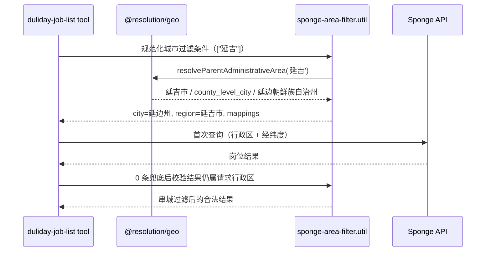

# 地理解析域架构（geo resolution）

**最后更新**：2026-08-14
**代码居所**：`src/resolution/geo/`（纯 TypeScript，零 LLM、零出向依赖）

> 本文描述已实现的系统。与 [brand-resolution.md](./brand-resolution.md) 是同一架构概念（确定性解析域）的两个实例——
> 输入用户表达，输出标准实体 + 证据。两者的 `resolve` 契约刻意同构：**状态 + 标准实体 + 证据**。

---

## 1. 领域边界

### 1.1 负责什么

- 行政区层级和标准名称；
- 城市、区县、地点别名的确定性归一化；
- 高置信白名单匹配：原语（最长优先扫描）与编排（三轮扫描顺序、字符覆盖继承）；
- 跨城同名和通用后缀的歧义策略；
- 从多个地理信号解析标准城市，返回证据，冲突时显式暴露；
- 与供应商无关的地理值对象和解析结果类型。

### 1.2 不负责什么

- 网络请求、缓存、重试和限流；
- 高德的 `adcode`、返回 DTO 或错误码；
- 海绵的 `cityNameList`、`regionNameList`、岗位响应 DTO；
- memory 的事实合并和置信度生命周期；
- tool 的重试策略、用户话术或最终岗位排序。

### 1.3 为什么不是 utils

utils 适合无领域所有权、可在任意上下文复用的机械函数。「延吉市属于延边州」「万达广场是高歧义地点」「区县白名单最长优先」都是会随业务和行政区数据演进的**领域决策**，放 utils 会隐藏决策所有权。

### 1.4 依赖约束

```text
允许：memory / agent / tools / guardrail / infra  →  resolution/geo
允许：tools → sponge

resolution/geo 零出向依赖：不 import memory/agent/tools/infra/sponge，
      也不 import resolution/brand（子域互不依赖；「resolution 至多依赖 sponge」
      是层级上限，geo 取零）

禁止：sponge → resolution（海绵行政区适配器因此落 tools 层，见 §6.2）
```

由 `.eslintrc.js` 的 `no-restricted-imports` 强制。

> `resolution/geo` 保持纯 TypeScript：**不声明 NestJS module、不注入服务**。对比 `resolution/brand` 因品牌目录来自 SpongeService 才需要 DI 门面——geo 数据是静态的（纯数据 + 纯函数）。resolution 层同时容纳「带 DI 门面的子域」和「纯函数子域」。

---

## 2. 目录结构

```text
src/resolution/geo/                          # 文件平铺，与 resolution/brand 风格一致
├── index.ts                                # 稳定出口
├── geo.types.ts                            # GeoResolution 等与供应商无关的类型
├── administrative-division.data.ts         # 直辖市/县级市映射/区县映射/业务城市前缀
├── administrative-division.generated.ts    # 脚本生成的全国行政区表
├── administrative-division.overrides.ts    # 人工维护：供应商差异 + 业务偏置 + 脏别名排除
├── explicit-city.data.ts                   # 全国显式「XX市」表
├── administrative-area.resolver.ts         # resolveCityFromDistrict / resolveParentAdministrativeArea
│                                           #   / resolveCityFromGeoSignals / detectGeoSignalConflict
├── geo-name.normalizer.ts                  # normalizeCityName / normalizeDistrictForLookup
├── whitelist-scanner.ts                    # scanWhitelistKeysByLongest / matchInUncoveredSegments（原语）
├── geo-text-scan.ts                        # scanGeoSignalsFromText（三轮扫描编排）
├── place-alias.data.ts                     # 地标/商圈 → 城市
├── place-alias.resolver.ts                 # resolveCityFromLocation
└── ambiguous-place.policy.ts               # GENERIC_AMBIGUOUS_SUFFIXES / hasGenericAmbiguousSuffix

src/tools/duliday/job-list/
└── sponge-area-filter.util.ts              # 海绵行政区适配（见 §6.2）

scripts/geo/                                # data/ 数据集快照 + 生成/校验脚本
├── generate-administrative-divisions.ts    # pnpm geo:generate
└── validate-administrative-divisions.ts    # pnpm geo:validate
```

`src/infra/geocoding` 保持原位——它是外部地理编码供应商集成，不是地理领域本身。

---

## 3. 公开 API 与核心类型

业务代码只从 `@resolution/geo` 导入。**数据常量不作为公共 API**，行政区关系一律通过 resolver 查询（`COUNTY_LEVEL_CITY_TO_PREFECTURE` 已从公共出口收回）。

### 3.1 解析结果模型

```ts
export type AdministrativeLevel =
  | 'municipality' | 'prefecture' | 'county_level_city'
  | 'district' | 'county' | 'township' | 'place';

export type GeoResolutionEvidence =
  | 'explicit_city_name' | 'unique_district_alias' | 'county_parent_relation'
  | 'hotspot_alias' | 'geocode_resolved';

export interface GeoResolution {
  status: 'resolved' | 'ambiguous' | 'unresolved';
  city: string | null;
  district: string | null;
  level: AdministrativeLevel | null;
  evidence: GeoResolutionEvidence | null;
  matchedText: string | null;
  candidates?: string[];
}
```

关键规则：

- **`resolved` 必须带 `evidence`**；
- 不确定时返回 `ambiguous` / `unresolved`，**禁止猜测**；
- geo 结果不包含高德 / 海绵字段；
- memory 可把 `evidence` 映射为事实置信度，geo **不反向依赖** memory 类型。

### 3.2 行政区解析

```ts
resolveParentAdministrativeArea('延吉')
// => { input: '延吉', canonicalName: '延吉市',
//      level: 'county_level_city', parentCity: '延边朝鲜族自治州' }
```

允许兼容裸名称，是因为调用方（工具的 `cityNameList` 参数）已在结构化字段中表达了明确语义；**自由文本扫描仍只命中「延吉市」这种显式后缀**，避免把道路名、门店名中的「延吉」误识别为城市。

### 3.3 自由文本扫描编排

```ts
scanGeoSignalsFromText(message: string): GeoTextScanResult
// 返回三类命中（各带白名单来源、位置、推导 city 与 evidence）+ 未覆盖段的 raw district
```

扫哪张表、按什么顺序、覆盖如何继承，**本身就是地理领域决策**，因此编排与原语同在 geo。memory 只消费扫描结果，决定如何写入 sessionFacts（置信度生命周期仍归 memory）。

---

## 4. 白名单扫描与开放世界解析

「最长优先 + 字符覆盖」的扫描机制：

1. 先扫描显式城市；
2. 再扫描高置信区县；
3. 再扫描唯一地点别名；
4. 后续扫描**继承前一步字符覆盖**，避免重叠消费；
5. 未覆盖片段才交给正则识别 raw district（**只标注，不补 city**）；
6. 白名单外的开放世界地点交给地理编码和多候选验证，**不由代码猜城市**。

---

## 5. 数据设计与治理

### 5.1 三类数据分离

| 类别 | 内容 | 性质 |
| --- | --- | --- |
| **行政区基础数据** | 城市、县级市、区县、父子关系 | 客观行政区事实，脚本生成 |
| **业务高置信别名** | `光谷 → 武汉`、`陆家嘴 → 上海` | 业务运营决策，人工维护 |
| **歧义策略数据** | `万达广场`、`人民广场` 等跨城通用后缀 | 防误判策略 |

三类数据来源、更新频率和置信原则不同，**不放在同一个大对象中**。

### 5.2 生成数据与 override 分离

- 行政区基础数据由 `geo:generate` 脚本生成（china-division 2.7.0 快照落盘 `scripts/geo/data/`，含来源 / sha256 / 更新流程）；
- **生成产物只接受代码生成更新，不接受零散手改**；
- 供应商口径差异与业务偏置分别记录在 `administrative-division.overrides.ts`，**不污染生成数据**。

⚠️ **业务偏置必须显式标注**：现实中北京 / 长春都有朝阳区、辽宁有朝阳市，白名单把「朝阳」判给北京是刻意的业务决策（其余朝阳不在业务区域）。这类条目在交叉校验中按 override **豁免**，而不是被「纠正」掉。

### 5.3 数据校验（`pnpm geo:validate`）

- key 重复；同一高置信别名映射到多个城市；
- 父子关系环；县级市缺失父级；
- 标准名称尾缀和行政级别不一致；
- 业务裸地名别名表中不得混入省份；
- 生成数据数量相对上一版本异常增减；
- **区名表与地标表的全国唯一性**（检查项 6 / 8）——跨城重名键必须登记 `BUSINESS_BIASED_SUBDIVISION_ALIASES`，见 §9.4；
- **脏别名防回填**（检查项 7）——`DIRTY_ALIAS_EXCLUSIONS` 登记的键不得出现在区名表 / 地标表。

> 原「余姚防线」（显式城市表 × 县级市映射交叉一致性）已于 2026-08-14 随 `DEFERRED_COUNTY_BACKFILL` 一并下线，理由见 §9.1。

---

## 6. 供应商适配边界

### 6.1 高德地理编码

`src/infra/geocoding` 负责：请求参数与供应商 DTO、网络调用 / 超时 / 重试 / 缓存、候选结果解析、转换为与供应商无关的候选模型。

它**可以**调用 `@resolution/geo` 完成名称归一化、歧义地点策略判断、候选行政区一致性比较。`resolution/geo` **不能**反向 import `@infra/geocoding`。

### 6.2 海绵行政区适配

落位 `src/tools/duliday/job-list/sponge-area-filter.util.ts`。**为什么不是 `src/sponge`**：分层规则禁止 sponge 反向 import resolution，且该转换只有岗位查询编排一个消费方。



**经纬度兜底的约束**：

1. 仅在首次严格查询为 0 时触发；
2. 兜底结果必须经过请求行政区校验；
3. 无法读取岗位 city/region 的结果**不得静默放行**；
4. 观测记录触发原因、原过滤条件、过滤前后数量；
5. 兜底属于 tool 编排，**不进入 geo**。

海绵非标准命名如出现，维护在适配 util 本地 override，**不进 geo**。

---

## 7. 距离锚点与坐标可信度

区级定位被包装成精确距离曾是最大地理类拦截源（`district_level_distance_claim`）。链路：候选人只报区/市名 → geocode 正确返回 `areaLevelQuery=true`（锚点为行政区代表点）→ 岗位距离按区中心计算 → 模型照抄工具文本输出「3.2km」。

**杠杆放在工具输出文本**——门店名照抄类 badcase 证明模型会高保真照抄工具文本，把正确表述放进被照抄的文本里是最稳的一层：

1. **锚点精度与坐标确定性传递**：geocode 的 `areaLevelQuery` 经回合上下文（`GeoQueryMeta.anchor`）传给岗位工具，**不依赖模型转抄参数**；
2. **距离渲染带估算标记**：区级锚点下一律渲染为「约 X.Xkm（按 XX 区估算）」，结果头部声明「本次定位为区级代表点，距离为估算值」；
3. **工具 description 约束**：区级定位下回复须用估算表述，或先追问具体位置 / 商圈 / 定位；
4. ~~**守卫规则保留为后盾**：拦截量趋零本身就是验收指标。~~ ⚠️ **2026-08-14 更正：后盾不存在，本链路只有单防线。** `district_level_distance_claim` 的规则实现早在 **2026-07-10 #499**（守卫硬规则批量下线，location 全族）中就已删除，比本方案 07-22 上线还早 12 天——#628 提交信息里「守卫规则保留为后盾，不下线」在写下时即不成立。因此「拦截量趋零」**不是验收指标**：规则不存在，命中必然为 0。真正的验收证据是第 2 条的渲染覆盖率——**生产 3 周 764 次 area_level 渲染、缺「估算」0 次**（2026-08-14 实测）。改动渲染层即直接改动投递话术，无第二道闸。

**坐标同样不可信任模型转抄**：曾实证模型在「5km 复查」轮未调 geocode、自编了一组与真实锚点偏差约 3.7km 的坐标。岗位工具因此校验模型传入坐标与会话内最近一次 geocode 结果的偏差，落 `anchor.coordsProvenance` / `anchor.coordsDeviationKm` 观测。

**geocode 已解析城市必须被消费**：geocode 解析出的城市进入 `resolveCityFromGeoSignals` 的输入源（evidence `geocode_resolved`），与会话事实冲突时走 ambiguous 出口由模型澄清，**不静默覆盖**；工具结果文本把解析结论**前置明示**（「已确认城市：大连市；已定位到 XX 门店」），description 声明「解析成功后禁止再向候选人反问城市」。

---

## 8. 可观测性

复用现有观测栈（结构化数据落库 + 飞书告警），**不引入 Prometheus 类指标系统**。只打日志不算观测——关键判定必须落库可查或触发告警。

```ts
interface GeoQueryMeta {
  requestedLocations: string[];
  normalizedLocations: string[];
  administrativeMappings: Array<{
    input: string; canonical: string;
    parentCity: string | null; evidence: string | null;
  }>;
  anchor: {
    source: 'geocode' | 'model_supplied' | null;
    precision: 'poi' | 'area_level' | null;   // area_level = 行政区代表点
    areaLevelQuery: boolean;
    areaName: string | null;                   // 区级锚点的行政区名，用于「按XX估算」话术回填
    coordsProvenance: 'turn_geocode' | 'model_supplied' | 'unreferenced' | null;
    coordsDeviationKm: number | null;          // 仅 model_supplied 时有值
  };
  providerFilters: { cityNameList: string[]; regionNameList: string[] };
  fallbackTriggered: boolean;
  fallbackReason: string | null;
  resultCountBeforeAreaGuard: number;
  resultCountAfterAreaGuard: number;
}
```

⚠️ `anchor.source` 实现只产出 `'geocode' | 'model_supplied' | null`——`'session_fact'` / `'user_location_share'` 是定稿期预留档，**从未接线也从未产出过，勿按这两个值写查询**。

**落点**：随工具执行结果落 `message_processing_records`（`agent_invocation`），与 `agent_execution_events` 同 `trace_id` 可 join；fallback 触发、area guard 拒绝等关键事件经 AgentTracer 记 `agent_execution_events`。日志仅辅助定位，**禁止包含用户完整原消息、手机号或精确住址**。

**可回答的问题**：解析状态与证据分布 / 县级市映射的应用次数与去向 / fallback 触发率与原因 / area guard 过滤前后数量差 / 0 结果查询中行政区映射是否生效 / 区级锚点查询占比 / 信号冲突频次与澄清率。

**飞书告警**：新行政区映射上线后 0 结果率显著上升；fallback 触发率突增；area guard 大量过滤岗位（供应商口径漂移信号）；**ambiguous 比例突降**（规则过度推断信号，而非能力提升）。

> ⚠️ 查询 `message_processing_records` 时必须用 `received_at`（该表无 `created_at` 索引），并走 MATERIALIZED 两段式，否则超时。

---

## 9. 开放项

### 9.1 县级市补录：登记表已下线，改为触发式

**`DEFERRED_COUNTY_BACKFILL` 与 `geo:validate` 原检查项 7「余姚防线」已于 2026-08-14 一并移除。** 那 23 条（余姚 / 慈溪 / 太仓 / 常熟 / 张家港 / 胶州 / 宜都 / 松滋 / 麻城 / 枣阳 / 瑞金 / 新民…）不再是待办清单。三条理由：

| 理由 | 依据 |
| --- | --- |
| **登记表与生成表重复** | 23 条在 `NATIONAL_COUNTY_LEVEL_CITY_TO_PREFECTURE` 里本来就全有正确父级（见 §9.2 对照表）。真正的闸门是单个开关 `GEO_NATIONAL_COUNTY_MAPPING_ENABLED`，一开全覆盖——把一件事拆成 23 条待办 + 一条 CI 检查去守这张待办表，是纯仪式 |
| **三周生产零命中** | 2026-07-22~08-13 观测（约 22,800 回合）中这 23 个县级市**一次都没被查询过**，无真实需求信号 |
| **阻塞条件是外部的** | 补录前置的口径验证卡在"宁波/苏州全城 0 在库岗位"（2026-07-30 真实海绵只读实测），属数据侧条件，不是地理域工程债 |

**处置改为纯触发式**：某县级市出现真实查询且解析失败时，按昆山法（真实海绵只读查询确认 `storeCityName`/`storeRegionName` 口径）单条补录进 `COUNTY_LEVEL_CITY_TO_PREFECTURE`，或直接评估开启上述开关。已补录的昆山市映射不受 0 库存影响，无需回滚。开关覆盖面样本固化在 `tests/resolution/geo/national-county-mapping-diff.spec.ts`。

### 9.2 全国映射开关：默认关闭，未授权开启

`GEO_NATIONAL_COUNTY_MAPPING_ENABLED` 缺省关闭，`resolveParentAdministrativeArea` 对未收录县级市返回 `null`、不猜父级。

只读对照实测（28 个输入，开关仅存在于测试进程内，调用后立即恢复）：

- **24 个由 `unresolved` 变为父级命中**——23 条业务城市辖下、策展表未收录的县级市（曾登记于已下线的 `DEFERRED_COUNTY_BACKFILL`，现固化在 spec 里作开关覆盖面样本）+ 全国表补充样本义乌市；
- 昆山市、延吉市**两态下结果一致**，证明人工策展表仍优先且未被全国生成表改写；
- 上海市与未知值火星市两态下都保持 `unresolved`，开关没有把普通地级市或未知名称误判为县级市；
- 样本未出现「已命中变未命中」或「父级被改写」。

⚠️ **行政区映射正确不等于海绵供应商存储口径已验证**——该对照不构成开启开关的执行授权。

<details>
<summary>对照表全 28 行（由 <code>tests/resolution/geo/national-county-mapping-diff.spec.ts</code> 逐行校验，改动须同步）</summary>

| 输入 | 开关关闭 | 开关开启 |
|---|---|---|
| 余姚市 | unresolved | 宁波市 |
| 慈溪市 | unresolved | 宁波市 |
| 太仓市 | unresolved | 苏州市 |
| 常熟市 | unresolved | 苏州市 |
| 张家港市 | unresolved | 苏州市 |
| 胶州市 | unresolved | 青岛市 |
| 莱西市 | unresolved | 青岛市 |
| 平度市 | unresolved | 青岛市 |
| 宜都市 | unresolved | 宜昌市 |
| 当阳市 | unresolved | 宜昌市 |
| 枝江市 | unresolved | 宜昌市 |
| 松滋市 | unresolved | 荆州市 |
| 洪湖市 | unresolved | 荆州市 |
| 石首市 | unresolved | 荆州市 |
| 监利市 | unresolved | 荆州市 |
| 麻城市 | unresolved | 黄冈市 |
| 武穴市 | unresolved | 黄冈市 |
| 新民市 | unresolved | 沈阳市 |
| 枣阳市 | unresolved | 襄阳市 |
| 宜城市 | unresolved | 襄阳市 |
| 老河口市 | unresolved | 襄阳市 |
| 瑞金市 | unresolved | 赣州市 |
| 龙南市 | unresolved | 赣州市 |
| 昆山市 | 苏州市 | 苏州市 |
| 延吉市 | 延边朝鲜族自治州 | 延边朝鲜族自治州 |
| 义乌市 | unresolved | 金华市 |
| 上海市 | unresolved | unresolved |
| 火星市 | unresolved | unresolved |

复现：`pnpm exec jest tests/resolution/geo/national-county-mapping-diff.spec.ts --runInBand --no-watchman`

</details>

### 9.3 地理信号冲突检测：enforce 终审 no-go（观测已结案）

`detectGeoSignalConflict` 在多信号指向不同城市时返回 `ambiguous` + `candidates`，**永久仅 shadow 运行，enforce 不再列为待办**。

**结案依据（2026-08-14）**：生产 shadow 观测 2026-07-22 ~ 08-13 共 3 周，扫描约 22,800 个 success 回合，累计 **25 起冲突样本，逐条分类后真冲突 0 起**——没有任何一起是候选人先后自陈了两个不同城市。噪音构成：

| 类别 | 条数 | 代表样本 |
| --- | --- | --- |
| `hotspot_alias` 地标误命中 | 10 | 五道口×3、王家湾×3、国贸×3、瑶湖 |
| 街道/镇级跨层级同形 | 4 | 长阳（宜昌县 vs 北京房山镇）×3；**宝山中街**（北京海淀街名 → 误判上海宝山） |
| 区名别名残留（本轮消息无地名，来自历史/岗位文案） | 11 | 宝安、洪湖、东湖、江北、昌平、镇海、海淀 |

**为何终审 no-go**：按 enforce 语义（冲突非 null → 跳过城市回填、留 `city=null` 让 Agent 反问），噪音样本会让 Agent 对信息最充分的输入反问城市——净误伤。决策日样本（id 225908，「北京市房山区长阳镇…」）与三周后的 id 223843（`[位置分享]` 海淀区…**宝山中街**北，自带精确经纬度）是同一形态，且后者证明该形态**可稳定复现**而非孤例。**零正样本 + 可复现误伤形态 = 收益侧不存在**，故不再保留"攒够证据就重开"的口子。

**根因：同形地名跨层级。** 长阳既是宜昌下辖县（`UNIQUE_SUBDIVISION_TO_CITY` 收录为 `长阳: '宜昌'`），也是北京房山下辖镇；宝山中街则是北京海淀的**街道名**撞上海宝山**区名**。收录不变式「多个城市共享的区名必须排除」只按**区/县级**排查过，**跨层级（县/区 vs 镇/街道）同形是漏网类别**——这是 shadow 三周留下的唯一真实产出。

**后续该做的不是 enforce，而是降噪**（按投入产出排序，均与 enforce 解耦、可独立立项）：

1. **`hotspot_alias` 收紧** —— 贡献 40% 噪音，是单一最大来源；
2. **`UNIQUE_SUBDIVISION_TO_CITY` 镇/街道级同形清表** —— 用已 vendored 的 `china-division` 生成表比对，把长阳/宝山中街类条目剔除或降权，产出并入 `DIRTY_ALIAS_EXCLUSIONS`。

> shadow 检测代码与 `queryMeta.geoSignalConflictShadow` 字段**保留**：纯函数零成本、无行为影响，且是排障时判断"城市判错是否源于别名误命中"的现成线索。但**已无定时观测者**，不要再按"待决策 shadow"对待。

> 同形地名是脏别名问题的地理侧镜像，与品牌域的 `cityHomograph` 门槛（「鄂尔多斯东胜」被塌缩成服装品牌）同类。

> 同形地名是脏别名问题的地理侧镜像，与品牌域的 `cityHomograph` 门槛（「鄂尔多斯东胜」被塌缩成服装品牌）同类。

### 9.4 地标表收紧：跨城唯一不变式补上机械守门

`UNIQUE_PLACE_ALIAS_TO_CITY`（地标/商圈 → 城市）命中打 `evidence: 'hotspot_alias'`，是城市识别链条 `city > 区名 > 地标 > "XX市"正则` 的倒数第二档——**一旦某轮没有区名信号，地标误命中会直接判错城市**。表头一直写着「仅收录高置信度、跨城市唯一的名称」，但此前无任何机械校验，不变式被静默破坏。

**2026-08-14 双管齐下（3 周 shadow 观测认定本表是最大单一噪音源，占 10/25）**：

1. **数据侧移出 11 条**（69 → 58），全部登记进 `DIRTY_ALIAS_EXCLUSIONS`，由检查项 7 防回填：

| 类别 | 条目 | 依据 |
| --- | --- | --- |
| 生产实证误命中 | 国贸、五道口、王家湾、瑶湖 | 三周 shadow 共 10 起，如「国贸」让上海会话误加北京候选（mpr 237500/237178/237152） |
| 通名 | 世纪公园、临港、东部新城、万寿宫、南门口 | 全国遍地同名，无法指向唯一城市 |
| 全国连锁商业品牌 | 水悦城、九方 | 同名项目遍布多城。对比保留的「万达广场宜昌」「万象城赣州」——带城市名即唯一串 |

2. **机制侧新增 `geo:validate` 检查项 8**：把区名表的全国唯一性校验（检查项 6）同样量到地标表上，跨城重名须登记 `BUSINESS_BIASED_SUBDIVISION_ALIASES`。此前只有区名表受保护，「襄城」（许昌襄城县 vs 襄阳襄城区）纯属因为它恰好也在区名表里才被拦下。

**能力边界**：`areas.json` 只到区县级，纯商圈/通名（国贸、世纪公园、九方）机械校验看不见，那一类仍靠人工登记 `DIRTY_ALIAS_EXCLUSIONS` + 检查项 7 防回填——与跨层级同形（长阳、宝山中街）是同一个已知盲区。

**与区名表键重复是允许且必要的**（光谷 / 沙市 / 黄州 / 樊城 / 襄城 / 红谷滩 6 条）：`resolveCityFromDistrict` 只查区名表、`resolveCityFromLocation` 只查地标表，抽取把同一个词放进 `district` 还是 `location` 槽位不确定，删掉重复项会造成 location 槽位漏解析。

---

## 相关文档

- [品牌解析域架构](./brand-resolution.md) — 同构的确定性解析域，resolve 契约共享同一套心智
- [候选人档案域架构](./candidate-profile-domain.md) — 城市字段的入档裁决与证据分级
- [记忆系统架构与数据流](./memory-architecture.md) — 扫描结果如何写入 sessionFacts
