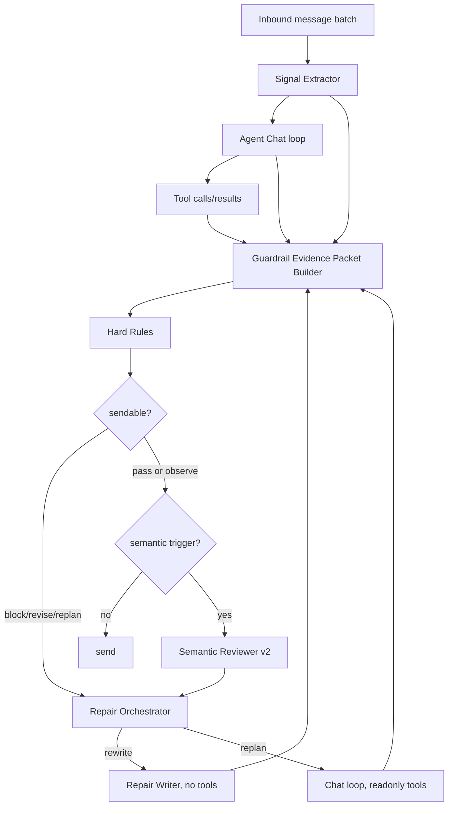

# Guardrail 反馈驱动的 LLM 层重设计

> 状态：设计稿 + 部分落地（2026-07-02 修订）
> 日期：2026-07-01
> 现状总览见 [security-guardrails.md](./security-guardrails.md)；本文保留为**设计背景与决策记录**，落地进度见下方「实现进度」。
> 输入：
> - `tmp/badcase-current-all-20260701.json`
> - `tmp/guardrail-open-badcase-coverage-20260701.json`
> - 当前分支 `agent/guardrail`、`agent/runner`、`llm` 实现
>
> **实现进度（2026-07-02）**：
> - ✅ 出站两档：确定性 rule 档（约 30 规则）+ 语义 reviewer v2（`SemanticReviewerService`，吃证据包，3/9 类 contract）。v1 `LlmReviewerService` 已删，不保留双版本。
> - ✅ Evidence Packet（`review-packet.builder.ts`，jobList/precheck/booking/geocode 四类）。
> - ✅ 受控修复回路（runner `invokeReviewed`，rewrite/replan + 上限 1）。
> - ✅ LLM 不能自证：低置信 enforce 结论代码层强制降级 observe（原设计只在 prompt 里，现落为确定性兜底）。
> - ✅ 故障降级 fail-close/fail-open（§9）；silent advisory（调试流量不 fire 告警）。
> - ✅ 观测落库 `message_processing_records.guardrail_input/output`；流水页徽标+时间线、调试页流末 advisory 展示。
> - ⏳ 未落地：Repair Writer 独立服务 / `ModelRole.Repair`（当前走 runner 内受控指令，非独立 service）；语义 contract 扩展（剩 6 类）；Evidence Packet 的 `signals` 字段（歧义/多消息优先级）。
>
> 2026-07-02 修订（与业务对齐后的三个决策）：
> 1. **Signal Extractor 不再单独立服务**：slots 抽取归位现有高置信事实层（`memory/facts/high-confidence-facts.ts` + session facts），
>    歧义标注作为事实层输出扩展，多消息优先级用确定性规则在 packet builder 内标注，详见 §5.1 修订。
> 2. **guardrail runtime 观测直接落 `message_processing_records`**：`guardrail_input` / `guardrail_output` 两个独立小 JSONB 列
>    （不塞 agent_invocation 大 blob，避开 deTOAST 慢查询），runner 产出全程 trace（首审→repair→二审），
>    流水页与对话调试页（debug-chat / test-suite trace）共用该数据展示 runtime 过程。shadow verdict 观测也走同一列。
> 3. **回放验证与 Feedback Distiller 不做自动化**：badcase→资产转化走人工触发 SOP（`analyze-chat-badcases` skill），
>    离线定时 LLM 归类任务取消，详见 §5.5/§7 修订。

## 1. 结论先行

飞书 BadCase 当前共有 935 条，其中未收口 547 条。按现有覆盖盘点：

| 覆盖状态 | 数量 | 占未收口 | 说明 |
|---|---:|---:|---|
| 有效覆盖 | 200 | 36.6% | 已有 `block / revise / replan / tool reject` 路径 |
| 仅 observe | 204 | 37.3% | 主要是 `booking_form_field_mismatch` 179 条、`salary_fabrication` 25 条 |
| 部分覆盖 | 143 | 26.1% | 岗位推荐、地理/品牌、预约状态、上下文、多模态、话术策略等 |

当前代码里 `booking_form_field_mismatch` 和 `salary_fabrication` 的 catalog 已升级为 `REVISE`，与快照中的 observe 口径存在时间差。若回放验证通过，这 204 条可从“看见但不拦”进入有效覆盖，理论有效覆盖可提升到约 `404 / 547 = 73.9%`。

剩余 143 条不适合靠继续堆 deterministic regex 或把现有 reviewer prompt 写长解决。它们需要一个重新分层的 LLM 层：

1. **Signal Extractor**：从候选人最新消息批次中抽结构化信号和证据 quote。
2. **Guardrail Evidence Packet**：把工具结果、权威状态、候选人偏好、图片置信度整理成 reviewer 可消费的短证据包。
3. **Semantic Reviewer v2**：只基于证据包审查候选人可见回复，输出稳定 violation code 和 repair mode。
4. **Repair Writer**：把 `revise` 从“重新跑完整 Chat Agent”降级成受控改写；`replan` 才允许 readonly 工具。
5. **Feedback Distiller**（07-02 修订：不自动化）：badcase → reviewer/rule/test 资产的转化走人工触发 SOP（`analyze-chat-badcases` skill），不做离线定时 LLM 任务；badcase 表补 §10 结构化字段由人工/skill 辅助填写。

## 2. 当前 LLM 层现状

当前 LLM 角色包括：

| 角色 | 现状 | 主要问题 |
|---|---|---|
| `ModelRole.Chat` | 主 Agent 负责理解、调工具、生成最终话术 | 承担过多：信号抽取、业务决策、文案生成混在一次 loop |
| `ModelRole.Extract` | 记忆事实抽取 | 与本轮 guardrail 审查无直接契约，来源置信度不是每个字段都可用于强决策 |
| `ModelRole.Vision` | 图片理解能力路由 | 图片置信度和附件类型未进入 output reviewer 的统一证据包 |
| `ModelRole.Review` | 当前 `LlmReviewerService`，输入 `reply/toolCalls/memory/redLines/userMessage`，输出 `pass/revise/block` | 审查粒度粗；没有领域 contract；没有稳定 evidence path；不能表达 `replan`；修复建议不够可执行 |

当前 output guardrail 的优点是方向正确：deterministic rule 先跑，LLM 只在高风险 fact/commitment 或副作用后触发，runner 有一次受控 repair，上限 1 次。但 reviewer 本身仍像一个“语义大裁判”，上下文不是为具体 badcase 缺口设计的。

## 3. 反馈数据暴露的 LLM 能力缺口

把 547 条未收口按 LLM 层应承担的职责重分组：

| 能力簇 | 数量 | 代表问题 | LLM 层职责 |
|---|---:|---|---|
| 收资模板 contract | 181 | 少字段、多收门店/时间、分段发模板 | deterministic rule + Repair Writer 按 precheck 字段重写 |
| 薪资/福利事实 contract | 38 | 薪资阶梯说成固定、节假日双倍、社保五险口径 | deterministic rule + reviewer 处理语义同义/复杂薪资 |
| 拉群/无岗维护 | 163 | 承诺拉群但没 invite、群满编造、突兀拉群 | deterministic rule 继续兜；LLM 负责体验/原因表达 |
| 岗位推荐决策 | 41 | 有近岗推远岗、跨品牌推荐、班次/身份不匹配 | Semantic Reviewer 需要 job list + candidate preference 对账 |
| 地理/品牌识别 | 26 | “成都刘姐/成都你六姐”、纯区/地铁站、错把昵称当品牌 | Signal Extractor + geocode/brand ambiguity contract |
| 预约状态机 | 31 | 已约面还继续收资、漏面试时间、线上面试无需二维码、地址楼层不准 | Reviewer 需要 active booking + booking/precheck 证据 |
| 上下文/图片/话术 | 27 | 多消息只看最后一句、图片低置信导致错拉群、转人工露馅 | Signal Extractor 给消息优先级；reviewer 做语义风险 |
| 保险/歧视硬红线 | 38 | 未问主动提保险、敏感筛选外露 | deterministic rule 继续强拦，LLM 只负责脱敏修复话术 |
| 未归类/空分类 | 2 | 表字段缺失 | Feedback Distiller 先补分类再进入规则设计 |

这说明：短期最值钱的是把 observe 升级成可修复；中期真正要补的是“审查前的结构化输入”和“审查后的可控修复”。

## 4. 设计原则

1. **LLM 不能自证**  
   Reviewer 只能基于外生信号裁决：工具结果、权威状态、候选人原文 quote、图片识别置信度、红线。没有新证据，就只能给低风险 observe 或要求 replan，不能凭感觉 block。

2. **Chat Agent 不再同时做所有事**  
   主 Chat 继续负责自然对话和工具 loop，但信号抽取、审查、修复要拆成更小的 LLM 任务。

3. **确定性 rule 优先，LLM 补语义缝隙**  
   `booking_form_field_mismatch`、`salary_fabrication`、`group_promise_without_invite` 这类能结构化对账的，仍优先 rule。LLM 只补规则覆盖不到的同义表达、复杂偏好、上下文优先级。

4. **修复比判错更重要**  
   运营要的是“这条别发错”，所以 reviewer 输出必须能驱动 repair：明确 `rewrite` 还是 `replan`，明确允许引用哪些事实，明确要删哪些未接地内容。

5. **先 shadow 后 enforce**  
   岗位推荐/地理/话术类 reviewer 误伤成本高，先 shadow 记录 precision，再逐类打开 `revise/replan`。

6. **Prompt / Tool / Output 分别承担预防、动作门禁、出站验收**  
   主体 prompt 的价值是让模型一开始少犯错；tool guardrail 的价值是防止模型把系统带去做错副作用；output guardrail 的价值是最终确认候选人可见回复是否忠实、合规、可发送。P0/P1 风险不能只留在 prompt 里，必须落到 tool 或 output 的硬护栏。

### 4.1 Prompt / Tool / Output 的协作关系

```text
候选人输入
  -> Prompt 约束模型怎么想、怎么说
  -> Tool guardrail 约束模型能不能执行这个动作
  -> Tool 返回结构化事实/错误
  -> Output guardrail 检查最终话术是否忠实、合规、可发送
  -> 候选人看到回复
```

| 层 | 本质 | 成功标准 |
|---|---|---|
| Prompt | 生成引导 / 预防 | 降低模型首次违规率；保留语气、身份、对话风格等生成职责 |
| Tool guardrail | 动作门禁 / 执行前判定 | 错误 jobId、跳过 precheck、硬筛不符、可疑姓名等不能进入副作用工具 |
| Output guardrail | 出站验收 / 最终 veto | 工具失败不能说成功；工具拒绝不能外露敏感原因；未接地岗位事实、内部实现、敏感政策不能发出 |

例如候选人不符合岗位硬要求时：

- Tool guardrail 应拒绝 booking，保证系统不会真的约上。
- Output guardrail 应禁止"预约成功"，也禁止把年龄/性别/户籍等敏感筛选理由说出口。
- Prompt 只负责提前引导模型使用正确口径，不能作为最终责任层。

后续评估 guardrail 架构时，不以"拦得更多"作为成功标准，而以"最终发送给候选人的回复更真实、更合规、更能推进流程，且误杀可控"作为成功标准。

## 5. 目标架构



### 5.1 Signal Extractor（2026-07-02 修订：不单独立服务，职责归位现有层）

原设计是新增 `src/agent/signals/` 独立 LLM 服务。评审结论：**与现有高置信线索/事实提取层重叠，取消独立服务**，按三块归位：

| TurnSignals 职责 | 归位 | 说明 |
|---|---|---|
| `candidateSlotsDraft`（姓名/电话/年龄/学历…） | 已有 `memory/facts/high-confidence-facts.ts` + session facts | 完全重叠，不重建 |
| geo/brand/人名歧义标注 | 高置信事实层的输出扩展 | geo-mappings 词典 + geocode 工具已返回 candidates；只缺"人名 vs 城市/品牌"歧义位（如"成都刘姐"），加到事实层输出 |
| `messagePriorities`（多消息优先级/引用/撤回） | packet builder 内确定性规则 | 含报名字段的消息标 critical 时应使用高置信事实提取/结构化字段信号，不复用已退役的出站 observe 正则 |

LLM 只在确定性规则确实覆盖不住时再考虑，且挂在现有 `ModelRole.Extract` 层，不新开层。以下原设计的 TurnSignals 结构保留作为字段参考：

输出建议：

```ts
interface TurnSignals {
  intents: Array<'job_search' | 'booking_info_submit' | 'booking_time_update' | 'location_query' | 'brand_query' | 'complaint' | 'other'>;
  messagePriorities: Array<{
    messageId: string;
    priority: 'critical' | 'normal' | 'low';
    reasonCode: 'contains_booking_fields' | 'contains_time' | 'contains_location' | 'contains_brand' | 'quoted_or_recalled' | 'revoked';
    evidenceQuote: string;
  }>;
  candidateSlotsDraft: {
    name?: EvidenceValue<string>;
    phone?: EvidenceValue<string>;
    age?: EvidenceValue<number>;
    gender?: EvidenceValue<string>;
    education?: EvidenceValue<string>;
    availableWindow?: EvidenceValue<string>;
    locationText?: EvidenceValue<string>;
    brandText?: EvidenceValue<string>;
  };
  ambiguity: Array<{
    type: 'geo' | 'brand' | 'person_name' | 'image';
    candidates: string[];
    shouldAskClarification: boolean;
    evidenceQuote: string;
  }>;
}
```

应用到反馈：

- `9wgqc4u1`：候选人给了报名信息但最后一句补时间，Signal Extractor 应把报名资料标为 `critical`，防止主 Agent 只回复最后一句。
- `567ao7fp / n7xdgidr`：把“刘姐/你六姐”标为品牌/人名歧义，而不是直接当城市。
- 图片/证件类：输出图片理解结果和 confidence；低置信不能驱动拉群、报名、城市结论。

### 5.2 Guardrail Evidence Packet

当前 reviewer 直接吃完整 `toolCalls` 和 `memorySnapshot`，噪声大、契约弱。应新增 packet builder，把 reviewer 所需证据裁剪成稳定结构。

```ts
interface GuardrailReviewPacket {
  draftReply: string;
  latestUserMessages: Array<{
    role: 'user';
    content: string;
    messageType: 'text' | 'image' | 'emotion' | 'quote' | 'revoke';
    timestamp?: number;
  }>;
  signals: TurnSignals;
  evidence: {
    jobList?: JobListEvidence;
    precheck?: PrecheckEvidence;
    booking?: BookingEvidence;
    geocode?: GeocodeEvidence;
    inviteToGroup?: InviteEvidence;
    handoff?: HandoffEvidence;
    activeBooking?: ActiveBookingEvidence;
    visual?: VisualEvidence[];
  };
  policies: {
    redLines: string[];
    outputRuleHits: string[];
  };
}
```

关键 evidence 子结构：

- `JobListEvidence`：查询入参、候选人偏好、返回岗位摘要、距离排序、品牌、班次、薪资 facts、硬条件。
- `PrecheckEvidence`：`requiredFieldsToCollectNow`、`starterFields`、`nextAction`、`interviewTimeMode`、阻断原因。
- `BookingEvidence`：成功/失败、确认面试时间、地址、楼层、线上/线下、`_onSiteScript`。
- `GeocodeEvidence`：resolution、候选地址、confidence、不确定原因。
- `VisualEvidence`：图片类型、识别文本、confidence、是否可用于副作用。

### 5.3 Semantic Reviewer v2

Reviewer 不再只输出 `pass/revise/block`，而是输出领域 finding。

```ts
const semanticReviewSchema = z.object({
  decision: z.enum(['pass', 'observe', 'revise', 'replan', 'block']),
  confidence: z.enum(['low', 'medium', 'high']),
  findings: z.array(z.object({
    code: z.enum([
      'booking_collection_contract_mismatch',
      'salary_or_welfare_ungrounded',
      'job_recommendation_not_best_supported',
      'brand_or_geo_ambiguity_ignored',
      'active_booking_state_conflict',
      'multi_message_priority_ignored',
      'visual_confidence_overclaimed',
      'tone_or_handoff_exposure',
      'unsupported_commitment'
    ]),
    evidencePath: z.string(),
    evidenceQuote: z.string(),
    userImpact: z.string(),
    repairMode: z.enum(['rewrite', 'replan']),
    feedbackToGenerator: z.string(),
  })),
});
```

领域 contract：

| Contract | 触发 | 可 enforce 动作 |
|---|---|---|
| booking collection | precheck 给了 required/starter fields，回复出现收资模板 | `revise` |
| salary/welfare | 回复含薪资、社保、节假日、周末加薪 | `revise` |
| job recommendation | 回复推荐具体岗位/门店 | `replan` 或 `revise` |
| geo/brand ambiguity | geocode/brand 信号不唯一，回复直接下结论 | `revise` |
| active booking state | 已约面/改期/入职跟进状态存在 | `revise` 或 `replan` |
| multi-message priority | Signal Extractor 标了 critical 信息，回复未承接 | `replan` |
| visual confidence | 图片/证件低置信却触发副作用或城市/品牌结论 | `block/replan` |
| tone/handoff exposure | “转人工露馅”、话术僵硬、敏感筛选委婉化 | 先 `observe`，灰度后 `revise` |

### 5.4 Repair Writer

当前 `revise` 复用 Chat Agent，加 `reviseFeedback` 后用 `toolMode:'none'` 或 readonly 重跑。这是可用的，但对 181 条收资模板和 25 条薪资编造来说，完整 Agent 太自由。

建议新增 `ModelRole.Repair` 和 `RepairWriterService`：

- `rewrite`：不暴露任何工具，只给 draft、findings、allowedFacts、requiredOutputShape。
- `replan`：仍走 Chat Agent，但 `toolMode:'readonly'`，并且 reviewer 指定允许调用的只读工具类型。

收资模板修复应尽量模板化：

```ts
interface RepairInstruction {
  mode: 'rewrite' | 'replan';
  requiredFacts: string[];
  forbiddenClaims: string[];
  requiredFields?: string[];
  allowedFacts?: Record<string, unknown>;
  style: 'candidate_visible_only';
}
```

示例：

- `booking_form_field_mismatch`：Repair Writer 只输出 precheck 要求字段，不多收门店/时间。
- `salary_fabrication`：Repair Writer 删除节假日双倍/周末加薪/面议，只保留 `jobSalary`。
- `confirmed_booking_time_missing`：Repair Writer 必须带 booking 确认时间和 `_onSiteScript`。

## 6. 对各类 badcase 的落地策略

| 类别 | 当前状态 | 新 LLM 层策略 |
|---|---|---|
| `booking_form_field_mismatch` 181 | 快照 observe；当前代码已改 `REVISE` | 先回放验证；修复走 Repair Writer，不再完整自由重跑 |
| `salary_fabrication` 25 | 快照 observe；当前代码已改 `REVISE` | rule 继续拦；reviewer 补复杂薪资同义表达 |
| `group_promise_without_invite` 153 | 已有效覆盖 | 保持 rule；体验类“该不该拉/怎么说原因”进入 reviewer shadow |
| 近岗/远岗/跨品牌/班次 41 | 部分覆盖 | Evidence Packet 加 job list 排序和偏好；reviewer 输出 `replan` |
| 地理/品牌 26 | 部分覆盖 | Signal Extractor 抽歧义；reviewer 禁止不确定时下位置结论 |
| 预约状态 31 | 部分覆盖 | Evidence Packet 加 active booking；reviewer 检查面试时间、线上/线下、地址楼层、已约后动作 |
| 多消息/图片/引用 2+ | 基本缺失 | Signal Extractor 标 critical 消息；图片低置信不得驱动副作用 |
| 情绪/话术 15 | 不宜硬拦 | reviewer 先 shadow，沉淀可执行话术策略后再 enforce |

## 7. 运行时触发策略

为了控制延迟，不是每轮都跑所有 LLM。

| 阶段 | 触发条件 | 默认动作 |
|---|---|---|
| 信号/事实抽取（07-02 修订：归位现有事实层） | 每轮（确定性规则，无额外 LLM） | 同步 |
| Semantic Reviewer | 回复含具体岗位/薪资/福利/预约/拉群/保险/位置结论，或本轮有工具调用 | 同步，先 shadow 部分类别 |
| Repair Writer | hard rule 或 semantic reviewer 返回 `revise` | 同步，工具关闭 |
| Replan Chat | reviewer 返回 `replan` | 同步，readonly tools |
| Feedback Distiller（07-02 修订：不自动化） | 人工触发（analyze-chat-badcases skill） | 人工 SOP |

故障降级：

- deterministic P0/P1 rule 命中：按现有 block/revise/replan，不依赖 LLM。
- Reviewer 故障：有副作用或高风险事实回复时 fail-close；低风险体验类 fail-open + observe。
- Repair Writer 故障：若首版不可发送则 block/handoff，不回退发送首版。

## 8. 代码改造建议

### 第一阶段：把 observe 升级闭环做实

1. 保持 `booking_form_field_mismatch`、`salary_fabrication` 为 `REVISE`。
2. 回放对应 204 条 open badcase，统计：
   - 命中率
   - revise 成功率
   - 二次仍命中率
   - 误伤样本
3. 把收资/薪资修复从 Chat Agent 重写迁到 `RepairWriterService`。

### 第二阶段：Evidence Packet + Reviewer v2 shadow

新增：

- `src/agent/guardrail/output/review-packet.builder.ts`
- `src/agent/guardrail/output/semantic-reviewer.service.ts`
- `src/agent/guardrail/output/semantic-reviewer.types.ts`
- `ModelRole.Repair`

改造：

- `LlmReviewerService`（v1）直接删除，Reviewer v2（`SemanticReviewerService`）是 llm 档唯一实现，
  不保留双版本并行：`OUTPUT_GUARDRAIL_LLM_ENABLED` 控制 enforce（参与裁决），
  `OUTPUT_GUARDRAIL_SEMANTIC_SHADOW_ENABLED` 控制未 enforce 时的 shadow 观测。
  低置信（confidence=low）的 revise/replan/block 结论在代码层强制降级为 observe（LLM 不能自证）。
  故障降级：高风险触发（副作用既成/承诺事实措辞）fail-close block；仅语义 contract 触发 fail-open 回退 rule 裁决。
- `OutputGuardrailService.check()` 接受 packet，先 hard rules，后 semantic reviewer。
- `AgentRunnerService.invokeReviewed()` 根据 `repairMode` 选择 Repair Writer 或 readonly replan。

### 第三阶段：信号能力归位现有事实层（07-02 修订，原 Signal Extractor 取消）

不新增 `src/agent/signals/`。改为：

- 高置信事实层（`memory/facts/high-confidence-facts.ts`）输出扩展歧义标注（人名 vs 城市/品牌）。
- packet builder 吃真实消息批次，用确定性规则标注多消息优先级（含报名字段→critical）。
- memory/session 权威字段仍由确定性 parser 决定；任何 LLM 补充信号只作为 reviewer 和工具调用提示，不直接作为 booking allow 证据。

### 第四阶段：分领域 enforce

建议打开顺序：

1. booking collection、salary/welfare：高收益、低歧义。
2. active booking state：依赖 booking evidence，收益高。
3. geo/brand ambiguity：先 revise，让回复追问或枚举候选项。
4. job recommendation：先 shadow，再对“明显有近岗却推远岗/指定品牌却跨品牌” enforce。
5. tone/handoff exposure：保持 observe，等运营确认话术标准再 enforce。

## 9. 验证指标

评估问题不是"这套规则拦截率有多高"这么窄，而是两个问题：

1. **硬规则本身准不准**：该拦的有没有拦，不该拦的有没有误拦。
2. **新架构是否提高最终回复质量**：拦截、修复、重查之后，候选人实际会看到的回复是否更好。

因此 badcase 回放要拆成四类指标：

| 指标 | 回答的问题 | 统计方式 |
|---|---|---|
| Recall / 应拦命中率 | 该拦的有没有拦 | 标注样本中 expectedAction 为 revise/replan/block 的 case，统计命中对应 input/tool/output rule 的比例 |
| Precision / 误杀率 | 不该拦的有没有误拦 | GoodCase 或人工标注 pass 样本中，被 hard rule 拦下的比例 |
| Repair success / 修复成功率 | 拦完以后有没有变好 | 首版命中后，rewrite/replan 产物二审 pass，且人工/LLM 评估不低于 baseline |
| Experience impact / 体验损伤 | 是否因为过度护栏变差 | 多问、答非所问、流程停滞、过度保守、延迟增加、重复转人工等负向标签 |

结论必须同时报告这四项。只报告 recall 会鼓励过度拦截；只报告平均回复分会掩盖 P0/P1 红线风险。

运行指标：

- Reviewer 触发率：按 turn / 按工具类型。
- Reviewer enforce 率：revise/replan/block 占触发比例。
- Repair 成功率：二审 pass 占 revise/replan。
- Repair exhausted：二审仍失败的比例。
- 延迟：p50/p95 增量，按 Signal/Reviewer/Repair 分开。
- 误伤率：运营抽样，按领域分类。

badcase 回放指标：

- 204 条 observe 升级样本：目标有效覆盖 > 90%，误伤 < 5%。
- 143 条 partial 样本：shadow 阶段先看可识别率；第一批 enforce 目标覆盖其中 50 条以上。
- 每条新增 rule/reviewer finding 必须有 source badcase id 和测试资产。

## 10. 需要反哺到 guardrail 的反馈信息

后续从飞书 badcase 里要结构化沉淀以下字段：

| 字段 | 用途 |
|---|---|
| `expectedGuardrailLayer` | input / tool / output / memory / retrieval |
| `expectedAction` | observe / revise / replan / block / handoff |
| `requiredEvidence` | 这条 case 需要哪个外生信号才能判断 |
| `violationCode` | 对应 rule id 或 semantic reviewer code |
| `repairExpectation` | 应该如何重写或重查 |
| `isPromptOnlyFixAllowed` | 是否允许只改 prompt；默认否 |
| `sourceBadcaseIds` | 回归测试血缘 |

这能避免 badcase 表继续只沉淀自然语言抱怨，而无法直接变成 reviewer/rule/test 资产。

## 11. 最小可行版本

MVP 不需要一次性重做全链路：

1. 先把 204 条 observe 升级样本跑通 `REVISE + Repair Writer`。
2. 构建 `GuardrailReviewPacket`，只覆盖 job/precheck/booking/geocode 四类 evidence。
3. Reviewer v2 先 shadow 三个 contract：
   - job recommendation
   - geo/brand ambiguity
   - active booking state
4. （07-02 修订）badcase → violationCode 统计和建议 rule 走人工触发的 `analyze-chat-badcases` skill SOP，不做每日自动任务。

这条路径能先把有效覆盖率从 36.6% 拉到接近 74%，再用 shadow 数据稳定推进剩余 143 条部分覆盖。
