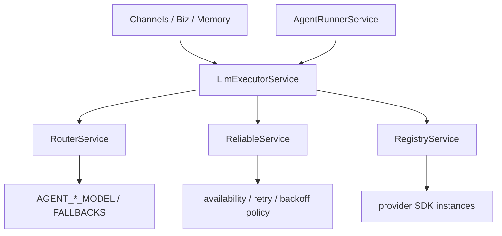
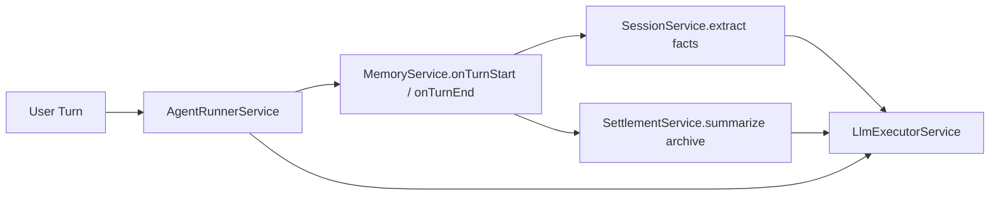
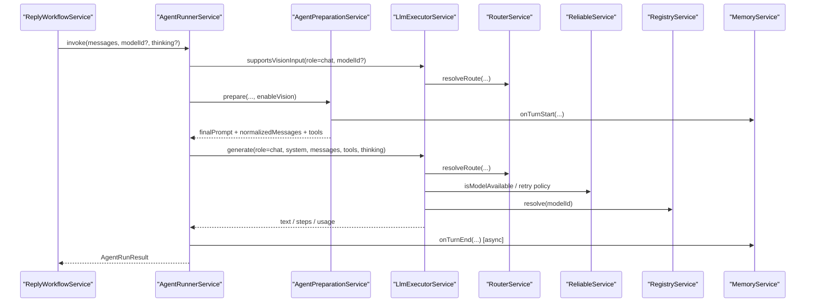

# LLM Executor 调用关系图

**最后更新**：2026-04-22

---

## 1. 分层关系

关键约束：

- `provider` 层只保留“注册、路由、可靠性策略”。
- 真正调用 Vercel AI SDK `generateText / streamText / Output.object` 的地方，统一只有 `LlmExecutorService`。

---

## 2. 为什么 memory 也会调用 LLM

`memory` 调用 LLM 不是越权，而是职责内需要：

- `SessionService` 需要抽取结构化 facts
- `SettlementService` 需要压缩摘要 / archive
- `AgentRunnerService` 需要执行本轮对话

它们共享同一个执行入口，而不是各自绕过架构直连 provider。

---

## 3. 一轮对话时序

---

## 4. 约束总结

- `AgentPreparationService` 不做模型选择，只做上下文准备。
- `AgentRunnerService` 负责编排，不直接拼 provider-specific SDK 参数。
- `LlmExecutorService` 是共享的 LLM 执行入口。
- `RouterService` 只回答“该走哪个模型链”。
- `ReliableService` 只回答“能不能试、要不要重试、等多久”。
- `RegistryService` 只负责 provider SDK 实例注册与解析。
