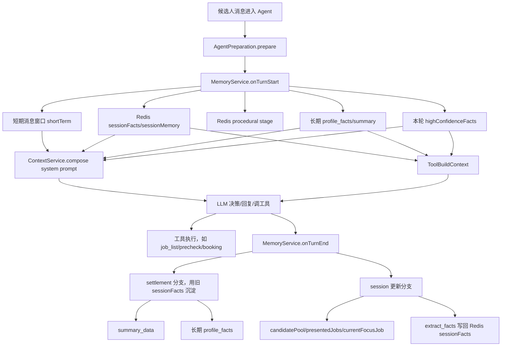
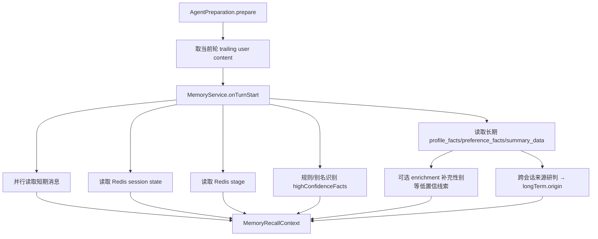
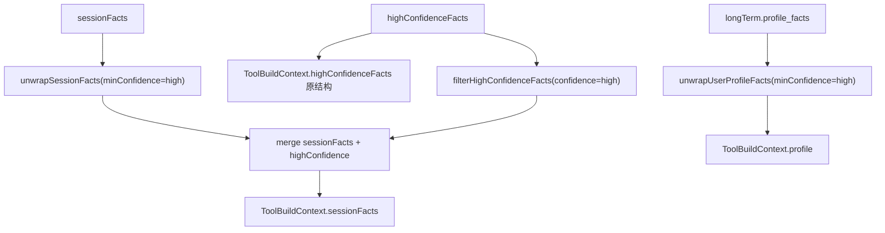
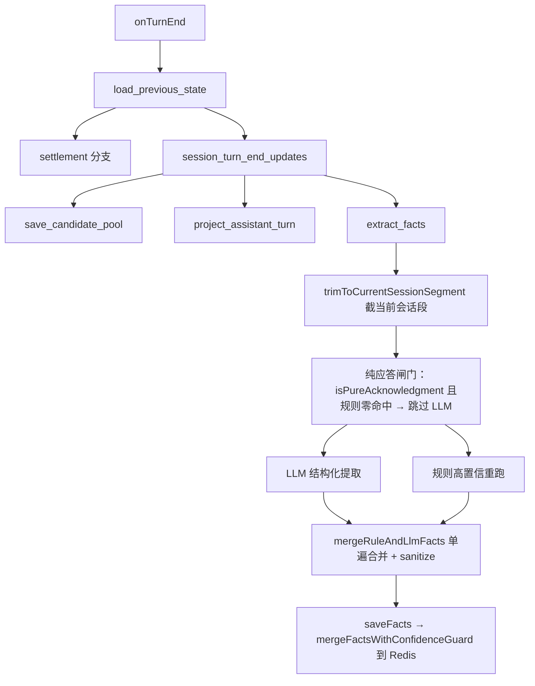
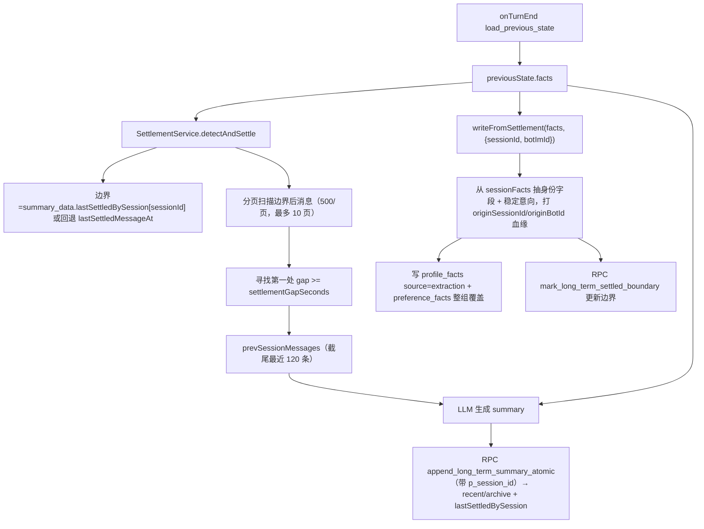

# 记忆与线索数据流

**最后更新**：2026-06-16

本文是记忆与线索链路的独立真相文档，描述当前真实生效的数据流、字段结构、消费规则和关键边界：哪些数据只是本轮线索，哪些会进入 Redis 会话事实，哪些会沉淀到长期画像，以及大模型和工具分别如何消费。

## 0. 端到端总览



一句话规则：

- 给大模型：展示事实和线索，但只带 `confidence/source/更新日期`，**不带 evidence 全文**（注入瘦身，evidence 是排障字段）。
- 给程序化工具：默认只消费 `confidence=high`；低/中置信字段只能作为模型参考或要求候选人确认。
- 写 Redis `sessionFacts`：通过回合结束的后置事实提取链路写入，不直接持久化 `onTurnStart` 的那个 `highConfidenceFacts` 对象；每字段打 `extractedAt` 时间锚，evidence 入库截断 200 字，`saveFacts` 经跨轮置信度守卫（低置信不覆盖高置信）。
- 写长期 `profile_facts` / `preference_facts`：profile 通过 booking、settlement、enrichment 三条路径写入；preference 仅由 settlement 快照式整组覆盖写入；settlement 只从已校验/清洗过的 `sessionFacts` 抽字段。

## 1. 数据分层

| 层 | 名称 | 存储 | 生命周期 | 用途 |
|----|------|------|----------|------|
| 短期记忆 | `shortTerm.messageWindow` | `chat_messages` + Redis 窗口缓存 | DB 永久 / Redis `sessionTtl` | 给模型提供最近对话窗口 |
| 本轮线索 | `highConfidenceFacts` | 不持久化 | 当前轮 | 当前消息的规则/别名识别 sidecar |
| 会话事实 | `sessionFacts` | Redis `facts:{corpId}:{userId}:{sessionId}` | `sessionTtl` | 当前求职会话的已校验/清洗结构化事实 |
| 程序记忆 | `procedural` | Redis `stage:{corpId}:{userId}:{sessionId}` | `sessionTtl` | 招聘阶段状态 |
| 长期记忆 | `profile_facts` / `preference_facts` / `summary_data` | Supabase `agent_long_term_memories` + Redis 2h cache | 永久 | 跨 session 复用的画像、稳定求职意向和历史摘要 |

`highConfidenceFacts` 不是正式记忆层。它只在当前轮帮助模型和工具理解新消息；回合结束时，系统会重新跑规则提取，并把可保存的事实通过 `sessionFacts` 链路写入 Redis。

各层职责不能互相替代：

| 层 | 可以做什么 | 不可以做什么 |
|----|------------|--------------|
| `highConfidenceFacts` | 当前轮快速识别年龄、城市、品牌、班次等明确线索 | 当作跨轮记忆；直接作为长期画像 |
| `sessionFacts` | 保存当前求职会话内已经提取、清洗、合并过的结构化事实 | 在沉淀 profile 时被跳过，改成直接扫旧消息重抽 |
| `profile_facts` | 跨 session 复用稳定画像，如姓名、电话、年龄、学历 | 存储门店、面试时间、岗位偏好等强会话字段 |
| `summary_data` | 记录历史会话摘要，帮助模型理解长期上下文 | 替代结构化字段参与硬判断 |

## 2. 字段结构

`highConfidenceFacts`、`sessionFacts`、长期 `profile_facts` 的业务事实字段都采用字段级 fact wrapper：

```json
{
  "value": "24",
  "confidence": "high",
  "source": "rule",
  "evidence": "年龄识别：24",
  "extractedAt": "2026-06-11T10:00:00.000Z"
}
```

`sessionFacts` 字段写入时带 `extractedAt` 时间锚（提取时间）：时间敏感字段注入 prompt 时会带记录日期、超 24h 失效告警。`evidence` 入库前经 `truncateEvidence()` 截断 `MAX_FACT_EVIDENCE_CHARS=200` 字。

其中 `highConfidenceFacts.reasoning` / `sessionFacts.reasoning` 是诊断说明文本，不作为业务事实字段消费。

长期画像会额外带 `updatedAt`，沉淀路径还带数据血缘 `originSessionId` / `originBotId`：

```json
{
  "value": "24",
  "confidence": "medium",
  "source": "extraction",
  "evidence": "会话沉淀提取；原字段来源=rule；原字段置信度=high；原证据=年龄识别：24",
  "updatedAt": "2026-05-27T10:00:00.000Z",
  "originSessionId": "6a2284a3536c965402ea3abb",
  "originBotId": "1688855974513959"
}
```

`originSessionId`（=chatId，bot 维度）与 `originBotId`（imBotId）由 settlement 沉淀时打戳，追溯"这条长期字段由哪次会话/哪位招募经理沉淀"。booking/enrichment 路径与本次改动前的存量数据没有这两个字段（缺失即 undefined，向后兼容）。长期记忆按 `(corp_id, user_id)` 跨 bot 共享，血缘用于第 4 节的**跨会话来源研判**。

`confidence` 决定是否能进入程序化判断：

| 值 | 含义 | 工具默认消费 |
|----|------|--------------|
| `high` | 可程序化采用。来自确定性规则、明确结构化输入或强校验事实 | 是 |
| `medium` | 可给模型参考。通常来自 LLM 结构化提取、会话沉淀或外部补全 | 否 |
| `low` | 弱参考。来自系统兜底、弱规则或补充接口 | 否 |
| `unknown` | 旧数据或缺少元数据的兼容值 | 否 |

`source` 只说明字段产生路径，不等于字段真假：

| 值 | 含义 |
|----|------|
| `candidate` | 候选人直接明示的结构化输入 |
| `llm` | LLM 根据对话做的结构化提取 |
| `rule` | 确定性规则、正则、白名单或别名表匹配 |
| `system` | 外部系统或平台接口补充 |
| `memory` | 历史记忆或旧结构兼容迁移 |
| `derived` | 由其他字段推导，例如区/地标反推城市 |
| `booking` | 预约/报名成功后写入长期画像 |
| `extraction` | 会话沉淀时从 `sessionFacts` 抽取后写入长期画像 |
| `enrichment` | 外部画像补全链路写入 |

## 3. 字段归属

`highConfidenceFacts` 和 `sessionFacts` 的业务字段分成两组：

| 分组 | 字段 |
|------|------|
| `interview_info` | `name` / `phone` / `gender` / `gender_source` / `age` / `applied_store` / `applied_position` / `interview_time` / `is_student` / `education` / `has_health_certificate` |
| `preferences` | `brands` / `salary` / `position` / `schedule` / `city` / `district` / `location` / `labor_form` / `delayed_intent` / `short_term` / `open_position` / `time_windows` / `schedule_constraint` / `available_after` |

长期 `profile_facts` 只存适合跨 session 复用的身份画像字段：

| 字段 | 原因 |
|------|------|
| `name` / `phone` / `gender` | 基本稳定 |
| `age` / `is_student` / `education` / `has_health_certificate` | 半稳定，但招聘判断经常需要参考 |

会话级字段如 `applied_store`、`interview_time`、`brands`、`schedule`、`city`、`district`、`location` 只保留在 Redis `sessionFacts`，不直接沉淀成长期画像。

## 4. 回合开始



`onTurnStart` 返回：

```ts
{
  shortTerm: { messageWindow },
  sessionMemory,
  highConfidenceFacts,
  procedural,
  longTerm: { profile, preferences, origin? } // origin = { fromOtherConversation: true } 时渲染跨会话口径
}
```

注意：

- `highConfidenceFacts` 只看当前轮用户新消息，不回看历史窗口。
- 外部 enrichment 目前只补充缺失性别，写入当前轮 `highConfidenceFacts`，不是直接写长期画像。
- 长期 `profile_facts` 读取后保留 `confidence/source/updatedAt` 给模型，但**注入 prompt 时不带 evidence 全文**。
- 长期 `preference_facts` 一并读取，注入为 `[历史求职意向]` 段。
- 老用户回访阶段兜底：长期画像有姓名/电话且程序性阶段已过期时，`resolveReturningUserStage()` 把 `entryStage` 兜底为 `job_consultation`。
- **跨会话来源研判**（`detectCrossConversationOrigin`）：长期记忆按 `(corp_id, user_id)` 跨 bot 共享。当①当前为全新 chat 首聊（无自有会话记忆）②长期画像/意向非空③这些记忆来自别的会话（优先看字段 `originSessionId !== 当前 sessionId`，存量无血缘回退 `summary_data.lastSettledBySession`/`recent[].sessionId`）时，置 `longTerm.origin.fromOtherConversation=true`。用于让新招募经理的 Agent 泛指"候选人此前在本平台与另一位顾问聊过"，而非假装自己聊过。

## 5. Prompt 消费

`AgentPreparationService` 会先构造 `memoryBlock`，再交给 `ContextService.compose()` 组装 system prompt。Prompt 消费保留字段 metadata，目的是让模型知道“这个字段从哪来、可信到什么程度”。

| Prompt 段 | 来源 | 内容 |
|-----------|------|------|
| `[历史背景｜来自候选人此前在本平台的咨询]` | `longTerm.origin.fromOtherConversation` | 仅全新 chat 首聊且长期记忆来自别的会话时渲染：泛指"候选人此前与另一位招聘顾问沟通过"，提示模型不要假装自己聊过、不点名同事 |
| `[用户档案]` | 长期 `profile_facts` | 全字段值 + 置信度 + 来源 + 更新日期（**不带 evidence 全文**） |
| `[历史求职意向]` | 长期 `preference_facts` | 跨会话稳定意向 + 更新日期 + “本次优先”指引；过期 `available_after` 不渲染 |
| `[会话记忆]` | Redis `sessionMemory` | `sessionFacts`、岗位池、已展示岗位、当前焦点岗位、已邀群 |
| `[本轮高置信线索]` | 当前轮 `highConfidenceFacts` | 与会话记忆不冲突的当前消息线索 |
| `[本轮待确认线索]` | 当前轮 `highConfidenceFacts` + `sessionFacts` | 与中高置信会话事实冲突的线索 |
| `[本轮查询硬约束]` | 高置信 `sessionFacts` + 高置信 `highConfidenceFacts` | 查岗必须带的 city / district / age / schedule 等约束 |

给大模型时的原则是：**所有字段都可以展示，但必须带置信度和证据**。模型可以参考低/中置信字段，但遇到筛人、约面、booking 等硬判断时要依赖工具和高置信输入。

### 5.1 `memoryBlock`

`memoryBlock` 由这几部分组成：

1. 跨会话来源说明：`memory.longTerm.origin.fromOtherConversation` 为真时，由 `formatCrossConversationNotice` 在档案/意向前插入 `[历史背景｜…]` 泛指口径。
2. 长期用户档案：来自 `memory.longTerm.profile`，展示 profile field wrapper。
3. 长期求职意向：来自 `memory.longTerm.preferences`，渲染为 `[历史求职意向]` 段（`formatLongTermPreferences`）。
4. 会话记忆：来自 `memory.sessionMemory`，包含 `sessionFacts`、岗位池、当前焦点岗位等。
5. 活跃 recruitment case：如存在，会附加到记忆块中。

`sessionFacts` 和 `highConfidenceFacts` 渲染时使用统一字段列表（`fact-lines.formatter.ts`），字段行带内联 metadata 但**不含 evidence 全文**（`includeEvidence` 默认 false，仅事实提取 prompt 的 `[规则模式匹配线索]` 置 true）。注入示例：

```text
- 年龄: 24（置信度: high，来源: rule，更新日期: 2026-06-11）
```

性别字段有额外提示：如果 `gender_source=system`，只能作为系统标签参考，不得用于直接排除候选人。

### 5.2 本轮线索与待确认线索

`TurnHintsSection` 会把 `highConfidenceFacts` 拆成两段：

| 段 | 判断逻辑 | 模型应该怎么用 |
|----|----------|----------------|
| `[本轮高置信线索]` | 会话中没有旧值、或当前轮字段与会话中 `minConfidence=medium` 的旧字段一致 | 可直接辅助理解本轮意图 |
| `[本轮待确认线索]` | 当前轮字段与会话中 `minConfidence=medium` 的旧字段冲突 | 只能用于判断是否澄清，不能直接覆盖旧记忆 |

冲突判断规则：

- 标量字段：trim 后字符串相同则不冲突；不同则进入待确认。
- 布尔字段：值相同则不冲突。
- 数组字段：去空、去重、排序后相同则不冲突。
- 复杂对象：按 JSON 内容比较。
- 城市字段：比较 `CityFact.value` 与当前轮 city value。

这里比较的是 `sessionFacts` 中 `medium` 及以上字段。原因是 `medium` 虽然不进入工具硬判断，但对模型而言已经是需要尊重的会话记忆，不能被当前轮弱理解无声覆盖。

### 5.3 查询硬约束与参考信息

`HardConstraintsSection` 只使用高置信字段，来源是：

1. `sessionFacts` unwrap `minConfidence=high`
2. `highConfidenceFacts` filter `confidence=high`

Prompt 里的合并规则是：`sessionFacts` 高置信优先，当前轮高置信只补 session 中缺失的字段。当前轮冲突字段会在 `[本轮待确认线索]` 中提醒模型处理。

硬约束字段：

| 字段 | 为什么是硬约束 |
|------|----------------|
| `city` | 不带城市会跨城查岗 |
| `district` | 不带区域会明显扩大到错误区域 |
| `location` | 商圈/地标/街道需要 geocode 或位置分享经纬度 |
| `age` | 影响岗位年龄边界，必须开招聘要求或 precheck 判断 |
| `schedule` | 班次不匹配会造成到店后不符 |
| `salary` | 薪资明显低于预期不能推荐 |

参考信息字段：

| 字段 | 使用方式 |
|------|----------|
| `gender` | 建议结合招聘要求筛掉明显不符岗位 |
| `brands` | 可作为品牌筛选；无结果时可放宽 |
| `position` | 可作为岗位筛选；硬约束不匹配时要放宽重查 |
| `labor_form` | 只作结果过滤，不填进岗位类别 |
| `is_student` | 学生身份要保守，不得由缺省反推接受学生 |
| `has_health_certificate` | 结合岗位健康证规则判断 |
| `education` | 结合招聘要求判断 |
| `open_position` | 岗位开放时 jobCategoryList 可留空 |
| `short_term` | 短期意向与最少工作月数冲突时排除 |
| `delayed_intent` | 有推迟意向时不主动催面 |
| `time_windows` | 推荐班次建议与时间窗口有交集 |
| `schedule_constraint` | 结构化班次约束，结合 includeWorkTime 校验 |
| `available_after` | 最早可面试日期之前不要催面 |

## 6. 工具消费

工具上下文和 prompt 不同。工具默认只消费高置信字段，避免低/中置信事实参与筛人、约面、booking 这类程序化判断。



工具上下文里的关键规则：

- `profile`：长期画像只传 `minConfidence=high` 的裸值。
- `sessionFacts`：先取 `sessionFacts minConfidence=high`，再叠加本轮 `highConfidenceFacts confidence=high`；本轮高置信非空字段可以覆盖旧会话事实。
- `highConfidenceFacts`：原结构也会传给工具，供工具自己做字段级判断和审计。
- `duliday_interview_precheck` 对候选字段的优先级是：显式工具入参 > 本轮高置信线索 > 高置信 session/profile。

### 6.1 ToolBuildContext 的实际形态

`AgentPreparationService.buildToolContext()` 会传这些与记忆/线索相关的字段：

| 字段 | 内容 | 置信度策略 |
|------|------|------------|
| `profile` | 长期 `profile_facts` unwrap 后的裸值 | 只保留 `high` |
| `sessionFacts` | Redis session facts unwrap 后的裸值，再叠加本轮高置信线索 | 只保留 `high`；当前轮覆盖旧值 |
| `highConfidenceFacts` | 当前轮原始 fact wrapper | 原结构保留，工具自行判断 |
| `currentFocusJob` | 当前焦点岗位 | 会话级状态 |
| `recentBrandPool` | 最近展示/推荐/焦点岗位品牌去重 | 给品牌别名回指使用 |

注意：这和 prompt 的 hard constraints 合并规则不同。

| 场景 | 合并策略 |
|------|----------|
| Prompt hard constraints | session 高置信优先，本轮高置信只补缺失；冲突交给待确认线索 |
| ToolBuildContext.sessionFacts | 本轮高置信非空字段覆盖旧 session 高置信 |

原因是：工具上下文更强调“当前消息刚补充的字段必须马上可用”，例如候选人刚说“我 24”，precheck 这一轮就要拿到 24；prompt 则需要更谨慎地处理跨轮冲突。

### 6.2 precheck 字段来源规则

`duliday_interview_precheck` 允许大模型显式传入候选人字段：

| 入参 | 含义 |
|------|------|
| `candidateAge` | 候选人明确自报年龄 |
| `candidateInterviewTime` | 候选人明确表达的面试时间原话 |
| `candidateGender` | 候选人明确自报性别 |
| `candidateEducation` | 候选人明确自报学历 |
| `candidateHasHealthCertificate` | 候选人明确说明健康证情况 |
| `candidateIsStudent` | 候选人明确说明是否学生 |

precheck 构造 `knownFieldMap` 的顺序：

1. 先从 `context.profile` 和 `context.sessionFacts.interview_info` 读取已知字段。
2. 再对上表候选字段应用覆盖：显式工具入参优先；如果显式入参为空，再读当前轮 `highConfidenceFacts.interview_info` 中 `confidence=high` 的字段。
3. 姓名和电话不作为 precheck 显式入参；它们来自 `profile/sessionFacts`，并由 `nameFieldGuard` 判断姓名是否像真名。

因此，候选人年龄这类筛选关键字段如果在当前对话中可见，模型应显式传给 `candidateAge`。即使模型漏传，只要本轮高置信识别出了年龄，precheck 也会兜底读取；但设计上不能依赖兜底替代显式入参。

precheck 的年龄规则：

- `ageBoundary.severity="pass"`：符合岗位年龄要求。
- `ageBoundary.severity="boundary"`：在弹性边界内，可以继续推进。
- `ageBoundary.severity="hard_reject"`：年龄硬伤，`nextAction="age_rejected"`，禁止继续收资/约面/booking。
- `ageBoundary.severity="unknown"`：年龄或岗位要求未知，继续按正常收资处理。

## 7. 回合结束



`extract_facts` 是 `sessionFacts` 的主写入链路：

1. 从当前 normalized messages 拆出 `conversationHistory` 和 `currentMessage`。
2. `trimToCurrentSessionSegment()` 按消息间隙（≥`settlementGapSeconds`）截到最近连续会话段，避免跨会话串味。
3. 如果 Redis 已有 `facts`，只回看最近 `SESSION_EXTRACTION_INCREMENTAL_MESSAGES` 条历史。
4. 纯应答闸门：`isPureAcknowledgment()` 命中且当前消息规则零命中时，跳过 LLM 提取直接复用旧 facts（提取降本）。
5. 重新拉品牌表（命中品牌带别名、其余仅名称，`formatBrandSection`），重新跑规则/别名识别。
6. 构造 extraction prompt：注入 `[当前时间]`（时间锚定，相对时间换算绝对日期）+ `[已确认事实]`，提取原则为**增量式**（补充/纠正，非累积重抽）。
7. LLM 根据对话和规则线索输出结构化事实；可输出 `explicit_provenance{field, quote}`，经候选人原文/phone 格式校验后把 medium 升 high（白名单 `EXPLICIT_UPGRADE_FIELDS`，排除 name 与事务字段）。
8. `mergeRuleAndLlmFacts()` 单遍合并规则与 LLM 事实（替代原两层合并），sanitizer 清理明显错误姓名等污染；共享原语在 `facts/fact-merge.util.ts`。
9. `saveFacts()` 经 `mergeFactsWithConfidenceGuard()` 与旧 Redis state 深度合并：跨轮低置信不覆盖高置信；每字段打 `extractedAt`。

因此：`onTurnStart` 的 `highConfidenceFacts` 对象本身不落库；但 `onTurnEnd` 会重新跑同类规则抽取，并把可保存的结果写入 `sessionFacts`。

### 7.1 回合结束顺序

`onTurnEnd` 的关键顺序是：

1. `load_previous_state`：先读旧 session state，给 settlement 使用。
2. settlement 分支：基于旧 `sessionFacts` 和 `chat_messages` 判断是否有上一段会话可沉淀。
3. session 更新分支：写候选池、投影 assistant 回复里的岗位、做后置事实提取。
4. 记录每一步 `success/skipped/failure` 到 `message_processing_records.post_processing_status`。

这个顺序的含义是：settlement 不使用本轮刚提取的新 facts，而是使用回合开始前已经存在的旧 sessionFacts。这样可以把“上一段已闭合会话”的状态沉淀出去，避免本轮新消息污染上一段摘要边界。

可观测：LLM 提取降级（异常兜底为纯规则结果）会落 `extract_facts_llm_degraded` 步骤到 `post_processing_status`；`booking.succeeded` 事件 payload 含 `candidate_age` / `candidate_gender`，便于事实提取对账。

### 7.2 sessionFacts 写入规则

`sessionFacts` 是 Redis 当前会话结构化事实，写入时遵循：

- LLM 负责从对话中抽结构化事实。
- 规则高置信结果负责补位、纠偏或给字段打 metadata（`mergeRuleAndLlmFacts` 单遍合并）。
- sanitizer 会清理明显错误姓名等污染。
- deep merge 时 null/undefined/空串不覆盖旧值；对象递归合并；数组去重合并。
- 跨轮置信度守卫（`mergeFactsWithConfidenceGuard`）：低置信的本轮值不覆盖旧的高置信值。
- 每字段写入打 `extractedAt`；evidence 经 `truncateEvidence()` 截断 200 字。
- 新旧结构兼容：旧裸值读取时会被包装成 `confidence="unknown"`、`source="memory"`。

`highConfidenceFacts` 与 `sessionFacts` 的关系：

| 问题 | 结论 |
|------|------|
| `onTurnStart` 的 highConfidenceFacts 会直接写 Redis 吗 | 不会 |
| 那当前轮规则识别怎么持久化 | `onTurnEnd.extract_facts` 会重新跑同类规则，再通过 sessionFacts 写入 |
| 工具本轮能不能马上看到 highConfidenceFacts | 可以，ToolBuildContext 会传原结构，并把高置信裸值叠加进 sessionFacts |
| sessionFacts 可不可以完全不用 | 不可以，它是沉淀和跨轮会话事实的主来源 |

## 8. 会话沉淀

沉淀由 `SettlementService.detectAndSettle()` 驱动。



> `botImId` 经 `onTurnEnd(ctx.botImId)` → `detectAndSettle(..., botImId)` → `writeFromSettlement(facts, { sessionId, botImId })` 串入；`sessionId` 即当前 chatId。两者作为数据血缘打到每条沉淀字段。

沉淀画像的来源是 `sessionFacts`，不是直接重新扫描旧消息片段。原因是 `sessionFacts` 已经过 LLM 提取、规则高置信补位、姓名 sanitizer、深度合并等处理，是当前会话里被清洗/校验过的结构化事实。

沉淀分成两件事：

| 输出 | 来源 | 写入位置 |
|------|------|----------|
| 对话摘要 | `chat_messages` 中待沉淀的旧消息片段（截尾最近 `SUMMARY_MAX_MESSAGES=120` 条）+ `sessionFacts` 摘要辅助 | `summary_data.recent/archive`（RPC 行锁内追加） |
| 长期画像 | Redis `sessionFacts.interview_info` | `profile_facts` |
| 长期意向 | Redis `sessionFacts`（`LONG_TERM_PREFERENCE_FIELD_KEYS`） | `preference_facts`（快照式整组覆盖） |

也就是说，summary 可以从聊天原文生成；profile_facts / preference_facts 不从聊天原文重新抽，而是从 sessionFacts 抽。

会写入长期画像的字段：

- `name`
- `phone`
- `gender`
- `age`
- `is_student`
- `education`
- `has_health_certificate`

长期写入时：

- `source = "extraction"` 表示“通过会话沉淀写入长期画像”。
- `confidence = "medium"`，避免沉淀字段覆盖 booking/high。
- `evidence` 会保留原 sessionFact 的 `source/confidence/evidence`，例如 `原字段来源=rule；原字段置信度=high；原证据=年龄识别：24`。

边界：

- 如果 Redis `sessionFacts` 已过期，summary 仍可基于 `chat_messages` 写入，但 `profile_facts` / `preference_facts` 不会从过期事实中恢复。
- 沉淀边界**按会话隔离**：优先取 `summary_data.lastSettledBySession[sessionId]`，缺失再回退全局 `lastSettledMessageAt`；双 bot 服务同一候选人时不再互相推进彼此边界。边界更新走 RPC `mark_long_term_settled_boundary`（行锁原子，带 `p_session_id`）。
- 冷启动时只初始化边界，不做历史全量沉淀。
- 一次 `detectAndSettle` 只沉淀第一段已闭合旧会话；边界后消息分页扫描（每页 500，最多 10 页）。

## 9. 长期画像写入路径

| 路径 | 写入方法 | 目标列 | confidence | source | 血缘 |
|------|----------|--------|------------|--------|------|
| 预约成功 | `LongTermService.writeFromBooking` | `profile_facts` | `high` | `booking` | — |
| 会话沉淀（身份） | `LongTermService.writeFromSettlement` → `upsertProfileFacts` | `profile_facts` | `medium` | `extraction` | `originSessionId/originBotId` |
| 会话沉淀（意向） | `LongTermService.writeFromSettlement` → `upsertPreferenceFacts` | `preference_facts` | — | （快照式整组覆盖） | `originSessionId/originBotId` |
| 外部补全 | `LongTermService.saveProfile` | `profile_facts` | `medium` | `enrichment` | — |

DB 端 RPC `upsert_long_term_profile_facts` 有置信度守卫：已有 `high` 字段不会被非 `high` 覆盖。`preference_facts` 是快照式整组覆盖，不做字段级守卫（最新一段会话的意向赢）。

## 10. 时间参数

| 参数 | 默认值 | 当前常见环境值 | 作用 |
|------|--------|----------------|------|
| `MEMORY_SESSION_TTL_DAYS` | 2 天 | `.env.local/.env.production` 为 3 天 | Redis 会话态 TTL，包括 `facts:*` / `stage:*` / 短期缓存 |
| `MEMORY_SETTLEMENT_GAP_DAYS` | 1 天 | 未配置时 1 天 | 两条消息间隔达到该值时，认为前一段会话已结束 |
| `MEMORY_HISTORY_WINDOW_DAYS` | 7 天 | 未配置时 7 天 | 短期窗口 DB fallback 的历史回查范围 |
| `MAX_HISTORY_PER_CHAT` | 60 条 | 可配置 | 短期窗口最大消息条数 |
| `AGENT_MAX_INPUT_CHARS` | 12000 | 可配置 | 短期窗口字符上限 |
| `SESSION_EXTRACTION_INCREMENTAL_MESSAGES` | 10 条 | 可配置 | 已有 facts 时后置提取回看的历史消息数 |

`sessionTtl` 和 `settlementGapSeconds` 已经分离：

- `sessionTtl` 决定 Redis key 能活多久。
- `settlementGapSeconds` 决定多长间隔算一段会话结束。
- `historyWindowSeconds` 决定 Redis miss 后能从 DB 回看多远。

## 11. 排障检查顺序

当发现“模型明明知道字段，但工具没用上”时，按这个顺序查：

1. 当前轮 `highConfidenceFacts` 是否识别出字段，且 `confidence=high`。
2. system prompt 中 `[本轮高置信线索]` 或 `[本轮待确认线索]` 是否展示了该字段。
3. ToolBuildContext 的 `sessionFacts` 是否已经把本轮高置信字段叠加进去。
4. 工具是否只读取了显式入参，没有读取 context 兜底。
5. 如果是 precheck，模型是否应该显式传 `candidateAge/candidateEducation/...`。
6. Redis `sessionFacts` 中该字段是否存在但置信度不是 `high`，导致工具 unwrap 时被过滤。
7. 如果是长期画像，检查 `profile_facts` 是否为 `high`；非 high 不会进入工具 `profile`。
8. 如果是沉淀问题，检查 Redis `sessionFacts` 是否还没过期；过期后 summary 仍可写，但 profile_facts 不能从过期 facts 恢复。

当发现“模型用了不该用的字段”时，按这个顺序查：

1. 字段是否来自 `[用户档案]` 的 `low/medium/unknown`，模型是否误当硬事实。
2. 字段是否在 `[本轮待确认线索]`，模型是否没有先确认就覆盖旧记忆。
3. 字段是否被错误纳入 `[本轮查询硬约束]`。
4. 工具是否没有设置 `minConfidence=high` 就 unwrap。
5. `sessionFacts` 旧裸值是否被兼容成 `unknown/memory`，却被消费方当成 high。

## 12. 实现入口

| 关注点 | 代码位置 |
|--------|----------|
| 本轮高置信识别（含 `FIELD_EXTRACTORS` 注册表） | [`src/memory/facts/high-confidence-facts.ts`](../../src/memory/facts/high-confidence-facts.ts) |
| 规则/LLM 合并 + 跨轮置信度守卫原语 | [`src/memory/facts/fact-merge.util.ts`](../../src/memory/facts/fact-merge.util.ts) |
| fact wrapper 类型与 unwrap（含 `extractedAt`、`truncateEvidence`、字段清单自检） | [`src/memory/types/session-facts.types.ts`](../../src/memory/types/session-facts.types.ts) / [`src/memory/types/long-term.types.ts`](../../src/memory/types/long-term.types.ts) |
| 字段行渲染 | [`src/memory/formatters/fact-lines.formatter.ts`](../../src/memory/formatters/fact-lines.formatter.ts) |
| prompt 组装 | [`src/agent/generator/context.service.ts`](../../src/agent/generator/context.service.ts) |
| 本轮线索/待确认线索 | [`src/agent/generator/context/sections/turn-hints.section.ts`](../../src/agent/generator/context/sections/turn-hints.section.ts) |
| 查询硬约束/参考信息 | [`src/agent/generator/context/sections/hard-constraints.section.ts`](../../src/agent/generator/context/sections/hard-constraints.section.ts) |
| 工具上下文合并 | [`src/agent/generator/preparation.service.ts`](../../src/agent/generator/preparation.service.ts) |
| precheck 字段消费 | [`src/tools/duliday-interview-precheck.tool.ts`](../../src/tools/duliday-interview-precheck.tool.ts) |
| sessionFacts 写回 | [`src/memory/services/session.service.ts`](../../src/memory/services/session.service.ts) |
| 会话沉淀 | [`src/memory/services/settlement.service.ts`](../../src/memory/services/settlement.service.ts) |
| 长期画像写入 | [`src/memory/services/long-term.service.ts`](../../src/memory/services/long-term.service.ts) |

## 13. 一句话总结

当前设计是：

```text
本轮线索 highConfidenceFacts：快、轻、不持久化
会话事实 sessionFacts：慢一点、经过校验/清洗、带 extractedAt 时间锚、跨轮置信度守卫、Redis 持久到本 session
长期画像 profile_facts：从 booking / settlement / enrichment 写入 Supabase，字段级保留置信度（注入不带 evidence 全文）
长期意向 preference_facts：仅由 settlement 快照式整组覆盖写入 Supabase，注入为 [历史求职意向]，不进工具预填
```
