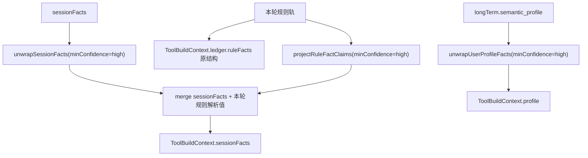

# 记忆系统架构与数据流

**最后更新**：2026-08-12
**代码居所**：`src/memory/`（模块内详细职责见 [`src/memory/README.md`](../../src/memory/README.md)）

> 本文是记忆链路的**唯一完整叙述**：四层结构、字段归属、读写时序、prompt/工具消费、沉淀与排障。
> **一张图看清全部状态存储**见 [memory-and-state.md](./memory-and-state.md)（心智模型层，排障入口）。
> 字段的**证据采信与冲突裁决**不在本文——那是 [候选人档案域架构](./candidate-profile-domain.md) 的域宪法：
> **事实主权归 memory（本文），判断实现归 resolution**。

---

## 1. 设计理念

基于认知科学的记忆分类模型（CoALA 框架），分四类正式层 + 一类旁路：

- **编排层固定读写**——记忆的读取 / 回写是 Agent Loop 的固定前置/后置步骤，**不由 LLM 自主决定**；
- **按需工具补充**——大体量、非每轮必需的记忆（如历史摘要）通过工具按需检索；
- **语义命名**——代码命名体现「这是什么记忆」，而非「存在哪里」；
- **facade 单入口**——编排层只通过 `MemoryService` 读写，不直接操作 Redis / Supabase。

---

## 2. 四层记忆 + 旁路

```
┌─────────────────────────────────────────────────────────────────────┐
│                     Agent Loop（编排层）                              │
│  onTurnStart:  一次性读取四类记忆 + 当轮规则轨识别 → 注入 prompt        │
│  onTurnEnd:    Agent 完成后 → 写会话态 + 触发后置事实提取              │
├──────────── 正式记忆（持久化）────────────────────────────────────────┤
│  短期记忆   chat_messages（Supabase 永久）+ Redis 窗口热缓存           │
│  会话记忆   facts / lastCandidatePool / presentedJobs /               │
│             currentFocusJob / invitedGroups → Redis                   │
│  阶段状态   STAGE 阶段 + 推进来源/时间/原因 → Redis                    │
│  长期记忆   semantic_profile / semantic_job_intent / summary                │
│             → Supabase agent_long_term_memories + Redis 2h 缓存        │
├──────────── 旁路（非持久化）──────────────────────────────────────────┤
│  本轮解析线索      对「本轮 user 最新消息」跑一次规则轨                  │
│                    → 注入本轮 prompt，不作为事实落库                    │
└─────────────────────────────────────────────────────────────────────┘
```

### 2.1 短期记忆（Short-term / Working Memory）

**真相源**是 `chat_messages` 表（Supabase 永久）。业务消息先写该表，memory 模块读取并镜像到 Redis 窗口做热缓存。

读取逻辑（`short-term.service.ts`）：Redis 窗口 → miss 回退 `ChatSessionService.getChatHistory` → 回填 Redis → 注入时间上下文 → 按字符上限裁剪为 `ShortTermMessage[]`。DB fallback 的时间边界与 `historyWindowSeconds` 对齐。

| 限制维度 | 默认值 | 环境变量 |
|---|---|---|
| 最大消息条数 | 60 | `MAX_HISTORY_PER_CHAT` |
| 时间窗口 | 7 天 | `MEMORY_HISTORY_WINDOW_DAYS` |
| 总字符上限 | 12000 | `AGENT_MAX_INPUT_CHARS` |

**空兜底**：WeCom 聚合/重跑时若 Redis/DB 都空，`memory-lifecycle` 用调用方提供的 `currentUserMessage` 构造一条 user fallback，避免 `messages=[]` 抛错。

### 2.2 会话记忆（Session Memory）

Redis，key `facts:{corpId}:{userId}:{sessionId}`，TTL = `sessionTtl`。

```typescript
interface WeworkSessionState {
  facts: SessionFacts | null;                        // 结构化事实（LLM 后置提取）
  lastCandidatePool: RecommendedJobSummary[] | null;  // 每轮覆盖：最后一次 job_list 候选池
  presentedJobs: RecommendedJobSummary[] | null;      // 最近几轮真正发给候选人的岗位
  currentFocusJob: RecommendedJobSummary | null;      // 当前在聊或准备报名的岗位
  invitedGroups: InvitedGroupRecord[] | null;         // 本会话已邀入的兼职群
}
```

`brand_state` 是同一 hash 下的独立字段，写入纪律与 facts 不同——见 [品牌解析域 §7](./brand-resolution.md)。

**合并策略**：`deep-merge.util`——null / undefined / 空串不覆盖旧值，对象递归合并，数组去重合并；`saveFacts` 经 `mergeFactsWithConfidenceGuard`，**跨轮低置信不覆盖高置信**。每字段写入打 `extractedAt`；evidence 经 `truncateEvidence()` 截断 `MAX_FACT_EVIDENCE_CHARS=200` 字。

**新旧结构兼容**：旧裸值读取时被包装成 `confidence='unknown'` / `source='archive'`。

### 2.3 阶段状态（Stage State）

Redis，key `stage:{corpId}:{userId}:{sessionId}`，TTL = `sessionTtl`。

```typescript
interface StageState {
  currentStage: string | null;  fromStage: string | null;
  advancedAt: string | null;    reason: string | null;   // 审计用
}
```

```
trust_building → needs_collection → job_recommendation → interview_arrangement
```

**唯一写入口是 `advance_stage` 工具**。阶段合法性在工具层校验，memory store 不做业务判断。

### 2.4 长期记忆（Long-term Memory）

Supabase `agent_long_term_memories`（每用户一行）+ Redis 整行 2h 缓存，按 `(corp_id, user_id)` **跨 bot 共享**。

#### Profile Facts（身份画像）

```typescript
interface UserProfileFactValue<T> {
  value: T;
  confidence: 'high' | 'medium' | 'low' | 'unknown';
  source: CandidateFactProducer;   // 六章根词汇，见 §5.2
  evidence: string;
  updatedAt: string;
  originSessionId?: string;   // 数据血缘：沉淀该字段的会话（=chatId，唯一对应一个 bot）
  originBotId?: string;       // 数据血缘：沉淀该字段的托管账号 wxid
}
```

- **读取**：每回合 `onTurnStart` 固定注入 `[用户档案]`，只带字段值 / 置信度 / 来源 / 更新日期——**不带 evidence 全文**（evidence 是排障字段）；
- **工具消费**：统一 unwrap，**只传 high**，低/中/未知交给模型判断是否追问；
- **写入**：`ConsolidationService` 沉淀时抽身份字段并打血缘；报名成功经 `writeFromBooking()`；外部补充经 `MemoryService.saveProfile()`。

#### Preference Facts（跨会话稳定意向）

```typescript
const LONG_TERM_JOB_INTENT_FIELD_KEYS = [
  'city', 'district', 'location', 'brands', 'position', 'schedule',
  'salary', 'labor_form', 'schedule_constraint', 'delayed_intent', 'available_after',
];  // 排除单次 episode 临时态：short_term / time_windows / open_position
```

- **覆盖语义是快照式整组覆盖**（最新一段会话的意向赢）——与 session facts 的 deepMerge 累积**刻意不同**：累积会让错值 / 错字变体永远清不掉；
- 唯一写方 `ConsolidationService`；渲染为 `[历史求职意向]`，带更新日期与「本次优先」指引，过期的 `available_after` 不渲染；
- **不进工具预填**，仅供模型参考。

#### Summary（分层压缩的对话摘要）

```typescript
interface SessionSummaries {
  recent: SummaryEntry[];   // 最近 N 条详细摘要（MAX_RECENT_SUMMARIES = 5）
  archive: string | null;   // 更早的被 LLM 压缩合并成一段
  lastSettledMessageAt: string | null;              // 全局兜底的已沉淀边界
  lastSettledBySession?: Record<string, string>;    // 按会话隔离的沉淀边界
}
```

压缩：每次沉淀生成一条 `SummaryEntry` 追加到 `recent` 头部 → `recent.length > 5` 时最早条目移出 → 与现有 `archive` 由 LLM 合并为新 `archive`（≤200 字）。

**不固定注入**：摘要条数不定且越积越多，固定注入浪费 token；由 `recall_history` 工具按需检索。

### 2.5 旁路：本轮解析线索

对「本轮 user 最新消息」跑一次**规则轨**识别（品牌 / 城市 / 用工形式 / 年龄 / 身高体重 / 户籍省份等）。

> **实现不在 memory**：规则轨解析器住 `src/resolution/candidate/*`（每字段唯一解析器），
> claim 生产住 `src/resolution/evidence/producers/rule-track.ts`。memory 只调用与消费。

**关键边界**：

- 只看**当前轮新消息**，不 fallback 到历史窗口；
- 注入本轮 prompt sidecar（`[本轮解析线索]` / `[本轮待确认线索]`）；
- **不写入 Redis / Supabase**——它不是正式记忆层，是当前轮前置解析 sidecar。

当前轮规则识别的持久化路径是 `onTurnEnd.extract_facts` **重新跑同类规则**后经 sessionFacts 写入。

### 2.6 跨会话来源研判

**背景**：长期记忆跨 bot 共享。同一候选人添加多位招募经理时，每个 (候选人, bot) 是独立 chat。长期画像被原样注入新 bot 会话，会让新经理的 Agent 开口就当成「自己之前聊过」。

`detectCrossConversationOrigin` 在**三条同时满足**时置 `longTerm.origin.fromOtherConversation = true`：

1. **仅全新 chat 首聊**（`hasStructuredSessionMemoryState=false`），延续会话不提示；
2. 长期 `semantic_profile` / `semantic_job_intent` 非空；
3. 长期记忆来自别的会话——优先用逐字段血缘（`originSessionId !== 当前 sessionId`），存量无血缘时回退 `lastSettledBySession` / `recent[].sessionId`。

**展示口径是会话级泛指**：插入 `[历史背景｜来自候选人此前在本平台的咨询]`，让模型泛指「此前与另一位招聘顾问沟通过」——**不假装本会话聊过、不点名具体招募经理**。血缘逐字段记录（可精确追溯），但展示不暴露 bot 名。

---

## 3. 字段归属（唯一权威表）

> ⚠️ **本表是全库唯一的字段归属真相源**，随 `session-facts.types.ts` / `long-term.types.ts` 同步。
> 其它文档引用本节，**不要复制表格**——同一张表抄两份必然演化成两个都不对的版本。

### 3.1 `sessionFacts.interview_info`（16 字段，Redis `sessionTtl`）

```
name  phone  gender  gender_source  age  applied_store  applied_position
interview_time  is_student  education  has_health_certificate
experience  upload_resume  height  weight  household_register_province
```

### 3.2 `sessionFacts.preferences`（15 字段，Redis `sessionTtl`）

```
brands  brand_ids  salary  position  schedule  city  district  location
labor_form  delayed_intent  short_term  open_position
time_windows  schedule_constraint  available_after
```

`city` 是 `CityFact = { value, confidence, evidence }`，evidence 枚举 `municipality_compact | explicit_city | unique_district_alias | hotspot_alias`；兼容旧字符串数据自动归一化。

### 3.3 长期沉淀白名单

| 目标 | 字段 | 来源 |
|---|---|---|
| `semantic_profile`（7 个） | `name` `phone` `gender` `age` `is_student` `education` `has_health_certificate` | `USER_PROFILE_FIELD_KEYS`，从 `interview_info` 抽 |
| `semantic_job_intent`（11 个） | 见 §2.4 的 `LONG_TERM_JOB_INTENT_FIELD_KEYS` | 从 `preferences` 抽，整组覆盖 |

**不沉淀的会话级字段**：`applied_store` / `applied_position` / `interview_time`（每次不同）、`experience` / `upload_resume` / `height` / `weight` / `household_register_province`（未列入白名单）、以及 `short_term` / `time_windows` / `open_position`（单次 episode 临时态）。

### 3.4 会话记忆顶层（非 facts）

`lastCandidatePool` / `presentedJobs` / `currentFocusJob`（会话级推导）、`invitedGroups`（会话级副作用）——均在 Redis `sessionTtl`。

---

## 4. 读写时序

### 4.1 onTurnStart

`memory-lifecycle.service.ts` 编排：

```
用户消息到达
  ├── 并行读取：short-term messages（Redis→DB fallback）/ session state / stage state
  │             / semantic_profile / semantic_job_intent / episodic_session_summaries
  ├── 短期窗口空兜底
  ├── 前置规则轨识别：currentUserMessage + brandList → ruleFacts
  ├── 可选 enrichment：options.enrichmentIdentity 提供时向外部系统补全缺失字段
  ├── 跨会话来源研判（§2.6）
  └── 返回 MemoryRecallContext { shortTerm.messageWindow, sessionMemory,
        ruleFacts, procedural, longTerm.{profile,preferences,origin?}, _warnings? }
```

### 4.2 onTurnEnd

```
1. load_previous_state                  ← 先读旧 state，给 consolidation 用
2. 分支 A：consolidation（可选）            ← gap ≥ consolidationGapSeconds 时触发
3. 分支 B：session_turn_end_updates（串行，避免 Redis 状态互覆盖）
   ├── save_candidate_pool
   ├── project_assistant_turn           岗位投影 → presentedJobs / currentFocusJob
   ├── save_attested_city               本轮 geocode 确权城市 → pref.city（source='system'）
   │                                     排在 extract_facts 前，本轮候选人原文可覆盖工具确权；
   │                                     与既有 high 城市冲突时不覆盖，等候选人亲证
   └── extract_facts                    后置 LLM 事实提取（见 §4.3）
4. 每步 success/skipped/failure 写入 message_processing_records.post_processing_status
```

⚠️ **consolidation 刻意使用回合开始前的旧 `sessionFacts`**，不用本轮刚提取的新 facts——沉淀的是「上一段已闭合会话」，用新 facts 会让本轮消息污染上一段摘要边界。

⚠️ **回合收尾必须纳入处理锁**：WeCom 链路用 `deferTurnEnd=true` 让收尾延迟到投递阶段，但**必须在释放 chat 处理锁前 `await` 完成**（`reply-workflow` 的 finally）。否则收尾仍在异步写 session state 时会与下一个 job 并发，整份覆盖写互相丢更新。首次调用若被 replay 丢弃，记忆投影与事实提取一同丢弃——避免「未发出的回复」污染记忆。

### 4.3 extract_facts：sessionFacts 的主写入链路

```
extract_facts
  → trimToCurrentSessionSegment()      按消息间隙截到最近连续会话段，避免跨会话串味
  → 增量回看                            已有 facts 时只看最近 SESSION_EXTRACTION_INCREMENTAL_MESSAGES 条
  → 纯应答闸门                          isPureAcknowledgment 且规则零命中 → 跳过 LLM，复用旧 facts
  → 重跑规则轨 + LLM 结构化提取（并行两轨）
  → mergeRuleAndLlmFacts                单遍合并 + sanitize
  → saveFacts → mergeFactsWithConfidenceGuard → Redis
```

**纯应答闸门的两个例外**（在闸门**之前**计算，因为确认应答恰好就是纯应答词）：

- **确认问答裁决**——Agent 城市确认句 + 纯肯定应答，命中时跳过 LLM 但单写 `pref.city`；
- **定位分享逆解析**——定位分享轮由 `buildLocationShareCityFact` 入档。

**提取原则是增量式**（补充 / 纠正，非累积重抽）；prompt 注入 `[当前时间]` 做时间锚定（相对时间换算绝对日期）+ `[已确认事实]`。

**可观测**：LLM 提取降级（异常兜底为纯规则结果）落 `extract_facts_llm_degraded` 步骤到 `post_processing_status`。

### 4.4 会话沉淀（Settlement）

```
detectAndSettle(): chat_messages 中出现 gap ≥ consolidationGapSeconds
  ├── 边界判定：lastSettledBySession[sessionId] → 缺失回退全局 lastSettledMessageAt
  │             分页扫描边界后消息（每页 500，最多 10 页）
  ├── 身份字段 → semantic_profile    从 Redis sessionFacts 抽（已校验/清洗过的结构化事实）
  │                               每条打 originSessionId + originBotId 血缘
  │                               字段级合并，已有 high 不被非 high 覆盖
  ├── 稳定意向 → semantic_job_intent  整组覆盖写入，同样打血缘
  ├── 对话摘要 → Summary          边界后到旧会话断点的消息（截尾最近 120 条）+ facts 意向
  │                               → LLM 生成 ≤100 字摘要
  │                               → RPC append_long_term_summary_atomic（行锁内）
  │                               → RPC mark_long_term_settled_boundary（带 p_session_id）
  └── 不反写 Redis 会话态；Redis key 自然过期
```

**沉淀边界按会话隔离**——双 bot 服务同一候选人时不再互相推进彼此边界。

---

## 5. 置信度与来源词汇

### 5.1 置信度

| 值 | 含义 | 工具消费 |
|---|---|---|
| `high` | 可程序化采用。来自确定性规则、明确结构化输入，或经过强校验的事实 | **默认消费** |
| `medium` | 可给模型参考。通常来自 LLM 提取、会话沉淀或外部补全 | 默认不消费 |
| `low` | 弱参考。来自系统兜底、弱规则或补充接口 | 不消费 |
| `unknown` | 旧数据或缺少元数据的兼容值 | 不消费 |

权威定义在 `confidence-rank.ts`（会话层与长期层共用；DB RPC `long_term_profile_confidence_rank` 是其 SQL 镜像）。

### 5.2 来源六章根词汇

`CandidateFactProducer` 是全库唯一定义（`resolution/evidence/claim.types.ts`）：

| 值 | 含义 |
|---|---|
| `candidate_quote` | 候选人直接明示且经原话复算或答问绑定确认 |
| `rule` | 确定性规则、正则、白名单或别名表匹配得到 |
| `model` | LLM 结构化提取或模型工具入参 |
| `system` | 外部系统或平台接口补充得到（含 geocode 确权、报名回填、enrichment） |
| `manual` | 真人经理带外裁决 |
| `archive` | 历史记忆或跨会话档案回放得到 |

> **存量数据兼容**：`LEGACY_PROFILE_FACT_PRODUCERS` 把 `candidate` / `llm` / `memory` / `derived` /
> `tool` / `booking` / `extraction` / `enrichment` 八个值映射进上表——**只在读存量数据时出现，写入侧只用六章**。
> 取名与待遇判据见 [候选人档案域 §5.1](./candidate-profile-domain.md)。

⚠️ `gender_source` 已进入两刀拆除批 A：活跃写入停止，当前仅保留为 3 天旧存量的兼容 sibling。消费方优先读取 `gender` 信封：`candidate_quote`=候选人自陈，`system+非 high`=系统标签（不得用于直接排除候选人），`system+high`=报名办结确权；仅当信封尚无新语义时回退该 sibling。批 B 待存量 TTL 清零后删除 schema 键与兼容读。

---

## 6. Prompt 消费

`PreparationService` 先构造 `memoryBlock`，再交 `ContextService.compose()` 组装 system prompt。**保留字段 metadata**，让模型知道「这个字段从哪来、可信到什么程度」。

| Prompt 段 | 来源 | 内容 |
|---|---|---|
| `[历史背景｜来自候选人此前在本平台的咨询]` | `longTerm.origin` | 仅全新 chat 首聊且长期记忆来自别的会话时渲染（§2.6） |
| `[用户档案]` | 长期 `semantic_profile` | 值 + 置信度 + 来源 + 更新日期（**不带 evidence 全文**）+ **展示出处门**：历史沉淀字段预填/复述必须披露来源并请候选人确认，否认即弃用 |
| `[历史求职意向]` | 长期 `semantic_job_intent` | 稳定意向 + 更新日期 + 「本次优先」指引 |
| `[会话记忆]` | Redis `sessionMemory` | sessionFacts、岗位池、已展示岗位、当前焦点岗位、已邀群 |
| `[本轮解析线索]` | 当前轮规则轨 | 与会话记忆**不冲突**的当前消息解析候选；不构成候选人事实 |
| `[本轮待确认线索]` | 规则轨 + sessionFacts | 与中高置信会话事实**冲突**的线索 |
| `[本轮查询硬约束]` | high sessionFacts + high 规则轨 | 查岗必须带的 city / district / age / schedule 等 |

原则：**所有字段都可以展示，但必须带置信度和证据**。模型可参考低/中置信字段，但筛人、约面、booking 等硬判断要依赖工具和高置信输入。

注入形态示例（`fact-lines.formatter.ts` 统一渲染，`includeEvidence` 默认 false）：

```text
- 年龄: 24（置信度: high，来源: rule，更新日期: 2026-06-11）
```

### 6.1 解析线索 vs 待确认的分野

| 段 | 判断逻辑 | 模型应该怎么用 |
|---|---|---|
| `[本轮解析线索]` | 会话中没有旧值，或与会话中 `minConfidence=medium` 的旧字段一致 | 可辅助理解本轮意图，不可据此提交候选人资料 |
| `[本轮待确认线索]` | 与会话中 `minConfidence=medium` 的旧字段**冲突** | 只能用于判断是否澄清，**不能直接覆盖旧记忆** |

冲突判断：标量 trim 后比较；布尔比值；数组去空去重排序后比较；复杂对象按 JSON 比较；城市比 `CityFact.value`。

> 门槛取 `medium` 而非 `high`：medium 虽不进工具硬判断，但对模型已是需要尊重的会话记忆，**不能被当前轮弱理解无声覆盖**。

### 6.2 查询硬约束

`HardConstraintsSection` **只用高置信字段**：sessionFacts unwrap `minConfidence=high` + 规则轨 filter `confidence=high`。

合并规则：查询视图中，**当前轮满足阈值的规则解析值优先覆盖旧 session 值**；本轮无该字段线索时沿用 session 值。该合并只服务查询，不改变候选人事实出处。

| 硬约束字段 | 为什么是硬约束 |
|---|---|
| `city` | 不带城市会跨城查岗 |
| `district` | 不带区域会明显扩大到错误区域 |
| `location` | 商圈/地标/街道需要 geocode 或位置分享经纬度 |
| `age` | 影响岗位年龄边界 |
| `schedule` | 班次不匹配会造成到店后不符 |
| `salary` | 薪资明显低于预期不能推荐 |

参考信息字段（非硬约束）：`gender`（结合招聘要求筛掉明显不符岗位）、`brands`（无结果时可放宽）、`position`、`labor_form`（只作结果过滤，**不填进岗位类别**）、`is_student`（**不得由缺省反推接受学生**）、`has_health_certificate`、`education`、`open_position`、`short_term`、`delayed_intent`、`time_windows`、`schedule_constraint`、`available_after`。

---

## 7. 工具消费

工具**默认只消费高置信字段**，避免低/中置信事实参与筛人、约面、booking 这类程序化判断。



| 字段 | 内容 | 置信度策略 |
|---|---|---|
| `profile` | 长期 `semantic_profile` unwrap 后的裸值 | 只保留 `high` |
| `sessionFacts` | session facts unwrap 后再叠加本轮规则解析值 | 只保留 `high`；**当前轮覆盖旧值** |
| `ledger.ruleFacts` | 当前轮原始 claim wrapper | 原结构保留，工具按用途自行判断；不得把 producer 当成事实权威 |
| `currentFocusJob` | 当前焦点岗位 | 会话级状态 |
| `recentBrandPool` | 最近展示/推荐/焦点岗位品牌去重 | 给品牌别名回指使用 |

**prompt 层与工具层必须同口径**：两处都是「本轮满足查询阈值的非空解析值覆盖旧 session 高置信」。两处口径若不一致，会出现候选人刚说「我 24」、precheck 拿到 24 而 prompt 硬约束段仍念旧值的自相矛盾。跨轮冲突提醒由 `[本轮待确认线索]` 承担。

### 7.1 precheck 字段来源规则

`duliday_interview_precheck` 构造 `knownFieldMap` 的优先级：

```
显式工具入参  >  本轮规则解析值  >  高置信 session/profile
```

允许显式传入：`candidateAge` / `candidateInterviewTime` / `candidateGender` / `candidateEducation` / `candidateHasHealthCertificate` / `candidateIsStudent`。

⚠️ **姓名和电话不作为显式入参**——它们来自 `profile/sessionFacts`，并由姓名闸判断是否像真名（HC-2：模型参数单独不构成权威）。

模型漏传时本轮规则解析值会兜底，但**设计上不能依赖兜底替代显式入参**。

年龄规则：`pass`（符合）/ `boundary`（弹性边界内可继续）/ `hard_reject`（`nextAction='age_rejected'`，禁止继续收资/约面/booking）/ `unknown`（按正常收资处理）。

---

## 8. 工具策略

| 工具 | 记忆类型 | 操作 | 保留原因 |
|---|---|---|---|
| `advance_stage` | 阶段状态 | 写入 | 只有 LLM 能判断阶段推进时机 |
| `recall_history` | 长期（summary） | 读取 | 历史摘要按需检索，避免 token 浪费 |
| `invite_to_group` | 会话（invitedGroups） | 写入 | 群邀请是 LLM 决策触发的副作用，发卡后需回写 |

**刻意不提供**：`memory_recall`（编排层已固定注入全部当前记忆，无需工具再拉）、`memory_store`（编排层统一结构化写回，LLM 随意写会格式不一致）。

> 设计原则：**编排层保证 LLM 一定知道「当前状态」，工具让 LLM 可以主动「翻阅历史」或「登记副作用」。结构化写入由编排层统一控制。**

---

## 9. 服务周期与时间常量

多个时间参数围绕同一业务概念——**单次求职服务周期**（候选人打招呼到上岗，典型 1~7 天）。**空闲超时判定**：连续两条消息时间差达 `consolidationGapSeconds` 即认为前一段会话已结束。

| 常量 | 默认值 | 环境变量 | 说明 |
|---|---|---|---|
| `sessionTtl` | 2 天 | `MEMORY_SESSION_TTL_DAYS` | Redis 会话级数据 TTL；常见环境配 3 天 |
| `consolidationGapSeconds` | 1 天 | `MEMORY_SETTLEMENT_GAP_DAYS` | 消息间隔达此值触发旧会话沉淀 |
| `historyWindowSeconds` | 7 天 | `MEMORY_HISTORY_WINDOW_DAYS` | 短期窗口 DB fallback 回查边界 |
| `sessionWindowMaxMessages` | 60 | `MAX_HISTORY_PER_CHAT` | 短期记忆最大消息条数 |
| `sessionWindowMaxChars` | 12000 | `AGENT_MAX_INPUT_CHARS` | 超限从最早消息开始裁剪 |
| `sessionExtractionIncrementalMessages` | 10 | `SESSION_EXTRACTION_INCREMENTAL_MESSAGES` | 已有 facts 时后置提取只重看最近 N 条 |
| `longTermCacheTtl` | 2h | — | 长期记忆整行 Redis 缓存（硬编码） |
| `MAX_RECENT_SUMMARIES` | 5 | — | `summary.recent` 上限（溢出压缩进 archive） |

**核心约束**：`sessionTtl` / `consolidationGapSeconds` / `historyWindowSeconds` 已分离——Redis 存活、沉淀判定、DB 回查窗口分别调优。

---

## 10. 存储后端与表结构

| 记忆类型 | 后端 | Key | TTL | 写入策略 |
|---|---|---|---|---|
| 短期 | Supabase `chat_messages` + Redis 窗口 | `chat_id` / `session:{id}` | 永久 / 会话级 | 业务写表，memory 镜像 Redis |
| 会话 | Redis | `facts:{corpId}:{userId}:{sessionId}` | `sessionTtl` | deepMerge + 置信度守卫 |
| 程序 | Redis | `stage:{corpId}:{userId}:{sessionId}` | `sessionTtl` | 覆盖写 |
| 长期 | Supabase `agent_long_term_memories` + Redis | `(corp_id, user_id)` 唯一 | 永久 / 2h 缓存 | profile 字段级合并；preference 整组覆盖；summary 分层压缩 |

`agent_long_term_memories` 每用户一行，唯一约束 `(corp_id, user_id)`：

| 字段 | 类型 | 说明 |
|---|---|---|
| `id` / `corp_id` / `user_id` | uuid / string / string | 主键与身份 |
| `semantic_profile` | jsonb | 7 个身份字段，每个为 fact wrapper 或 null |
| `semantic_job_intent` | jsonb? | 跨会话稳定意向，快照式整组覆盖 |
| `episodic_session_summaries` | jsonb? | `{ recent, archive, lastSettledMessageAt, lastSettledBySession }` |
| `message_metadata` | jsonb? | `{ botId, imBotId, imContactId, contactType, contactName, externalUserId, avatar }` |
| `created_at` / `updated_at` | timestamptz | — |

---

## 11. 排障检查顺序

**「模型没用上某个字段」**：

1. 当前轮规则轨是否识别出该字段，且 `confidence=high`；
2. system prompt 的 `[本轮解析线索]` / `[本轮待确认线索]` 是否展示了它；
3. `ToolBuildContext.sessionFacts` 是否已把本轮满足查询阈值的规则字段叠加进去；
4. 工具是否只读了显式入参、没读 context 兜底；
5. precheck 场景：模型是否应显式传 `candidateAge` 等；
6. Redis `sessionFacts` 中该字段是否存在但**置信度不是 high**，被 unwrap 过滤；
7. 长期画像场景：`semantic_profile` 是否为 high（非 high 不进工具 `profile`）；
8. 沉淀场景：Redis `sessionFacts` 是否已过期——**过期后 summary 仍可写，但 semantic_profile 无法从过期 facts 恢复**。

**「模型用了不该用的字段」**：

1. 字段是否来自 `[用户档案]` 的 low/medium/unknown，模型误当硬事实；
2. 字段是否在 `[本轮待确认线索]`，模型没先确认就覆盖旧记忆；
3. 字段是否被错误纳入 `[本轮查询硬约束]`；
4. 工具是否没设 `minConfidence=high` 就 unwrap；
5. `sessionFacts` 旧裸值被兼容成 `unknown/archive`，却被消费方当成 high。

---

## 12. 实现入口

| 关注点 | 代码位置 |
|---|---|
| 对外 facade | `src/memory/memory.service.ts` |
| 回合生命周期编排 | `src/memory/services/memory-lifecycle.service.ts` |
| sessionFacts 写回与抽取编排 | `src/memory/services/session.service.ts` |
| 会话沉淀 | `src/memory/services/consolidation.service.ts` |
| 长期画像写入 | `src/memory/services/long-term.service.ts` |
| 抽取提示词 | `src/memory/services/session-extraction.prompt.ts` |
| fact wrapper 类型与 unwrap | `src/memory/types/session-facts.types.ts` / `long-term.types.ts` |
| 置信度序 | `src/memory/types/confidence-rank.ts` |
| 字段行渲染 | `src/memory/formatters/fact-lines.formatter.ts` |
| 规则轨解析器（每字段唯一） | `src/resolution/candidate/*` |
| 规则轨 claim 生产 | `src/resolution/evidence/producers/rule-track.ts` |
| rule×LLM 合并与准入门 | `src/resolution/evidence/merge.ts` / `admission.ts` / `admission-gates.ts` |
| prompt 组装 | `src/agent/generator/context/context.service.ts` |
| 本轮线索 / 待确认线索 | `src/agent/generator/context/sections/turn-hints.section.ts` |
| 查询硬约束 / 参考信息 | `src/agent/generator/context/sections/hard-constraints.section.ts` |
| 工具上下文合并 | `src/agent/generator/preparation.service.ts` |
| precheck 字段消费 | `src/tools/duliday-interview-precheck.tool.ts` |

---

## 13. 设计边界

- **memory 只持有事实，不实现字段判断**——判断规则住 `resolution`，memory 负责「什么时候裁、拿什么裁、裁完归谁、留多久」；
- **编排层固定读写，LLM 不能自主决定记什么**——工具只能翻阅历史（`recall_history`）或登记副作用（`invite_to_group`）；
- **旁路不落库**——`ruleFacts` 是本轮解析线索 sidecar，持久化必须走 `extract_facts` 的证据与准入链；
- **存储格式与裁决通货解耦**——`SessionFactValue` / `UserProfileFactValue` 是纯落盘格式，裁决语义在 claim（见 [候选人档案域 §5.2](./candidate-profile-domain.md)）。

---

## 相关文档

- [记忆与状态全局视图](./memory-and-state.md) — 三角色心智模型 + 存储实现清单（排障入口）
- [候选人档案域架构](./candidate-profile-domain.md) — 域宪法：事实主权 vs 判断实现
- [Agent 运行时架构](./agent-runtime-architecture.md) — 回合模型与运行时硬约束
- [品牌解析域](./brand-resolution.md) ｜ [地理解析域](./geo-resolution.md) ｜ [图片信息链路](./visual-fact-pipeline.md)
- [`src/memory/README.md`](../../src/memory/README.md) — 模块内部职责分解
