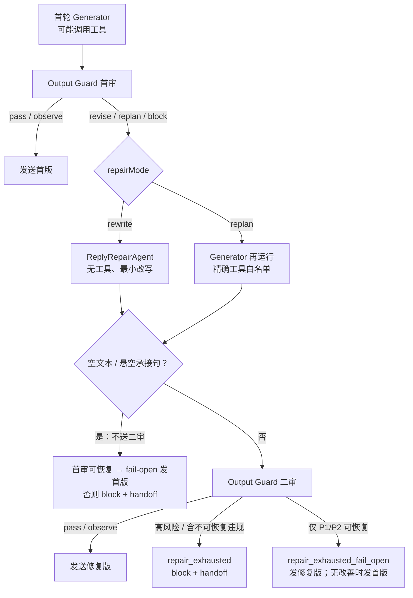

# Repair 与 Replan 链路设计分析

> 状态：v2（代码核查修订）
> 编写日期：2026-07-15（v1 同日；v2 对照 `src` 实现逐条核实后修订）
> 核心入口：`src/agent/runner/agent-runner.service.ts` 的 `invokeReviewed()`

**v2 修订要点**（相对 v1）：

1. 术语对齐代码：repair 是修复总称，`repairMode ∈ {rewrite, replan}`，首审 block 也会先修一次；
2. 修正 8.1 的影响面：污染的是岗位记忆投影（presentedJobs / currentFocusJob），不是"违规原文进入下一轮 recall"；
3. 收窄 8.2、8.6：修复上下文读取已有降级、空产物仅 block 分支跳过归档；
4. 补齐三处遗漏：空/悬空产物不送二审、修复自制 `internal_output_leak` 的回退路径、replan 的 toolMode 降级；
5. 新增 8.7：replan 换绑 turn-end 后首轮 turnState 被丢弃（与 8.1 互为镜像）；
6. 8.2、8.5 的建议收敛为可直接落地的最小方案。

## 1. 结论摘要

当前出站守卫后的恢复链路，整体采用了正确的分层设计：把"文本表达错误"和"事实或执行计划错误"拆成两条成本、权限不同的恢复路径。代码里统称 **repair**（受控修复，硬上限 1 次），由裁决携带的 `repairMode` 决定执行器：

- `rewrite`：由独立修复模型（`ModelRole.Repair`）对原回复做最小必要改写，不允许调用工具。
- `replan`：重新运行 Chat Agent，只开放命中规则明确登记的工具白名单，用新证据重新生成回复。

修复产物（空/悬空除外）必须再次经过 Output Guard 二审。这个方向能够控制循环、成本和副作用风险，但当前实现仍存在一个严重的记忆投影一致性缺口（8.1），以及修复执行异常降级（8.2）、replan 权限硬边界（8.3）、fail-open 判定与粒度（8.4、8.5）等问题。

## 2. 总体流程

首审的三种不可发送裁决（revise / replan / block）**都会先进入这一次受控修复**——block 也先修一次自救，救不活才静默（见规则目录的准入治理说明）。



二审还有一条特例回退路径（修复自己制造 `internal_output_leak`），见 6.3。

## 3. 两条链路对比

| 维度 | rewrite | replan |
| --- | --- | --- |
| 适用问题 | 措辞、敏感信息、承诺口径、格式泄漏 | 岗位事实错误、品牌错误、图片事实未保存、需要重新查证 |
| 执行器 | 独立 `ReplyRepairAgent`（`ModelRole.Repair` 轻量模型） | 复用完整 `GeneratorAgent` |
| 工具权限 | 完全无工具 | 规则/语义策略登记的精确白名单 |
| 主要输入 | 原回复、违规项、工具事实、记忆上下文 | 原始对话、违规项、允许工具、已提交副作用摘要 |
| 执行成本 | 一次轻量模型请求 | 完整 preparation、Agent 循环和工具调用 |
| 预期产物 | 原回复的最小改写 | 基于重新查询结果生成的新回答 |
| 修复上限 | 1 次 | 1 次 |
| 修复后二审 | 必须（空/悬空产物例外，见 6.2） | 同左 |
| turn-end 归属 | 继承首轮闭包（8.1 的根因） | 换绑第二次运行（8.7 的根因） |

## 4. Rewrite 链路

### 4.1 触发和执行

首审判定 `repairMode === 'rewrite'` 后，runner 不再运行完整 Chat Agent，而是调用独立的 `ReplyRepairAgent`。

相关实现：

- `src/agent/runner/agent-runner.service.ts`
- `src/agent/reply-repair/reply-repair.agent.ts`
- `src/agent/reply-repair/reply-repair-context.provider.ts`

Repair Agent 接收：

- 被拦截的原始回复；
- 结构化违规项和修改建议；
- 本轮工具事实；
- 红线和命中的出站规则；
- 最近对话、候选人事实、画像、历史意向、相关岗位和群资源；
- 本轮已经成功执行、不可撤销的副作用摘要。

### 4.2 权限边界

Repair Agent 没有任何工具，并在 system prompt 中明确禁止：

- 规划或模拟工具调用；
- 输出工具名、JSON 或代码块；
- 承诺"稍后查询"等本轮无法兑现的动作；
- 新增工具事实和修复上下文之外的信息。

这使 rewrite 适合处理以下问题：

- 删除户籍、民族、婚育等敏感拒绝理由；
- 删除名额承诺或内部系统信息；
- 修正语气、表达和流程口径；
- 保留已经成功预约等不可撤销事实，只修改候选人可见文本。

### 4.3 上下文控制

Repair 上下文做了显式容量限制：

- 最近消息最多 8 条；
- 事实最多 40 行；
- 相关岗位最多 6 个。

这能避免把完整主 Agent 上下文复制到修复模型，控制 token、延迟和噪声。

## 5. Replan 链路

### 5.1 触发和执行

首审为 replan 时，runner 重新调用 `GeneratorAgent`：

```ts
toolMode: params.toolMode === 'none' ? 'none' : 'scenario'
allowedToolNames: repairAllowedToolNames
```

第二次 Generator 会收到结构化违规反馈（`reviseFeedback`）和已经提交的副作用摘要，并按允许的工具重新核实事实。

注意 toolMode 会被统一改写成 `scenario`（`none` 除外）：即使调用方原本是主动回合的 `readonly`，物理只读屏障在 replan 内也被工具白名单取代——白名单成为唯一防线（风险展开见 8.3）。

### 5.2 工具授权来源

确定性规则通过 `output-rule-catalog.ts` 声明 `repairToolNames`。当前登记的场景：

- `requested_brand_mismatch`（指定品牌却推荐了其它品牌）：允许 `geocode`、`duliday_job_list`；
- `image_description_not_saved`（使用了图片事实但没有保存描述）：允许 `save_image_description`。

语义审查 finding 通过 `SEMANTIC_REVIEW_FINDING_POLICIES` 静态映射到恢复工具（含 `duliday_interview_precheck`）。

调用方显式给出 `allowedToolNames` 时，runner 会与规则白名单取交集，避免 repair 借机扩大调用方权限；未给出时（入站与主动回合的常态），规则白名单原样生效。

### 5.3 事实连续性

replan 完成后，二审使用的工具调用集合为：

```text
首轮工具调用 + replan 工具调用
```

这使 Output Guard 能看到完整事实链。同时，首轮已经成功执行的 booking、拉群等副作用会被压缩为既成事实提示，要求 replan 不得声称动作未发生，也不得重复执行。

但**轮内 turnState 不合并**：采纳 replan 结果时，记忆收尾用的是第二次运行的 turn-end 与 turnState，首轮的候选池等状态被整体丢弃（见 8.7）。

### 5.4 "只读"的实际含义

当前文档中常把 replan 描述为 readonly，但实现上更准确的名称应是 `scoped replan`：

- 查岗、地理解析属于只读；
- `save_image_description` 会写入图片描述，是受控的状态投影写操作；
- 权限安全完全依赖精确工具白名单，而不是 `readonly` 工具模式（5.1 已说明 toolMode 会被改写）。

## 6. 共同的安全和降级机制

### 6.1 Hard cap

无论 rewrite 还是 replan，最多修复一次。二审不会继续触发第三次生成，从而避免：

- 无限修复循环；
- 无界 token 和模型成本；
- 重复工具调用；
- 时延持续扩大。

### 6.2 空文本和悬空回复

修复结果为空，或者只生成"我帮你查一下"等没有后续结果的悬空承接句时，不会发给候选人，也**不送二审**——二审只查规则违规，会放行悬空文本。直接按首审风险收敛：

- 首审可恢复（非高风险且全部违规可恢复）：fail-open 发送首版，reasonCode 为 `repair_unusable_fail_open`；
- 否则：block（`revise_empty` / `revise_dangling`）+ handoff 告警。

### 6.3 二审与风险分级

正常修复产物再次经过完整 Output Guard：

- 二审通过或仅 observe：发送修复版；
- 二审仍为高风险或包含不可恢复违规：`repair_exhausted`，最终 block + handoff；
- 二审仅剩 P1/P2 可恢复违规：`repair_exhausted_fail_open`——默认发送修复版；若首审的 `blockedRuleIds` 在二审中全部原样保留（`isSecondDecisionNoBetter` 判定"无改善"），回退发送首版；
- 特例：修复产物**新制造**了 `internal_output_leak` 类 block（修复模型泄漏内部实现的典型形态）且首审本身可恢复时，直接回退首版（`repair_unusable_fail_open`）。

### 6.4 副作用保护

首轮已经成功执行的副作用不能撤销。系统会把这些动作摘要后提供给修复链路，避免修复文本：

- 声称预约、拉群等动作没有发生；
- 再次调用同一个副作用工具；
- 给出与真实业务状态冲突的结论。

## 7. 设计优点

### 7.1 按错误性质分级恢复

文本错误不值得重跑完整 Agent。事实错误又不能只靠改写掩盖。当前设计把两者拆开，避免了"一律重新生成"的高成本和高副作用风险。

### 7.2 最小权限

replan 工具由规则声明，runner 只负责聚合和取交集。新增规则不需要在 runner 中继续添加 ruleId 分支。

### 7.3 证据驱动

Repair Writer 只能使用工具事实和修复上下文；replan 则通过重新调用白名单工具产生新证据。两条链路都尽量避免模型凭空自证。

### 7.4 双重审查

修复模型本身仍可能产生新问题，因此修复结果必须二审。空文本和悬空回复还在二审前被专门识别。

### 7.5 可观测性

正常路径会记录：

- 首审裁决；
- repair 模式；
- 修复后回复；
- 二审裁决；
- 最终决策和 reasonCode；
- 已提交副作用摘要。

例外是"空产物 + block"分支的档案缺失，见 8.6。

## 8. 当前主要问题

### 8.1 P0：rewrite 后记忆投影仍按首版文本执行

这是当前最需要优先修复的问题。

**机制**：Generator 的 `attachTurnEnd` 在生成完成时把 `result.text` 按值捕获进 `runTurnEnd` 闭包；rewrite 采纳修复版时，runner 的 `buildRepairedResult` 只替换 `result.text` 和 `responseMessages` 的文本部分，继承的 `runTurnEnd` 仍持有首版文本。渠道投递修复版后触发 `TurnFinalizer.settle({ delivered: true })`，记忆收尾用的还是首版。

**影响面**（按 `assistantText` 在记忆收尾中的真实消费链界定）：

- 唯一消费者是 `projectAssistantTurn`（岗位记忆投影）。它不存原文，而是拿回复文本与候选池匹配，推导「已展示岗位 presentedJobs」和「当前锁定岗位 currentFocusJob」；
- 因此污染形态是：**首版展示过的岗位被记成"已展示/已锁定"**（例如被拦下的错误岗位成为 currentFocusJob，可能误导后续轮次的报名对象），而**修复版真正展示的岗位反而漏记**（"已推荐岗位"的去重与回指失真）；
- 容易误判的边界：违规话术、错误承诺的**原文不会**经此进入下一轮 recall——事实提取只消费输入侧消息，短期对话窗口存的是渠道实际投递的文本。

replan 不存在这个文本问题：第二次 Generator 会 attach 新的 turn-end（但有镜像缺口，见 8.7）。

**建议**：

- 让 `runTurnEnd` 支持"最终采纳文本"覆盖，或在采纳修复版时重绑 turn-end。覆盖语义必须以**最终采纳文本**为准：二审 fail-open 无改善回退首版的分支里，闭包里的首版文本恰好是对的，不能无条件覆盖为修复版；
- 增加回归测试：实际投递哪个版本，`MemoryService.onTurnEnd` 收到的正文就必须是哪个版本。当前 runner spec 覆盖了修复链路的全部分支，唯独没有这条断言。

### 8.2 P1：修复执行异常缺少链路内降级

真正无异常边界的是两个执行点：

- rewrite 的修复模型调用（`ReplyRepairAgent.repair` → `llm.generate`）；
- replan 的第二次 `generator.invoke`（含其 preparation 记忆召回）。

两者抛错会让整个 `invokeReviewed()` 抛出，且**首审记录一并丢失**——`persistReviewRecord` 在修复完成后才执行。

不属于该问题的（已有降级，勿重复处理）：rewrite 的修复上下文读取（`buildReplyRepairContext`）已 try/catch 降级为 undefined；工具异常在本仓库普遍被工具内部捕获为错误结果返回，不必然上抛。

**影响**：

- 被动会话退回渠道 fallback；
- 主动回合收敛为 skipped；
- 守卫档案对这次修复失败完全无记录。

**建议**：

- 给两个执行点加异常边界，降级语义**复用现有 fail-open eligibility**（与 6.2 空产物同构）：首审为高风险或含不可恢复违规 → fail-close block + handoff；否则 fail-open 投递首版；
- 统一落 `repair_execution_failed` 档案（含阶段、模型、耗时），保住首审记录。

### 8.3 P1：replan 白名单没有工具类别硬校验，且 toolMode 被降级

两个事实叠加放大了风险：

- runtime 只按字符串白名单过滤工具。规则或语义策略若错误登记了 booking、拉群、取消类工具，它就会被真实暴露；
- replan 把 toolMode 统一改写成 `scenario`（见 5.1）——主动回合的 `readonly` 物理屏障在 replan 内不复存在，白名单是唯一防线。

目录测试目前只断言 replan 规则的工具列表非空，不校验工具类别。

**建议分两步**：

1. 立即可做：运行时与目录测试各加一条断言——`repairToolNames`（含语义策略映射）与现有 `SIDE_EFFECT_TOOLS` 集合的交集必须为空。复用现成集合，一行成本，先把底兜住；
2. 完整方案：给工具注册信息增加能力元数据，runner 强制交集：

   ```ts
   repairCapability: 'read' | 'projection_write' | 'forbidden'
   ```

   - 查岗、地理解析：`read`；
   - 保存图片描述：`projection_write`；
   - booking、拉群、取消、改期：永久 `forbidden`。

### 8.4 P1：纯语义违规的"是否改善"判断失效

fail-open 时，runner 用 `blockedRuleIds` 判断修复版是否没有改善。但 `blockedRuleIds` 只来自确定性规则，纯 LLM semantic finding 不会进入该集合——首审为纯语义违规时，"无改善"判定恒为否，fail-open 一律发送修复版，即使修复在同一语义维度上变得更糟也无从识别。

**建议**：改为比较标准化 violation 集合：

- `type`；
- `severity`；
- `recoverability`；
- `evidencePath`；
- `riskLevel`。

### 8.5 P1：全局 P1/P2 fail-open 粒度过粗

当前二审仍失败时，只要不是高风险且全部可恢复，就会 fail-open。但不同 P1/P2 规则的业务风险差异较大：

- 语气问题可以发送修复版；
- `requested_brand_mismatch` 在二审"无改善"时会回退首版——等于把跨品牌错误推荐原样发出，"发首版 = 发错误事实"；
- 图片事实没有保存却继续推进报名，也不适合统一 fail-open。

**建议**：完整的逐规则 `exhaustedPolicy`（`send_first | send_revised | safe_fallback | block`）在当前仅 ~10 条规则的现状下偏重。先给"发首版即发错误事实"的规则（`requested_brand_mismatch` 一类）加 `never_send_first` 语义即可覆盖已知实例，其余维持全局策略，待规则数量增长后再考虑完整方案。

### 8.6 P2：空修复产物在 block 分支不落审查档案

精确边界：

- 空产物 + 首审可 fail-open：**已归档**（带合成的 `revise_empty` 决策步骤）；
- 悬空产物：两个分支都**已归档**；
- 空产物 + 首审不可 fail-open（block）：`revisedDecision` 为空，`persistReviewRecord` 的完整性校验直接跳过，**整条档案（含首审步骤）不落库**，`revise_empty` 只剩日志可查。

**建议**：给 repair attempt 增加独立执行状态，空产物用合成步骤归档（与 fail-open 分支同构），不再依赖"必须有二审决策"的完整性校验：

```ts
repairExecutionStatus:
  | 'succeeded'
  | 'empty'
  | 'dangling'
  | 'model_failed'
  | 'tool_failed'
```

### 8.7 P2：replan 换绑 turn-end 后，首轮 turnState 被整体丢弃

replan 采纳第二次运行结果时，turn-end 连同其 turnState（candidatePool、imageBrandResolutions）一起换成第二次运行的，首轮闭包永不触发。若 replan 白名单不含查岗工具（如 `image_description_not_saved` 只开 `save_image_description`），首轮查岗形成的候选池不会写入 session，记忆按上一轮的旧池做投影。

当前两条 replan 规则下影响有限（品牌 replan 会重新查岗，图片 replan 的回复通常不引用首轮岗位），列为 P2。但它与 8.1 是同一条不变式的两面——**采纳哪个版本，就沉淀哪个版本的完整轮内状态**——修 8.1 时应一并补断言，避免只修文本半边。

## 9. 推荐改造顺序

### 第一优先级

修复 8.1：turn-end 支持最终采纳文本，保证"候选人实际收到的内容"与"记忆投影依据的内容"完全一致；同步补 8.7 的 turnState 归属断言。

### 第二优先级

修复 8.2 + 8.6：为两个修复执行点增加异常边界（降级复用 fail-open eligibility），并以 `repair_execution_failed` / `repairExecutionStatus` 把修复失败完整归档——覆盖执行异常与空产物两类缺口。

### 第三优先级

修复 8.3：先落 `SIDE_EFFECT_TOOLS` 交集断言兜底，再建立工具级 `repairCapability` 元数据并在 runtime 强制校验。

### 第四优先级

修复 8.4：统一首审和二审的 violation identity，基于标准化违规集合判断修复是否真正改善。

### 第五优先级

修复 8.5：为"发首版即发错误事实"的规则加 `never_send_first`，视规则规模再评估完整的逐规则 `exhaustedPolicy`。

## 10. 建议补充的指标

建议分别按 `rewrite` 和 `replan` 统计：

- 触发量和触发率；
- 首审规则 / semantic finding 分布；
- 修复成功率；
- `repair_exhausted`、`repair_unusable_fail_open`、`repair_execution_failed` 比例；
- 首版、修复版、最终发送版三者的选择分布；
- repair 模型延迟和 token；
- replan preparation、模型、工具的分段延迟；
- replan 工具调用数和失败率；
- 修复制造的新违规比例；
- 实际发送文本与 turn-end 记忆文本的一致率（8.1 的长期守护指标）。

## 11. 最终评价

Repair（rewrite / replan 两种模式）的分层本身是合理的：

- 文本问题走无工具小链路；
- 事实问题走带精确能力授权的重规划；
- 两者都有一次硬上限，正常产物必经二审；
- 已发生副作用被视为不可撤销事实。

在继续扩大守卫覆盖面之前，应先解决 rewrite 的记忆投影一致性问题，并补齐修复执行失败和 replan 权限的硬边界。否则守卫虽然修正了当前候选人可见回复，错误首版仍会通过岗位投影污染后续回合——锁定错误岗位、漏记真实推荐——形成隐蔽的跨轮偏差。
