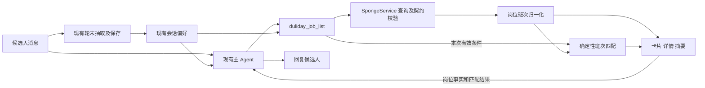

# 班次理解与岗位匹配架构

**日期**：2026-10-09　**状态**：分支实现，待 PR 合并部署　**负责人**：蛋糕研发；海绵负责源数据契约，产品负责业务边界裁定。

本方案在现有 `duliday_job_list` 链路中实现班次理解、岗位筛选和一致展示。主 Agent 识别候选人的查询条件，海绵提供岗位事实，确定性代码计算标签和时间匹配，现有 memory 保存持续偏好。匹配与展示使用同一份班次数据，避免模型、筛选代码和岗位文案分别解释排班关系。

本文描述本次实现的代码结构、匹配规则和测试边界。生产是否已启用以 PR 合并及部署状态为准。

## 1 目标与业务边界

### 1.1 功能范围

| 场景 | 系统行为 |
| --- | --- |
| S1 询问几点上下班 | 按岗位ID获取事实，展示具体班次，不将普通问题写成候选人限制 |
| S2 询问或指定班次类型 | 将表达映射为需要／排除的班次标签，支持本次检索 |
| S3 询问或限制班次时长 | 回答已知时段；明确要求3—4小时等条件时，按班次时段跨度筛选 |
| S4 询问排班方式 | 解释固定／组合／灵活的关系；明确偏好灵活时优先排序 |
| S5 说明可出勤时间 | 按明确的时间边界判断岗位班次是否可完整覆盖 |
| S6 询问休息、计薪等细节 | 从岗位事实回答，不从班次跨度推算休息时间或计薪工时 |

本期覆盖查岗和咨询。报名资格继续由现有实时收资契约及表单裁决，查岗匹配结果不授予报名资格。

### 1.2 已确认规则

- 固定排班：至少1个班次，候选人必须能接受所有班次；多个班次不等于每天连续上完全部时段。
- 组合排班制：至少2个班次，完整满足其中一个即可。
- 标签是粗筛；有明确时段时按时段匹配，不让派生标签先行剔除岗位。
- 海绵数据结构固定。蛋糕按契约读取、校验和计算；源数据错误由海绵修复。

2026-10-09 13:24生产复核的395条可报名岗位中，固定268条、组合94条、灵活33条；组合均有2—5个班次，单班次均归固定。该基线限定于当次生产凭证、完整品牌目录和可报名口径。原始复核证据保存在本地忽略目录；仓库中的岗位测试快照只更新当次仍在招岗位的日内班次字段。

### 1.3 本次修正的问题

| 原实现 | 影响 | 本次调整 |
| --- | --- | --- |
| `classifyArrangementType()` 把固定映射为任选、组合映射为全部 | 上游修正后，应用仍可能反向解释排班关系 | 使用海绵中文枚举的精确映射，筛选和展示共同消费 |
| 先用文本判断早／晚班，再检查 `availableWindow` | 已满足具体时段的岗位可能被先行排除 | 将日内匹配集中到一个确定性入口 |
| 卡片、详情、摘要分别解析时段 | 同岗的班次关系和标签可能不一致 | 取数后解析一次，所有消费方复用 |
| 本地筛选后第一页为空即输出无匹配 | 后续页可能仍有符合条件的岗位 | 班次筛选接入有界补页，并返回扫描完整性 |
| 工具和轮末保存的条件合并方式不同 | 跨轮条件可能丢失或取消后复活 | 在现有字段合并链路中统一处理，不新增状态系统 |

## 2 架构与模块职责

### 2.1 数据流



`resolution/schedule` 是无状态纯函数模块，只处理已结构化的数据；不调用模型、接口或数据库。海绵字段适配位于 tools 层，候选人状态写入仍归 memory。依赖方向遵循 [CLAUDE.md](../../CLAUDE.md) 和[语义判定三分法](../architecture/semantic-decision-taxonomy.md)。

### 2.2 代码归属

| 模块 | 新增或修改位置 | 职责 |
| --- | --- | --- |
| 海绵契约 | 新增 `src/sponge/work-time.types.ts`；修改 [sponge.types.ts](../../src/sponge/sponge.types.ts)、[sponge.service.ts](../../src/sponge/sponge.service.ts) | 声明固定班次字段；按请求分区校验响应；契约错误明确抛出 |
| 岗位适配 | 新增 `src/tools/job-list/schedule-normalizer.util.ts` | 将合法海绵班次转换成分钟区间及标准班次对象 |
| 共享类型 | 新增 `src/resolution/schedule/types.ts` | 六类标签、时间区间、岗位班次和匹配结果类型 |
| 时间计算 | 新增 `src/resolution/schedule/time.ts` | 钟点解析、跨日对齐、包含和重叠计算 |
| 标签计算 | 新增 `src/resolution/schedule/tags.ts` | 六类标签的唯一计算入口 |
| 日内匹配 | 新增 `src/resolution/schedule/matcher.ts` | 标签／时段分支、固定全部／组合任一、时长限制 |
| 查询编排 | 修改 [duliday-job-list.tool.ts](../../src/tools/duliday-job-list.tool.ts)、[search.util.ts](../../src/tools/job-list/search.util.ts) | 合并本轮条件、取数、补页、过滤、排序和结果回执 |
| 展示 | 修改 [format-shift-time.util.ts](../../src/tools/job-list/format-shift-time.util.ts)、[candidate-card.util.ts](../../src/tools/job-list/candidate-card.util.ts)、[render.util.ts](../../src/tools/job-list/render.util.ts)、[job-summary.util.ts](../../src/tools/job-list/job-summary.util.ts) | 使用同一标准班次对象生成说明 |
| 候选人记忆 | 修改 [short-term.types.ts](../../src/memory/short-term/short-term.types.ts)、[facts.service.ts](../../src/memory/short-term/facts.service.ts) 、共享 `mergeScheduleConstraints()` 与现有 turn-hints 入口 | 扩展已有班次字段，保存经核验的持续要求 |

不增加独立服务、岗位存储或模型调用。岗位适配器以岗位对象为键使用 WeakMap 缓存标准班次对象，筛选、卡片和摘要复用计算结果；不持久化该计算缓存。

## 3 数据与接口设计

### 3.1 海绵输入

沿用 `POST /ai/api/job/list`。城市、品牌、项目、岗位ID、距离等仍用于上游召回；当前接口没有班次标签和可用时段过滤参数，日内匹配在本地执行。

| 路径，相对 `workTime.dayWorkTime` | 类型及用途 |
| --- | --- |
| `arrangementType` | 精确枚举：`固定排班`、`组合排班制`、`灵活排班` |
| `combinedArrangement` | 固定／组合的班次数组；灵活排班为null |
| `combinedArrangement[].combinedArrangementStartTime` | 班次开始钟点字符串 |
| `combinedArrangement[].combinedArrangementEndTime` | 班次结束钟点字符串 |
| `fixedTime` | 灵活排班对象；固定／组合为null |
| `fixedTime.goToWorkStartTime`、`goOffWorkEndTime` | 灵活排班时间边界 |
| `fixedTime.goOffWorkTimeType` | `当日`／`次日` |
| `fixedTime.perDayMinWorkHours` | 数值字符串，计算时明确转换成分钟 |
| `fixedTime.shiftCodes` | 海绵声明的班次名称，不直接当成本需求计算得到的六类标签 |

使用按 `arrangementType` 区分的Schema校验对象分支。固定数组长度至少1、组合至少2；数组长度用于校验，不用于改写类型。`weekAndMonthWorkTime` 继续承载周期出勤要求，`employmentForm` 等继续承载工期要求，与日内计算分开。

需要筛选班次或回答班次问题时，工具强制请求 `includeWorkTime=true`。未请求的分区可以缺省；已请求却缺少契约必填字段、类型不符或枚举非法时，返回数据错误，不能当作空岗位列表。

### 3.2 工具内部的岗位班次对象

以下对象是一次调用中的计算视图，不另行持久化，不改变海绵契约。

```ts
type ShiftTag = 'early' | 'morning' | 'midday' | 'afternoon' | 'evening' | 'night';

interface TimeRange {
  startMinute: number; // 相对班次开始日00:00
  endMinute: number;   // 跨日可大于1440
}

interface ShiftSlot extends TimeRange {
  index: number;      // 对应上游班次数组索引
  tags: ShiftTag[];
}

type JobSchedule =
  | {
      arrangementType: '固定排班' | '组合排班制';
      slots: ShiftSlot[];
      tags: ShiftTag[]; // 所有班次标签的并集
    }
  | {
      arrangementType: '灵活排班';
      window: TimeRange;
      minimumMinutes: number;
    };
```

固定／组合中的 `slots` 表示具体班次；灵活排班的 `window` 不伪装成具体班次。海绵契约解析由 `sponge` 完成，tools 层负责分钟转换和标签派生，resolution 层只接收上述视图。

### 3.3 现有查岗参数的扩展

继续使用 `candidateScheduleConstraint`，不增加结构版本或偏好提案协议。字段对应实际筛选能力：

| 字段 | 设计 | 对应需求 |
| --- | --- | --- |
| `includeAnyTags` | 新增六类标签数组，任一命中 | 早班有吗、只做晚班 |
| `excludeTags` | 新增六类标签数组，任一命中则排除 | 夜班不做 |
| `availableWindow` | 扩展已有字段，支持单边边界和跨日标识 | 17点后、15点到21点 |
| `unavailableWindow` | 新增与可用时段同形的具体时间限制 | 15点到18点不能上班 |
| `minShiftHours`、`maxShiftHours` | 新增每班时段跨度上下限 | 只做3—4小时 |
| `onlyWeekends`、`maxDaysPerWeek` | 沿用现有字段与出勤含义 | 保留已有周频能力 |

时间对象使用 `{ start?: string, end?: string, endDayOffset?: 0 | 1 }`，至少一个边界；均使用 `HH:mm`。完整跨日区间须明确下一日结束，不能给“17点后”补出24点上限。只有结束边界时，按对应业务日的结束上限匹配。本期单次条件分别支持一个可用区间和一个不可用区间；多段表达不能擅自拼接或遗漏，应先明确本次筛选范围。

工具外层增加 `purpose: recommend | inspect`，默认recommend。inspect必须指定岗位ID，用于详情补查，返回事实及匹配结果而不按班次条件隐藏该岗位；结果不进入可推荐岗位池。`preferFlexibleSchedule` 作为查询排序参数，仅在候选人明确偏好时启用。

当前轮新增／更改的班次条件携带 `candidateScheduleCitation: TextCitation`，复用已有 [citation校验](../../src/resolution/notary/citation-verifier.ts)；引用只用于原话核验，不进入时间算法。历史条件使用已有事实证据，不用本轮引文替历史条件背书。

### 3.4 匹配返回值

```ts
interface ScheduleMatchResult {
  status: 'matched' | 'unmatched' | 'unknown';
  mode: 'tag' | 'time' | 'none';
  matchedSlotIndexes: number[];
  reason: string | null;
}
```

`unknown` 表示合法业务事实不足以确认，例如灵活排班只有窗口而没有实际班次；接口契约错误通过错误链路返回，不伪装成unknown或条件不匹配。

核心调用接口为 `normalizeJobSchedule(workTime)`、`buildShiftTags(range)` 和 `matchDailySchedule(schedule, conditions)`。`applyScheduleConstraint()` 负责将日内结果与现有周频／工期筛选结果组合，匹配器不访问会话状态。

## 4 标签与匹配算法

### 4.1 岗位标签

使用分钟区间进行计算，区间为左闭右开。重叠时长为 `max(0, min(end1, end2) - max(start1, start2))`。

| 标签 | 窗口 | 判定 |
| --- | --- | --- |
| 早班 | 04:00—08:00 | 与具体班次重叠至少60分钟 |
| 上午班 | 08:00—11:00 | 同上 |
| 中班 | 11:00—14:00 | 同上 |
| 下午班 | 14:00—17:00 | 同上 |
| 晚班 | 17:00—21:00 | 同上 |
| 夜班 | 21:00—次日04:00 | 开始钟点在该窗口内，或跨次日零点；不套用60分钟阈值 |

`MIN_TAG_OVERLAP_MINUTES=60` 集中定义于标签模块。跨日班次同时比较开始日和次日的标签窗口；一个班次可有多个标签，岗位标签取班次标签并集。例如06:00—10:00同时有早班和上午班。

候选人表达映射由现有 Agent／抽取模型完成：开档→早班；早上／早班→早班或上午班；白天→早班、上午班、中班、下午班；夜间／凌晨／通宵→夜班。代码校验标签枚举和原话出处，不另写自然语言分类器。

### 4.2 选择匹配分支

1. 先应用已有周频、工期等条件，不以“每周工作多天”推断日内时段不合适。
2. 有具体可用／不可用时间：进入时间分支，不再由日内标签预先筛除。
3. 只有标签：进入标签分支。
4. 没有日内条件：不按班次筛除，仍可展示班次事实。
5. 明确要求每班时长时，叠加时段跨度限制；偏好灵活仅影响通过硬条件后的排序。

时间优先不会删除记忆中的标签。“具体时间＋独立排除标签”尚未裁定时返回 unknown，由 Agent 澄清，不静默丢弃负向限制。

### 4.3 标签分支

正向标签为空或与岗位标签有交集，且负向标签与岗位标签没有交集，才满足标签条件。判定使用岗位标签并集，与需求截图一致；不因为组合排班中还有一档白班，就绕过“岗位不得含夜班”的标签排除。

标签命中只证明粗筛通过，不能承诺候选人已接受岗位的全部实际出勤要求。没有具体班次的灵活岗位，须先明确源标签映射规则；缺少足够事实时返回unknown。

### 4.4 时间分支

每个具体班次同时满足以下条件，才记为该班次通过：

- 落在候选人完整可用区间内；只有开始边界时只检查开始不早于该边界，只有结束边界时只检查结束不晚于该边界。
- 与明确不可用区间没有实际重叠。
- 如有时长上下限，班次跨度满足限制。跨度不等于扣除休息后的工时或计薪工时。

跨日区间先转换成同一业务日基准，再做包含／重叠计算；例如候选人22:00—次日07:00可覆盖次日00:00—06:00的班次。不能用区间交集大于零代替整段包含。

```text
slotMatches = 对每个班次执行时间条件和时长检查
固定排班   = every(slotMatches)
组合排班制 = some(slotMatches)
```

固定多班次要求候选人能接受每一档，不将各档跨度盲目相加为每天工时。只有时长条件而没有钟点条件时，也按同样的固定／组合关系聚合每档时长检查。

### 4.5 灵活排班

当前灵活岗位提供窗口、最低工时和源标签，尚不提供具体班次清单。交集连续时长小于最低工时，可以确定不匹配；交集足够不能推出“窗口内任选一段即可上岗”。存在不可用时段时先从交集中扣除，并取剩余连续段，不能把中断的多段时间相加。

在海绵明确可安排班次规则前，时间匹配返回unknown，展示已知窗口及最低工时。后续根据明确契约实现该分支，不使用“缺省2小时”或按长时段自动拆班的方式确认匹配。

## 5 端到端处理与系统接入

### 5.1 当前轮查询

1. 主 Agent 结合当前候选人消息与有效会话偏好，提交本次查岗条件和引用。
2. 工具校验输入及原话出处，读取历史条件，形成一次查询的有效条件。
3. 需要班次事实时强制请求workTime，并按原有城市／品牌／岗位／距离条件召回。
4. 每页响应先通过海绵契约校验，再按岗位ID去重、归一化和本地筛选。
5. 根据用途返回推荐结果或指定岗位详情，携带匹配结论与扫描范围。
6. 卡片、详情及 `shiftSummary` 读取同一班次视图；Agent基于回执回答。

S1的详情补查走inspect，不因候选人条件不匹配而丢失事实。只有recommend下明确匹配的岗位进入推荐池；unknown岗位单独说明待确认，不能包装为已经满足要求。

### 5.2 跨轮条件

条件仍保存在现有 `preferences.schedule_constraint`。工具调用只生成本轮有效视图，不直接写memory；轮末沿用 `SessionFactsService.extractAndSave()` 提取并保存持续要求。

| 输入含义 | 合并规则 |
| --- | --- |
| 本轮未提及某个字段 | 保持此前有效值 |
| 明确给出新值 | 替换该字段；数组是更新后的完整集合 |
| 明确取消某个条件 | 显式清空对应字段；不影响其他条件 |
| 整项取消 | 沿用现有turn-hints的clear与事实墓碑 |

在现有 [turn-hints/reducer.ts](../../src/resolution/turn-hints/reducer.ts) 增加班次字段的共享合并函数，供工具及memory调用；不新增状态所有者。输入保留字段是否出现的信息，不能先用Schema补null再把它当取消。标签数组的空数组用于清空该集合，时间字段的显式null用于清空该时间条件。

现有轮末抽取需调整为上述字段语义，保存前合并成完整有效对象，再沿用现有事实信封。普通询问不写持续限制；“晚上也可以”由已有模型结合上下文输出扩充后的标签集合，代码不从原文重新推断增加或替换。正常有效抽取不被旧规则轨再次覆盖。

新日内条件统一用标签和时间匹配，旧 `onlyMornings`／`onlyEvenings` 不与其重复执行。历史值结合候选人原话更新；`onlyEvenings` 曾同时表示晚班／夜班，无原话时不能擅自收窄为仅晚班。同步调整现有读写点，避免取消标签后旧布尔值复活，不增加版本路由或批量迁移。

工具上下文对已保存的班次偏好接受 medium 及以上置信度，用于可逆的岗位筛选；不提升其存储置信度，也不改变报名身份字段的准入阈值。当前规则轨不覆盖已保存班次条件，本轮变更仅由 Agent 通过带原话引用的工具参数提交。有效结构化条件写入后，清除重复的旧 schedule/time_windows 文本入口，避免撤销后被旧钟点唤回。

### 5.3 分页与结果完整性

复用现有补页机制，将“存在实际生效的本地班次筛选”加入补页触发条件。默认每页20条、最多10页；整次扫描增加15秒预算，作为初始实现参数通过集成测试验证。扫描到上游总数、页数上限或时间预算时停止；空页、重复页、后页请求失败或扫描中总数变化均标记为未完整。恢复查询的城市／门店本地条件也对补页统一执行。

只读查询不因本地筛空而自动放宽城市、品牌、距离或候选人的时间要求。后续页失败不升级为更大范围查询；合法已取回结果可以标明部分扫描，契约错误则按第5.5节返回错误。

`queryMeta.scheduleFilter` 返回筛选模式、匹配／排除／未知数量和有限原因样例；查询同时返回 `upstreamTotal`、`scannedCount`、`scanComplete`、`stopReason`。扫描条数和上游total不能用本地过滤后的数量覆盖。

仅在扫描完整、没有待确认岗位且匹配数为0时，才在本次查询范围内输出“无匹配”。达到分页上限、预算或存在unknown时，不触发原有“全部无匹配”的确定性话术。

[查询签名](../../src/tools/shared/job-list-query-signature.ts)纳入有效班次条件、用途和灵活排序参数；标签数组排序去重，时间字段按固定键序列化。相同查询条件不等于海绵岗位永不变化，重复查询提示不能宣称实时接口必然返回同一结果集。

### 5.4 展示与摘要

`formatSchedule()` 消费标准班次对象；`formatJobShiftTime()` 通过共享适配器获取该对象。卡片、详情、岗位摘要不得再各自使用正则或字段名判断排班关系。固定显示“需满足所有班次”，组合显示“任选一档”；可以标记匹配到的档位，但保留完整岗位事实。

灵活岗位显示窗口和最低工时，不将窗口跨度直接描述为实际工作时长。跨日统一展示“次日”。`RecommendedJobSummary.shiftSummary` 沿用现有保存位置，不增加摘要版本；后续班次结论仍按岗位ID实时补查。

### 5.5 错误边界

| 情况 | 处理 |
| --- | --- |
| 条件格式错误、缺少有效候选人引用 | 工具返回可修正的参数错误，不执行筛空结论 |
| 海绵必填字段缺失、类型／枚举错误、组合不足两档 | 沿用工具错误链路，记录岗位ID与字段；停止本次班次匹配，由海绵修复 |
| 合法字段不足以确定实际可安排班次 | 返回unknown，明确需确认的事实 |
| 已有事实明确与候选人条件冲突 | 返回unmatched和具体原因 |
| 接口超时或分页未完整 | 返回查询失败或部分扫描状态，不冒充业务无岗 |

`SpongeService.fetchJobs()` 对响应Schema失败、成功响应缺少data以及请求了workTime但班次契约不合法时明确抛错。实现中不增加坏数据补值、自动改类型、静默删除异常班次或按备注修复结构化字段的逻辑。

## 6 实施与验收

### 6.1 实施顺序

| 阶段 | 交付 |
| --- | --- |
| 1 契约与现有映射 | 补班次Schema，精确映射固定／组合关系，纠正现有说明和相反的测试断言 |
| 2 共享计算模块 | 完成归一化、时间、标签和日内匹配；替换现有文本日内判断；接入统一展示 |
| 3 工具与记忆 | 扩展参数和引用核验，接入现有条件合并、inspect、有界补页和完整性回执 |
| 4 回归与发布 | 端到端验证筛选／展示／跨轮一致，确认第7节依赖，更新相关Prompt与规则台账 |

关键替换点是 [format-shift-time.util.ts](../../src/tools/job-list/format-shift-time.util.ts) 的分类及关系推断、[schedule-semantic.util.ts](../../src/tools/job-list/schedule-semantic.util.ts) 的日内判断、已移除的日内正则出处校验（现在复用 citation verifier）、工具中的筛空返回，以及memory的班次字段合并。周频判断独立保留。

上游类型修正已生效，应用映射纠正可以优先交付；筛选和文案必须一起回归。工具description、抽取Prompt、候选人手册中的相反规则同批收敛，并更新 [Prompt规则台账](../prompt-rule-ledger.md)。后续功能回滚须保留正确的固定／组合解释。

### 6.2 验收矩阵

| 输入／场景 | 预期 |
| --- | --- |
| 529575固定10:00—22:00单班次 | 合法输入，完整覆盖即可匹配 |
| 529561组合07:00—14:00／07:00—15:00；可用07:00—14:00 | 匹配第一档，无需覆盖第二档 |
| 527773固定08:00—14:00／15:00—20:00；仅可用08:00—14:00 | 不匹配，仍需接受第二档 |
| 06:00—10:00；07:01—08:00；07:00—08:00 | 前者早班＋上午班；后两者分别不满足／满足60分钟早班阈值 |
| 21:00—23:00；18:00—次日02:00；22:00—次日07:00 | 夜班规则及次日标签正确，早／晚／夜不混为单标签 |
| “早班有吗”“夜班不做” | 本次正向早班或上午班查询；负向夜班排除；询问不沉淀为排他限制 |
| “17点后有空”；可用15:00—21:00 | 前者不补结束上限；后者接受16:00—20:00、拒绝14:00—22:00 |
| 具体时段与其派生标签同时存在 | 只按时段筛日内条件，不被旧onlyEvenings再次剔除 |
| 灵活窗口足够但没有实际班次 | unknown，不宣称已满足完整班次 |
| 空班次、非法枚举、组合只有一档 | 明确数据错误，不返回候选人不匹配或无岗 |
| 先说只周末，再说晚上也行，随后取消晚班限制 | 周频保留，日内更新／取消有效，不从旧消息恢复已撤销条件 |
| 第一页都不匹配，后页有匹配；扫描达到上限 | 继续有界补页；未完整时不宣称整个查询范围无匹配 |
| inspect一个不匹配岗位 | 返回实际班次与不匹配原因，不重新放入推荐池 |
| 同岗卡片、详情、摘要及下轮补查 | 固定／组合关系一致，摘要不取代实时事实 |

单测覆盖纯函数与海绵字段分支；工具集成覆盖参数、引用、分页和用途；多轮测试覆盖保存、更新、取消。真实 Agent 用例见 [scenario-cases.json](../../tests/fixtures/shift-matching/scenario-cases.json)，通过 test-suite 运行并逐条评审；仅 runtime success 不代表业务通过。最终测试记录见本次 PR。

## 7 待确认的业务边界

| 依赖 | 需要明确的规则 | 对实现的影响 |
| --- | --- | --- |
| 灵活排班 | 窗口内能否连续自选、还是由门店提供具体班次；源shiftCodes与六类标签如何对应 | 决定灵活岗位何时可以从unknown判为matched |
| 起止时间相同 | 529577、528281为05:00—05:00，527951为00:00—00:00；需海绵明确合法含义或修复 | 明确前不默认0小时、24小时或全天可排；实现固定契约规则，不按岗位ID特判 |
| 固定／组合跨日 | 当前实现按结束钟点小于开始钟点转换为次日，与需求中的跨日示例一致；起止相同拒绝 | 跨日包含、标签和展示共用同一分钟区间 |
| 零点边界 | 刚好结束于次日00:00是否按业务定义打夜班标签 | 时间包含和标签判定分别验收，不混用边界 |
| 独立负向标签与时间并存 | “17点后有空＋夜班不做”是否仍保留夜班排除，还是严格按截图忽略全部标签 | 未裁定前不静默丢弃明确限制，由Agent澄清有效条件 |

固定全部、组合任选、单班次归固定及中文枚举已确认。未裁定边界已实现为 unknown 或契约错误，不通过兼容、补值或猜测将其转成可推荐。无数据库迁移、新增环境变量或新模型调用。
