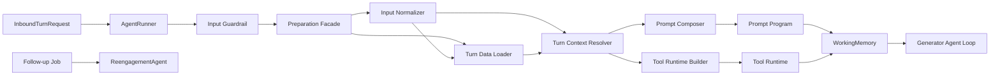

# Agent 回合装配边界重构方案

> 状态：已完成，PR [#1190](https://github.com/huajune/cake-agent-runtime/pull/1190)
>
> 建立日期：2026-09-02
>
> 实施分支：`codex/refactor-agent-turn-assembly`
> 目标：在不改变生产回复、工具、副作用与记忆语义的前提下，清理失活的 proactive Runner 抽象，重建 Runner、Preparation、数据加载、事实裁决、Prompt 编译、工具运行时和 Prompt Injection 的职责边界。

## 1. 背景与问题

重构前的主链已经形成两套不同的运行协议：

- 被动企微消息走 `ReplyWorkflowService → AgentRunnerService.runTurn() → GeneratorAgent`；
- 主动复聊走 `FollowUpProcessor → ReengagementAgent.compose()`，不经过主 Runner 和 Generator。

但 `TurnTrigger` 仍把 `inbound` 与 `proactive` 声明为同一条 `runTurn()` 链路，导致 Runner 内部扩散 `trigger.kind` 分支，并用 `PROACTIVE_TRIGGER_PLACEHOLDER` 把系统事件伪装成用户消息。与此同时，`PreparationService` 同时承担 IO、事实裁决、Prompt 排版、工具装配、Ledger 初始化和告警，`ContextService` 又反向读取策略与群资源；部分 Section 只返回上游预渲染字符串，Prompt 尾块依赖 `findIndex + slice` 手工插缝。

这组问题的共同根因不是局部表达式风格，而是运行协议和编译阶段边界失真：

1. 已经独立的 inbound / reengagement 仍共享过时类型；
2. 每轮源数据、可信事实、模型视图和工具运行时没有独立中间产物；
3. Prompt Section 没有真正拥有渲染职责，也没有用结构表达 block 位置；
4. Prompt Injection 的检测、模型提示和告警副作用分散在多个调用层。

## 2. 设计依据

本次改造遵守仓库既有原则：

- **C2 前缀稳定性优先**：Prompt 静态前缀、动态尾部和 block 顺序保持确定性；
- **C3 行为逻辑归代码**：阶段、冲突、安全判定和工具发牌在代码中完成，Section 只渲染已裁决视图；
- **C4 约束只住一处**：安全与业务规则保留单一权威源；
- **C6 末尾复诵**：`final-check` 继续处于 Prompt 尾部；
- **C7 职责迁移即回收旧权威**：新边界落地后删除旧入口、旧字段和旧注释，不长期双轨；
- **P11 模型作证、代码公证、本人终审**：模型可以理解开放语义，业务真值与副作用继续由确定性代码约束。

同时遵守 YAGNI：不引入通用 DAG 引擎、事件总线、插件框架或“每个函数一个 Service”的过度抽象。

## 3. 目标架构



各层只回答一个问题：

| 层                        | 唯一职责                                     | 禁止承担                    |
| ------------------------- | -------------------------------------------- | --------------------------- |
| AgentRunner               | 入站回合准入、生成审查、终态分类             | 主动复聊适配、Prompt 组装   |
| Input Normalizer          | 纯函数归一化当前输入                         | IO、业务副作用              |
| Turn Data Loader          | 集中读取本轮外部源并记录降级                 | Prompt 文案、工具执行       |
| Turn Context Resolver     | 把源数据裁决成单一可信回合视图               | Redis/Supabase/HTTP IO      |
| Prompt Composer / Section | 确定性渲染结构化模型视图                     | 每轮外部 IO、事实裁决       |
| Tool Runtime Builder      | 创建 Ledger、ToolContext、工具发牌与计时包装 | Prompt 排版、事实读取       |
| Generator                 | 执行模型/工具 loop                           | 渠道投递、主动任务调度      |
| ReengagementAgent         | 独立主动复聊协议                             | 伪装成 inbound user message |

## 4. 目标契约

### 4.1 入站协议

主 Runner 只接受被动消息：

```ts
export interface InboundTurnRequest {
  sessionRef: SessionRef;
  input: {
    text: string;
    images?: string[];
  };
  context?: TurnContext;
  toolMode?: GeneratorToolMode;
  modelId?: string;
}
```

`AgentRunnerService.runInboundTurn()` 取代宽泛的 `runTurn(TurnRequest)`。迁移期可保留一个标记为 deprecated 的兼容方法，但只能存在一个 PR，完成调用点迁移后立即删除。

从主链删除：

- `TurnTrigger` union；
- 所有 `trigger.kind` 判断；
- `isProactive`；
- `PROACTIVE_TRIGGER_PLACEHOLDER`；
- proactive 默认 `readonly` 和异常吞掉策略；
- `classifyReviewedOutcome()` 对 trigger 的依赖；
- 无生产调用者的 `proactiveDirective` 生成链路。

主动复聊继续使用 `ReengagementAgentExecution`，不借用入站协议表达任务身份。

### 4.2 输入归一化

`normalizeTurnInput()` 是无 IO 纯函数，返回：

```ts
interface NormalizedTurnInput {
  truncatedMessages: InputMessage[];
  currentUserMessage?: string;
  currentTurnTexts: string[];
  laborFormIntent: LaborFormIntentDecision;
}
```

它只负责字符预算、当前轮连续 user 消息、本轮文本和基础确定性意图。

### 4.3 源数据快照

`TurnDataLoaderService` 是每轮外部读取的唯一编排点：

```ts
interface TurnSourceSnapshot {
  memory: TurnStartMemory;
  booking: BookingPromptSnapshot;
  realtimeGroups: RealtimeGroupStatus[];
  groupInventory: GroupInventoryPromptView | undefined;
  accountIdentity: AccountIdentity;
  strategyConfig: StrategyConfigRecord;
  visualSheetsByContent: VisualFactsIndex | undefined;
  turnBrandContext: TurnBrandContext;
  geoAnchor: GeoResolution | undefined;
  warnings: SourceWarning[];
}
```

Loader 内部显式表达依赖图，并保持最大并发：`turnHints → memory → 带外预约`、`群资源 → 实时群状态`；策略、指针预约、群资源、账号身份、视觉事实和可独立地理读取并行启动。所有 fail-open 降级转成结构化 warning，不把 Prompt 文案写在 Loader 中。

### 4.4 可信回合视图

`resolveTurnContext()` 尽量保持纯函数：

```ts
interface ResolvedTurnContext {
  entryStage: string | null;
  composeParams: ComposeParams;
  ledgerSeed: TurnLedgerSeed;
  bookingWorkOrderJobIds: number[];
  memorySnapshot: AgentMemorySnapshot;
}
```

这里完成 memory adjudication、用工形式、品牌状态、返回用户阶段、候选人证据、字段收集、地理信号、Prompt Injection assessment 与 critical-turn signals。原始实体不会直接泄露给 Section。

### 4.5 Prompt 模型与 Section

`PromptContext` 不再接收 `memoryBlock` / `groupInventoryBlock` 等预渲染大字符串，
改为接收 `MemoryPromptView` / `GroupInventoryPromptView` 等类型化视图：

```ts
interface PromptContext {
  strategyConfig: StrategyConfigRecord;
  memory?: MemoryPromptView;
  groupInventory?: GroupInventoryPromptView;
  inputSecurityInstruction?: string;
  // 其余均为 Resolver 已裁决的本轮字段
}
```

Section 是同步纯渲染器：

```ts
interface PromptSection {
  readonly name: string;
  readonly domain?: CorpusDomain;
  build(ctx: PromptContext): string;
  buildBlocks?(ctx: PromptContext): PromptCorpusBlock[];
}
```

每轮禁止在 Section 中查询 Redis、Supabase、海绵、群服务或配置。当前 `memoryBlock` 至少按来源/时效拆成 `candidate-memory`、`booking-context`、`realtime-group-status` 三类 evidence block；`groupInventoryBlock` 改为由 Section 渲染类型化库存视图。

### 4.6 Prompt 顺序

用场景 manifest 的显式顺序替换数组插缝：

```ts
final-check
→ input-guard
→ critical-turn-guard
```

Composer 按 `SCENARIO_SECTIONS` 顺序稳定输出。`input-guard` 和
`critical-turn-guard` 成为条件式 section，不再由 Preparation 使用
`findIndex + slice` 插缝。这个表达已足以消除当前问题，本次不再叠加一层
slot 排序器。

`final-check` 与 `critical-turn-guard` 是两个渲染落点，但消费同一份 `FINAL_CHECK_RULES`；单一权威指的是规则表，不要求两个 block 被迫存在于同一个类中。

### 4.7 工具运行时

`ToolRuntimeBuilderService` 只构造：

```ts
interface ToolRuntime {
  tools: ToolSet;
  ledger: TurnLedger;
  toolExecutionTimings: Map<string, number>;
}
```

它消费已经解析好的 `ToolContextModel` 和 `ledgerSeed`，创建 ToolContext、场景工具、active tool 屏蔽与 timing wrapper；不读取外部源、不渲染 Prompt。

### 4.8 Prompt Injection

区分两种输入机制：

- `InputGuardrailService` 决定消息是否允许进入 Agent，可形成 block/handoff；
- `PromptInjectionDetector` 识别角色劫持、提示词泄露和系统标记，默认不阻断，而是形成模型安全上下文和观测事件。

检测器返回结构化结果且不发送告警：

```ts
interface PromptInjectionAssessment {
  detected: boolean;
  category?: 'role_hijack' | 'prompt_leak' | 'system_marker';
  ruleId?: string;
  evidencePreview?: string;
}
```

Resolver 把 assessment 转成 `PromptSecurityView`，`InputSecuritySection` 渲染 system block，Observer 负责日志、trace 与飞书告警。告警失败不得阻断主回合，但必须留下本地 warning，禁止空 `catch`。记录只保留脱敏 preview，不能泄漏完整敏感输入或系统 Prompt。

## 5. 建议目录

```text
src/agent/
├── runner/
│   ├── agent-runner.service.ts
│   ├── inbound-turn.types.ts
│   └── turn-outcome.ts
├── generator/
│   ├── preparation/
│   │   ├── preparation.service.ts
│   │   ├── turn-input-normalizer.ts
│   │   ├── turn-data-loader.service.ts
│   │   ├── turn-context-resolver.ts
│   │   ├── tool-runtime-builder.service.ts
│   │   └── preparation.types.ts
│   └── context/
│       ├── prompt-composer.service.ts
│       ├── prompt-model.types.ts
│       ├── prompt-manifest.ts
│       └── sections/
├── guardrail/input/
│   ├── input-guard.service.ts
│   ├── prompt-injection-detector.ts
│   └── prompt-security-observer.service.ts
└── reengagement/
```

纯计算优先使用普通函数；只有需要依赖注入的 IO、工具注册表和观测出口使用 Nest Service。

## 6. 实施阶段

### Phase 0：行为基线

- 为普通、图片、Prompt Injection、critical guard、二者同时命中、memory conflict、预约、实时群、老用户阶段和外部源降级建立 characterization tests；
- 固化 `promptBlocks` ID/domain/顺序、`finalPrompt`、active tools、entryStage 和 ledger seed；
- 确认重构前基线测试通过。

### Phase 1：删除失活 proactive Runner 抽象

- 引入 `InboundTurnRequest` 和 `runInboundTurn()`；
- 迁移 WeCom 与测试调用点；
- 删除 `TurnTrigger`、placeholder、proactive 参数映射和错误分支；
- 简化 `classifyReviewedOutcome()`；
- 保持 Reengagement 独立行为不变。

### Phase 2：建立中间类型并集中 IO

- 引入 `NormalizedTurnInput`、`TurnSourceSnapshot`、`ResolvedTurnContext`、`PromptModel`、`ToolRuntime`；
- 提取 `TurnDataLoaderService`；
- 把策略配置和群库存查询移出 `ContextService`；
- 保持原有并发依赖与降级语义。

### Phase 3：拆出裁决与工具运行时

- 提取输入归一化和事实裁决；
- 提取阶段、品牌、memory view、candidate evidence 与 ledger seed；
- 提取工具运行时 Builder；
- 把 Preparation 收敛为短编排门面。

### Phase 4：Section 类型化与 Prompt Compiler

- 删除 `memoryBlock`、`groupInventoryBlock` 等预渲染字符串；
- Section 直接渲染 typed view；
- 用 manifest 显式表达条件 section 顺序；
- 删除 `findIndex + slice`；
- 保持最终 Prompt 的稳定前缀、尾部顺序和字节兼容。

### Phase 5：Prompt Injection 职责拆分

- Detector、Security View、Section、Observer 分离；
- 增加 ruleId/category 与脱敏观测；
- 告警仍 fail-open，但不再静默吞错。

### Phase 6：清理、文档与验证

- 删除全部兼容字段、无调用函数和漂移注释；
- 拆分巨型 Preparation 测试；
- 更新 Agent Runtime、Prompt Section、Security Guardrails、Prompt Rule Ledger、final prompt example 与 WeCom dataflow；
- 执行定向测试、lint、format、typecheck、build、全量测试、DI smoke、duplication check 和 `git diff --check`。

## 7. 测试策略

测试分为四层：

1. **纯函数单测**：输入归一化、事实裁决、Prompt block 渲染、manifest 顺序；
2. **Loader 单测**：依赖图、并发启动、数据源失败与 warning；
3. **Preparation 集成测试**：输入到 WorkingMemory 的完整装配；
4. **Prompt 兼容测试**：代表性场景的 block ID/domain/order 与最终字符串对拍。

关键断言不能只使用 `toContain()`，还必须验证：

```ts
expect(promptBlocks.map((block) => block.id)).toEqual(expectedIds);
expect(renderPromptBlocks(promptBlocks)).toBe(expectedPrompt);
```

重构涉及 Agent 输入形态但不主动改变业务规则；若最终 diff 改变 Prompt 字节、工具集合、阶段、守卫终态或副作用，需要额外执行正式 badcase 真实链路回归。若只完成等价结构迁移，则用 characterization tests、现有全量测试和差异审计证明兼容，不伪称模型业务效果得到提升。

## 8. 观测边界

本 PR 保持现有回合级 `prepMs`、tool timing、prompt bloat 告警和各外部源降级 warning，
不在结构重构中同时扩展 MPR schema 或 AgentEvent 协议。分阶段耗时、block 顺序 hash
与每源 status 是后续独立 observability PR，避免把数据契约变更混入本次行为等价改造。

## 9. 风险与控制

| 风险                                  | 控制手段                                                                           |
| ------------------------------------- | ---------------------------------------------------------------------------------- |
| Prompt 顺序变化导致模型/缓存漂移      | 固化 block 顺序和代表性渲染结果，manifest 改造保持现有顺序                         |
| 拆 Loader 后串行化导致延迟上升        | 保留显式 Promise 依赖图，增加阶段耗时断言/观测                                     |
| 多个事实视图产生双权威                | Resolver 输出单一 `ResolvedTurnContext`，迁移后删除旧字段                          |
| 大量测试 mock 因接口变化失效          | 先引入兼容适配，再分域迁移测试，最后删除适配                                       |
| Prompt Injection 重构意外改变拦截语义 | 保持“检测 + 提示 + 告警、不阻断”基线，新增结构化对拍                               |
| 抽象过度                              | 限定为一个 IO Service、一个工具 Builder、纯函数 Resolver/Normalizer、一个 Composer |

## 10. 完成定义

- [x] 主 Runner 中不存在 `trigger.kind` 和 proactive 协议；
- [x] 不存在伪造的 proactive user placeholder；
- [x] Preparation 只负责编排，不包含外部数据实现或 Prompt 数组手术；
- [x] 每轮外部 IO 集中在 Loader，Section 零 IO；
- [x] Section 消费类型化裁决视图，不消费预渲染大字符串；
- [x] Prompt block 位置由 manifest 确定；
- [x] Prompt Injection 检测、渲染、观测职责分离；
- [x] Prompt 字节、工具集合、entryStage、Ledger 与守卫终态无非预期变化；
- [x] Reengagement 独立链路无行为变化；
- [x] 新增 TypeScript 文件均有对应测试；
- [x] 相关文档与代码同步更新；
- [x] 定向测试和 `pnpm run ci:check` 通过；
- [x] 最终 diff 无数据库 migration、环境变量或部署顺序变化；
- [x] PR [#1190](https://github.com/huajune/cake-agent-runtime/pull/1190) 指向 `develop`，正文包含根因、边界变化、风险和真实验证证据。

## 11. 本地验证记录

- 定向回归：18 个 suites、377 个 tests 全部通过；覆盖 Runner、ReplyWorkflow、Preparation、Context、Prompt Injection、关键轮规则和 Reengagement。
- 完整门禁：`pnpm run ci:check` 通过；456 个 suites、6618 个 tests 通过，1 个 suite / 5 个 tests 按仓库既有配置跳过。
- 依赖装配：`pnpm run test:di-smoke` 通过，完整 `AppModule` 可实例化。
- 重复度：`pnpm run duplication:check` 通过，重复行率 0.8%，低于 2.06% 阈值。
- 结构审计：旧 `TurnTrigger` / `TurnRequest` / placeholder / `PromptInjectionService` 无生产残留；`git diff --check` 通过。
