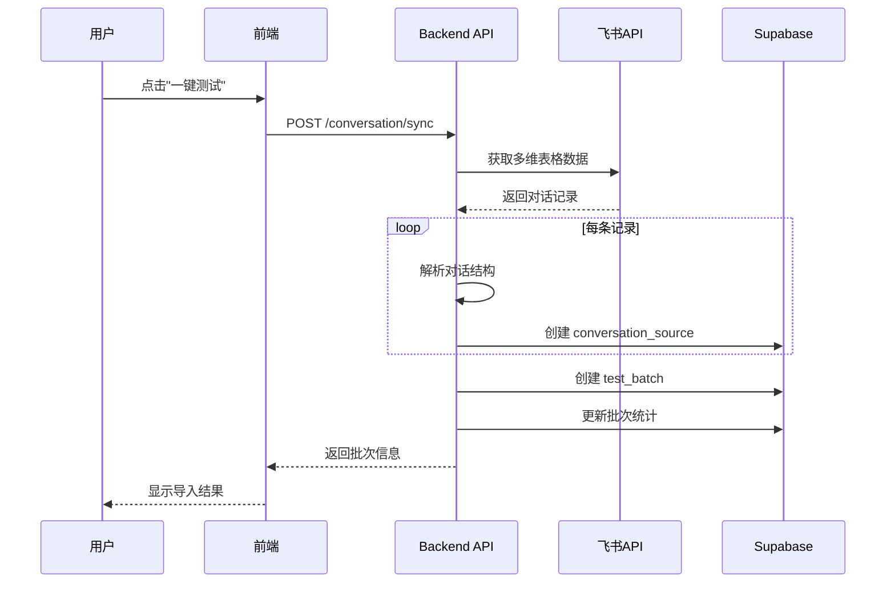
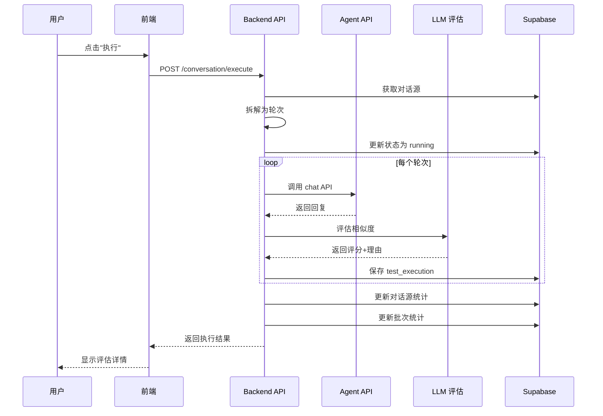

# 对话验证工作流程

> 本文档描述对话验证功能的完整数据流、执行流程和设计决策

## 目录

- [概述](#概述)
- [数据模型](#数据模型)
- [工作流程](#工作流程)
- [API 接口](#api-接口)
- [LLM 评估机制](#llm-评估机制)
- [前端集成](#前端集成)
- [配置说明](#配置说明)

## 概述

### 功能定位

对话验证是测试套件的核心功能之一,用于:
- 从飞书多维表格导入真实客户对话记录
- 将历史对话重放给 AI Agent,验证回复质量
- 使用 LLM 自动评估 Agent 回复与真人回复的相似度
- 提供可视化界面查看测试结果和评估详情

### 核心概念

| 概念 | 说明 | 示例 |
|------|------|------|
| **测试批次 (Batch)** | 一次导入的完整测试集 | "对话验证 2026/1/16" |
| **对话源 (Source)** | 单个完整对话记录 | Paidax 的 3 轮对话 |
| **测试轮次 (Turn)** | 对话中的单次交互 | 用户问 → Agent 答 |
| **相似度评分 (Score)** | LLM 对回复质量的评分 | 0-100 分,60分及格 |

### 技术栈

- **后端**: NestJS + TypeScript + Supabase (PostgreSQL)
- **前端**: React + TypeScript + Ant Design
- **评估**: 花卷 Agent API (OpenAI GPT-4o-mini)
- **数据源**: 飞书多维表格 API

## 数据模型

### ER 关系图

```
┌─────────────────┐
│  test_batches   │  测试批次
│  ─────────────  │
│  id             │  UUID (PK)
│  name           │  批次名称
│  test_type      │  'conversation'
│  total_cases    │  对话总数
│  executed_count │  已执行数
│  pass_rate      │  平均评分
└────────┬────────┘
         │ 1:N
         ▼
┌──────────────────────┐
│ conversation_sources │  对话源
│ ──────────────────── │
│ id                   │  UUID (PK)
│ batch_id             │  UUID (FK)
│ conversation_id      │  对话标识
│ participant_name     │  参与者姓名
│ full_conversation    │  完整对话 JSONB
│ total_turns          │  轮次总数
│ avg_similarity_score │  平均评分
│ status               │  执行状态
└─────────┬────────────┘
          │ 1:N
          ▼
┌────────────────────┐
│ test_executions    │  执行记录
│ ────────────────── │
│ id                 │  UUID (PK)
│ conversation_source_id │ UUID (FK)
│ turn_number        │  轮次编号
│ input_message      │  用户输入
│ expected_output    │  期望输出
│ actual_output      │  实际输出
│ similarity_score   │  相似度评分
│ evaluation_reason  │  评估理由
│ tool_calls         │  工具调用
│ duration_ms        │  执行耗时
│ token_usage        │  Token 用量
└────────────────────┘
```

### 表结构详解

#### test_batches (测试批次表)

| 字段 | 类型 | 说明 | 示例 |
|------|------|------|------|
| `id` | UUID | 主键 | `batch-001` |
| `name` | TEXT | 批次名称 | "对话验证 2026/1/16 11:13" |
| `test_type` | TEXT | 测试类型 | `'conversation'` |
| `status` | TEXT | 批次状态 | `'created'` \| `'running'` \| `'completed'` |
| `total_cases` | INTEGER | 对话总数 | `19` |
| `executed_count` | INTEGER | 已执行数 | `2` |
| `pass_rate` | NUMERIC | 平均评分 | `82.5` |
| `created_at` | TIMESTAMP | 创建时间 | - |
| `updated_at` | TIMESTAMP | 更新时间 | - |

#### conversation_sources (对话源表)

| 字段 | 类型 | 说明 | 数据示例 |
|------|------|------|----------|
| `id` | UUID | 主键 | `source-001` |
| `batch_id` | UUID | 所属批次 | `batch-001` |
| `feishu_record_id` | TEXT | 飞书记录ID | `rec123` |
| `conversation_id` | TEXT | 对话标识 | `conv-595972ed` |
| `participant_name` | TEXT | 参与者姓名 | `"Paidax"` |
| `full_conversation` | JSONB | 完整对话 | 见下方示例 |
| `raw_text` | TEXT | 原始文本 | 飞书原始对话记录 |
| `total_turns` | INTEGER | 轮次总数 | `3` |
| `avg_similarity_score` | NUMERIC | 平均评分 | `83.5` |
| `min_similarity_score` | NUMERIC | 最低评分 | `75.0` |
| `status` | TEXT | 执行状态 | `'pending'` \| `'running'` \| `'completed'` \| `'failed'` |

**full_conversation JSONB 结构**:

```json
[
  {
    "role": "user",
    "content": "我想了解Java岗位",
    "timestamp": "12/04 17:20"
  },
  {
    "role": "assistant",
    "content": "好的,我们有以下Java岗位:\n1. 高级Java开发...",
    "timestamp": "12/04 17:21"
  },
  {
    "role": "user",
    "content": "薪资范围是多少",
    "timestamp": "12/04 17:22"
  },
  {
    "role": "assistant",
    "content": "薪资范围在20-30K",
    "timestamp": "12/04 17:23"
  }
]
```

#### test_executions (执行记录表)

| 字段 | 类型 | 说明 | 示例 |
|------|------|------|------|
| `id` | UUID | 主键 | `exec-001` |
| `conversation_source_id` | UUID | 所属对话源 | `source-001` |
| `turn_number` | INTEGER | 轮次编号 | `1` (从1开始) |
| `input_message` | TEXT | 用户输入 | "我想了解Java岗位" |
| `expected_output` | TEXT | 期望输出 | "好的,我们有以下..." |
| `actual_output` | TEXT | 实际输出 | "当然可以!我们目前..." |
| `similarity_score` | NUMERIC | 相似度评分 | `85.0` |
| `evaluation_reason` | TEXT | 评估理由 | "回复正确理解了用户意图..." |
| `agent_request` | JSONB | Agent 请求 | API 请求参数 |
| `agent_response` | JSONB | Agent 响应 | API 完整响应 |
| `tool_calls` | JSONB | 工具调用 | `[]` 或工具调用数组 |
| `execution_status` | TEXT | 执行状态 | `'success'` \| `'failed'` |
| `duration_ms` | INTEGER | 执行耗时 | `3500` (ms) |
| `token_usage` | JSONB | Token 用量 | `{inputTokens, outputTokens, totalTokens}` |
| `error_message` | TEXT | 错误信息 | - |
| `review_status` | TEXT | 评审状态 | `'pending_review'` \| `'passed'` \| `'failed'` |
| `review_comment` | TEXT | 评审评论 | - |
| `reviewed_by` | TEXT | 评审人 | - |
| `reviewed_at` | TIMESTAMP | 评审时间 | - |

## 工作流程

### 阶段 1: 数据同步 (飞书导入)

**触发方式**: 用户点击"一键测试"按钮

**API 端点**: `POST /test-suite/conversation/sync`

**执行步骤**:



**详细流程**:

1. **创建测试批次**

```typescript
const batch = await testBatchRepository.create({
  name: '对话验证 2026/1/16 11:13:17',
  test_type: 'conversation',
  status: 'created',
});
```

2. **从飞书读取数据**

```typescript
const feishuRecords = await feishuBitableService.getRecords({
  appToken: 'bascn...',
  tableId: 'tbl...'
});
```

3. **解析对话结构**

```typescript
// 输入: 原始对话文本
const rawText = `
【杜力岱】我想了解Java岗位  12/04 17:20
【🎯杜力岱招聘助手】好的,我们有以下Java岗位:
1. 高级Java开发工程师...  12/04 17:21
【杜力岱】薪资范围是多少  12/04 17:22
【🎯杜力岱招聘助手】薪资范围在20-30K  12/04 17:23
`;

// 输出: 结构化消息数组
const parsed = parseConversation(rawText);
// {
//   messages: [
//     { role: 'user', content: '我想了解Java岗位', timestamp: '12/04 17:20' },
//     { role: 'assistant', content: '好的,我们有以下Java岗位:...', timestamp: '12/04 17:21' },
//     { role: 'user', content: '薪资范围是多少', timestamp: '12/04 17:22' },
//     { role: 'assistant', content: '薪资范围在20-30K', timestamp: '12/04 17:23' }
//   ],
//   totalTurns: 2  // 用户消息数量
// }
```

4. **保存到数据库**

```typescript
await conversationSourceRepository.create({
  batch_id: batch.id,
  feishu_record_id: record.record_id,
  conversation_id: `conv-${uuid()}`,
  participant_name: record.fields['姓名'],
  full_conversation: parsed.messages,
  raw_text: rawText,
  total_turns: parsed.totalTurns,
  status: 'pending',
});
```

5. **更新批次统计**

```typescript
await testBatchRepository.update(batch.id, {
  total_cases: conversationSources.length,
});
```

### 阶段 2: 执行测试 (重放对话)

**触发方式**: 用户点击单个对话的"执行"按钮

**API 端点**: `POST /test-suite/conversation/execute`

**执行步骤**:



**详细流程**:

1. **获取对话源**

```typescript
const source = await conversationSourceRepository.findById(sourceId);
```

2. **拆解为测试轮次**

```typescript
// 输入: full_conversation
const messages = [
  { role: 'user', content: 'A', timestamp: '17:20' },
  { role: 'assistant', content: 'B', timestamp: '17:21' },
  { role: 'user', content: 'C', timestamp: '17:22' },
  { role: 'assistant', content: 'D', timestamp: '17:23' },
];

// 输出: 轮次数组
const turns = splitIntoTurns(messages);
// [
//   {
//     turnNumber: 1,
//     history: [],  // 第一轮无历史
//     userMessage: 'A',
//     expectedOutput: 'B'
//   },
//   {
//     turnNumber: 2,
//     history: [
//       { role: 'user', content: 'A' },
//       { role: 'assistant', content: 'B' }
//     ],
//     userMessage: 'C',
//     expectedOutput: 'D'
//   }
// ]
```

3. **逐轮执行测试**

```typescript
for (const turn of turns) {
  const startTime = Date.now();

  // 3.1 调用 Agent API
  const agentResponse = await agentService.chat({
    conversationId: `${source.conversation_id}-turn-${turn.turnNumber}`,
    userMessage: turn.userMessage,
    messages: turn.history,  // 关键: 传递历史上下文
    model: 'anthropic/claude-sonnet-4-5',
  });

  const actualOutput = extractText(agentResponse.data.messages);
  const durationMs = Date.now() - startTime;

  // 3.2 LLM 评估相似度
  const evaluation = await llmEvaluationService.evaluate({
    userMessage: turn.userMessage,
    expectedOutput: turn.expectedOutput,
    actualOutput: actualOutput,
    history: turn.history,
  });
  // 返回: { score: 85, passed: true, reason: "..." }

  // 3.3 保存执行记录
  await testExecutionRepository.create({
    conversation_source_id: sourceId,
    turn_number: turn.turnNumber,
    input_message: turn.userMessage,
    expected_output: turn.expectedOutput,
    actual_output: actualOutput,
    similarity_score: evaluation.score,
    evaluation_reason: evaluation.reason,
    agent_request: { conversationId, userMessage, messages },
    agent_response: agentResponse,
    tool_calls: agentResponse.data.tool_calls || [],
    execution_status: 'success',
    duration_ms: durationMs,
    token_usage: agentResponse.data.usage,
    review_status: 'pending_review',
  });
}
```

4. **更新对话源统计**

```typescript
const executions = await testExecutionRepository.findBySourceId(sourceId);
const scores = executions.map(e => e.similarity_score).filter(Boolean);

await conversationSourceRepository.update(sourceId, {
  status: 'completed',
  avg_similarity_score: average(scores),
  min_similarity_score: Math.min(...scores),
});
```

5. **更新批次统计**

```typescript
const sources = await conversationSourceRepository.findByBatchId(batchId);
const completed = sources.filter(s => s.status === 'completed');

await testBatchRepository.update(batchId, {
  executed_count: completed.length,
  pass_rate: average(completed.map(s => s.avg_similarity_score)),
});
```

### 阶段 3: 结果展示 (前端查看)

**查看流程**:

1. **批次列表页** → 2. **对话列表页** → 3. **轮次详情弹窗**

## API 接口

### 数据同步接口

```typescript
POST /test-suite/conversation/sync
Content-Type: application/json

// 请求体
{
  "feishuAppToken": "bascn...",
  "feishuTableId": "tbl...",
  "batchName": "对话验证 2026/1/16"  // 可选
}

// 响应
{
  "success": true,
  "data": {
    "batchId": "batch-001",
    "name": "对话验证 2026/1/16 11:13:17",
    "totalCases": 19,
    "syncedCount": 19,
    "createdAt": "2026-01-16T03:13:17.000Z"
  }
}
```

### 执行测试接口

```typescript
POST /test-suite/conversation/execute
Content-Type: application/json

// 请求体
{
  "conversationSourceId": "source-001"
}

// 响应
{
  "success": true,
  "data": {
    "conversationSourceId": "source-001",
    "totalTurns": 3,
    "executedTurns": 3,
    "avgSimilarityScore": 83.5,
    "minSimilarityScore": 75.0,
    "status": "completed",
    "executions": [
      {
        "turnNumber": 1,
        "similarityScore": 85.0,
        "durationMs": 3500,
        "status": "success"
      },
      // ...更多轮次
    ]
  }
}
```

### 查询接口

```typescript
// 1. 获取批次列表
GET /test-suite/batches?test_type=conversation

// 响应
{
  "success": true,
  "data": [
    {
      "id": "batch-001",
      "name": "对话验证 2026/1/16",
      "totalCases": 19,
      "executedCount": 2,
      "passRate": 82.0,
      "status": "running",
      "createdAt": "2026-01-16T03:13:17.000Z"
    }
  ]
}

// 2. 获取对话源列表
GET /test-suite/conversation/sources?batchId=batch-001

// 响应
{
  "success": true,
  "data": [
    {
      "id": "source-001",
      "participantName": "Paidax",
      "totalTurns": 3,
      "avgSimilarityScore": 83.5,
      "minSimilarityScore": 75.0,
      "status": "completed"
    }
  ]
}

// 3. 获取轮次详情
GET /test-suite/conversation/turns?sourceId=source-001

// 响应
{
  "success": true,
  "data": {
    "conversationInfo": {
      "participantName": "Paidax",
      "totalTurns": 3,
      "avgSimilarityScore": 83.5
    },
    "turns": [
      {
        "turnNumber": 1,
        "inputMessage": "我想了解Java岗位",
        "expectedOutput": "好的,我们有以下Java岗位...",
        "actualOutput": "当然可以!我们目前有多个Java开发岗位...",
        "similarityScore": 85.0,
        "evaluationReason": "回复正确理解了用户意图,虽然用词略有不同但信息完整",
        "durationMs": 3500,
        "toolCalls": [],
        "tokenUsage": {
          "inputTokens": 120,
          "outputTokens": 80,
          "totalTokens": 200
        }
      }
    ]
  }
}
```

## LLM 评估机制

### 评估原理

使用 LLM (GPT-4o-mini) 作为评估器,对比 Agent 回复与真人回复的质量。

**关键设计**:
- **模型选择**: `openai/gpt-4o-mini` (速度快、成本低)
- **禁用工具**: 评估时关闭所有工具,确保纯文本输出
- **结构化输出**: 强制 JSON 格式输出评分和理由

### 评估流程

```typescript
// llm-evaluation.service.ts
async evaluate(input: {
  userMessage: string;
  expectedOutput: string;
  actualOutput: string;
  history?: Message[];
}) {
  // 1. 构建评估 prompt
  const prompt = `
你是 AI 客服回复评估专家,请对比以下两个回复的质量:

【用户消息】
${input.userMessage}

${input.history?.length ? `【对话历史】\n${formatHistory(input.history)}` : ''}

【参考回复 (真人客服)】
${input.expectedOutput}

【实际回复 (AI Agent)】
${input.actualOutput}

评估标准:
1. 意图理解 (40%): 是否正确理解用户意图
2. 信息完整性 (30%): 必要信息是否完整
3. 语言表达 (20%): 表达是否清晰、专业
4. 相关性 (10%): 是否与用户问题相关

请严格按以下 JSON 格式输出:
{
  "score": 85,
  "passed": true,
  "reason": "回复正确理解了用户意图,信息完整,表达清晰"
}
`;

  // 2. 调用 Agent API
  const result = await this.agentService.chat({
    conversationId: `eval-${uuid()}`,
    userMessage: prompt,
    model: 'openai/gpt-4o-mini',
    allowedTools: [],  // 关键: 禁用所有工具
    systemPrompt: '你是严格的评估专家,必须按 JSON 格式输出。',
  });

  // 3. 解析 JSON 响应
  const text = this.extractText(result.data.messages);
  const json = JSON.parse(text);

  return {
    score: json.score,  // 0-100
    passed: json.score >= 60,
    reason: json.reason,
    evaluationId: result.data.conversationId,
  };
}
```

### 评分标准

| 分数区间 | 等级 | 颜色 | 说明 |
|---------|------|------|------|
| 80-100 | 优秀 | 🟢 绿色 | 回复质量与真人相当或更好 |
| 60-79 | 良好 | 🔵 蓝色 | 回复基本正确,有改进空间 |
| 40-59 | 一般 | 🟡 黄色 | 部分理解偏差或信息不完整 |
| 0-39 | 较差 | 🔴 红色 | 理解错误或答非所问 |

**及格线**: 60 分

## 前端集成

### 组件层级

```
TestSuitePage (index.tsx)
├── BatchList (批次列表)
│   └── BatchRow → 点击展开 → ConversationList
│
├── ConversationList (对话列表)
│   └── ConversationRow
│       ├── 执行按钮 → executeConversationTest()
│       └── 查看按钮 → 打开 ConversationDetailModal
│
└── ConversationDetailModal (轮次详情弹窗)
    ├── CompactMetrics (统计卡片)
    ├── TurnCompareView (左右对比视图)
    └── ToolCallItem (工具调用展示)
```

### 状态管理

```typescript
// 使用自定义 Hook 管理数据
const {
  batches,              // 批次列表
  selectedBatch,        // 当前选中批次
  conversations,        // 对话列表
  executeConversationTest,  // 执行测试
  loadBatches,          // 刷新批次
} = useConversations();

// 执行后自动刷新
const handleExecute = useCallback(async (conversationId: string) => {
  await executeConversationTest(conversationId);
  await loadBatches();  // 刷新统计数据
}, [executeConversationTest, loadBatches]);
```

### 数据流

```
用户操作 → API 调用 → 更新数据库 → 刷新前端状态 → 更新 UI
```

**关键刷新点**:
1. 执行测试后 → 刷新批次列表 (更新统计)
2. 展开批次后 → 加载对话列表
3. 查看详情后 → 加载轮次数据

## 配置说明

### 环境变量

```bash
# 评估模型配置
EVALUATION_MODEL=openai/gpt-4o-mini

# 飞书 API (用于同步数据)
FEISHU_APP_ID=cli_xxx
FEISHU_APP_SECRET=xxx
```

### 代码常量

```typescript
// src/test-suite/services/llm-evaluation.service.ts
const EVALUATION_MODEL = 'openai/gpt-4o-mini';  // 评估模型
const PASS_THRESHOLD = 60;  // 及格分数线

// 评分标准权重
const CRITERIA = {
  INTENT_UNDERSTANDING: 0.4,   // 意图理解 40%
  INFORMATION_COMPLETENESS: 0.3,  // 信息完整性 30%
  LANGUAGE_EXPRESSION: 0.2,    // 语言表达 20%
  RELEVANCE: 0.1,              // 相关性 10%
};
```

### 飞书表格格式

**必填字段**:
- `姓名`: 参与者姓名 (TEXT)
- `对话记录`: 完整对话文本 (TEXT)

**对话记录格式**:
```
【杜力岱】消息内容  时间戳
【🎯杜力岱招聘助手】回复内容  时间戳
```

## 常见问题

### Q1: 如何提高评估准确性?

**A**:
1. 优化评估 prompt,明确评分标准
2. 使用更强大的模型 (如 GPT-4)
3. 增加人工复审机制 (review_status 字段)

### Q2: 执行失败如何处理?

**A**:
- 系统自动记录错误到 `test_executions.error_message`
- 对话源状态标记为 `'failed'`
- 前端显示错误提示,支持重试

### Q3: 如何调整评分标准?

**A**:
修改 [llm-evaluation.service.ts](../../src/test-suite/services/llm-evaluation.service.ts) 的评估 prompt 和权重配置。

### Q4: 批次统计如何计算?

**A**:
- `totalCases`: `conversation_sources` 表记录数
- `executedCount`: `status='completed'` 的记录数
- `passRate`: 所有已完成对话的 `avg_similarity_score` 平均值

## 相关文档

- [场景测试工作流程](./scenario-test-workflow.md)
- [测试套件架构设计](../architecture/test-suite-architecture.md)
- [飞书 API 集成指南](../integrations/feishu-integration.md)
- [Agent API 使用文档](../agent/agent-api-guide.md)
