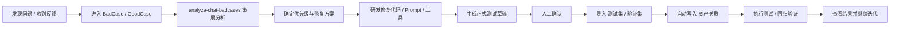

# 反馈修复测试验证链路 V2 说明

面向对象：运营同学、产品同学、研发同学  
使用时间：2026-04-23 起

## 一句话总结

新流程把“样本收集”和“正式测试”彻底拆开了：

- `BadCase / GoodCase` 只负责收集样本
- `测试集 / 验证集` 只负责承载正式测试资产
- `资产关联` 自动记录样本和正式资产之间的血缘关系

也就是说：

- 提交反馈，不会再直接进入正式测试集
- 正式测试集和验证集，只能通过 `analyze-chat-badcases` 这条策展工作流生成
- 不再依赖手动勾选字段做同步

---

## 为什么要改

旧流程有三个典型问题：

1. 样本池和正式测试资产混在一起
   结果是：一条随手记录的 badcase，可能不经过筛选就进入正式测试，数据质量不稳定。

2. 依赖人工勾选字段驱动同步
   结果是：容易漏勾、误勾，也很难回头解释“这条为什么会进测试集”。

3. 缺少清晰的血缘关系
   结果是：当大家追问“这条测试用例从哪个 badcase 来”“这个验证样本参考了哪些聊天记录”时，很难追溯。

这次改造的目标，就是把这三件事一次理顺。

---

## 新流程的核心原则

### 原则 1：样本池和正式数据集分离

- `BadCase / GoodCase` 是样本池
- `测试集 / 验证集` 是正式数据集

样本池可以多、可以杂、可以先收进来；  
正式数据集必须是经过策展、确认后才入库。

### 原则 2：反馈提交只进入样本池

无论是好反馈还是坏反馈，提交之后都只会进入：

- `BadCase`
- `GoodCase`

不会直接写入：

- `测试集`
- `验证集`

### 原则 3：正式测试资产必须经过策展

正式测试资产的唯一入口是：

- `analyze-chat-badcases`

它会负责：

- 抽样分析真实对话
- 归类问题
- 产出修复方向
- 生成正式测试草稿
- 在确认后导入 `测试集 / 验证集`

### 原则 4：关联关系自动记录，不靠人工维护

新增加了一张内部表：

- `资产关联`

它会自动记录：

- 某条 `BadCase` 生成了哪条 `测试集`
- 某条 `GoodCase` 参考进了哪条 `验证集`
- 某个 `chatId` 变成了哪条正式验证资产

运营同学不需要手工维护这张表。

---

## 现在的 5 张表分别做什么

## 1. `BadCase`

定位：负向样本池

适合放什么：

- 真实问题反馈
- 线上坏案例
- 明显答错、答偏、漏问、乱推进的样本
- 后续可能会被提炼成正式测试用例的候选素材

一句话理解：

> 先收证据，不直接当正式测试。

## 2. `GoodCase`

定位：正向样本池

适合放什么：

- 表现好的真实回复
- 值得复用的话术
- 值得参考的追问节奏
- 可以作为“正样本参考”的素材

一句话理解：

> 先收优秀样本，后续需要时再提炼。

## 3. `测试集`

定位：正式场景测试集

适合放什么：

- 明确的问题场景
- 需要稳定回归的用户输入
- 面向功能验证、策略验证的正式用例

典型内容：

- 用户消息
- 聊天上下文
- 核心检查点
- 预期行为
- 是否启用
- 测试状态

一句话理解：

> 这是给“场景测试”跑的正式题库。

## 4. `验证集`

定位：正式对话验证集

适合放什么：

- 完整真实对话
- 需要做回归验证的整段会话
- 面向“与真人/预期是否一致”的正式验证资产

典型内容：

- 完整对话记录
- chatId
- 候选人昵称
- 招募经理姓名
- 测试状态
- 相似度分数

一句话理解：

> 这是给“整段回归验证”跑的正式样本库。

## 5. `资产关联`

定位：内部血缘表

记录什么：

- 来源表：`BadCase / GoodCase / Chat`
- 来源资产 ID
- 目标表：`测试集 / 验证集`
- 目标资产 ID
- 关系角色：`问题来源 / 正样本参考 / 对话证据`
- 是否生效

一句话理解：

> 这是系统自动维护的“样本从哪来、最后去了哪”的关系账本。

---

## 全新的完整流程

可以拆成 4 个阶段来理解：

### 第一阶段：收样本

入口包括：

- 反馈弹窗提交
- 运营人工发现问题
- 线上对话抽查
- 研发在联调时发现问题

结果：

- 坏的进 `BadCase`
- 好的进 `GoodCase`

### 第二阶段：策展

通过 `analyze-chat-badcases` 做分析和策展：

- 不是把 badcase 原样搬进测试集
- 而是先判断哪些问题值得固化成正式测试
- 再决定生成场景测试还是对话验证

结果：

- 输出正式测试草稿

### 第三阶段：导入正式资产

确认后的正式草稿会导入：

- `测试集`
- `验证集`

同时系统自动写入：

- `资产关联`

结果：

- 正式数据集可跑
- 血缘关系可追踪

### 第四阶段：执行与迭代

导入完成后，就可以在 test-suite 里跑：

- 场景测试
- 回归验证

如果测试结果不好，就继续：

- 调整修复
- 更新正式用例
- 再跑一轮

测试完成后，还要回写源样本池：

- 已完成修复和验证的 `BadCase`，状态应从 `待分析 / 待修复 / 修复中 / 待测试 / 待验证` 流转到合适终态，通常是 `已解决`
- `修复说明` 应写清修复点、正式用例 ID、验证批次 ID、残余风险
- `根因层` 应标注 `prompt / stage / tool / data / memory / workflow / policy / unknown`
- `最近复现时间` 写本轮最终验证或复跑时间
- 正式资产之间的血缘仍以 `资产关联` 表为准；源样本池只保留便于运营查看的收尾摘要

人工评审时，飞书正式数据集也要自动收口：

- 场景测试评审后，`测试集` 会自动回写 `测试状态 / 最近测试时间 / 测试批次 / 错误原因 / 评审摘要`
- 回归验证评审后，`验证集` 会自动回写 `测试状态 / 最近测试时间 / 测试批次 / 相似度分数 / 最低分 / 评估摘要`
- 如果飞书字段更新了但 `https://cake.duliday.com/web/test-suite` 还没变化，不代表回写失败；该页面读的是生产 test-suite 数据库，不是飞书表

如果还需要让线上页面 `https://cake.duliday.com/web/test-suite` 同步看到这轮批次，仅回写飞书还不够，还要把测试环境批次同步到生产 test-suite 数据库：

- 运行 `pnpm sync:test-suite:prod -- <batchId...>`
- 该脚本会把 `test_batches / test_executions` 同步到生产库，并兼容回归验证的旧表 `conversation_test_sources`
- 建议在本轮批次评审状态确认后再同步，避免把中间态批次写到线上页面

评审弹窗的信息展示建议按“两层上下文”来理解：

- 第一层是 test-suite 当前执行上下文：用户消息、历史上下文、预期输出、实际输出、工具调用、评审状态和评审备注
- 第二层才是生产消息处理流水上下文：`message_processing_records` 里的 agent step、memory snapshot、异常标记等

当前默认应优先展示第一层，因为它和本次测试执行一一对应、噪音更少。第二层只有在正式资产能稳定关联到源 `chatId / messageId` 时，才适合做深链查看；否则容易把生产时态数据和测试时态数据混在一起，影响评审判断。

---

## 运营同学明天开始怎么用

这是最重要的部分。

## 你们要做的

### 1. 发现坏案例时，记录到 `BadCase`

适用场景：

- 候选人流失风险高
- 回复明显错误
- 漏问关键信息
- 推进时机不对
- 让人感觉别扭、不自然

### 2. 发现好案例时，记录到 `GoodCase`

适用场景：

- 追问节奏好
- 回复准确
- 话术自然
- 推进顺滑
- 值得沉淀为最佳实践

### 3. 需要形成正式测试资产时，发起 `analyze-chat-badcases`

什么时候发起：

- 某类问题反复出现
- 研发已经修复，需要补正式测试
- 需要做回归验证
- 需要对一批真实对话做质量分析

### 4. 看结果时，主要看 `测试集 / 验证集`

如果想看：

- 正式场景题库：看 `测试集`
- 正式回归样本：看 `验证集`
- 某条正式资产从哪里来：看 `资产关联`
- 某条反馈是否已经处理完：看 `BadCase / GoodCase` 的 `状态` 和 `修复说明`

---

## 你们不用再做的事

以下动作，从明天开始都不需要了：

### 1. 不需要手动勾选“是否进入测试集/验证集”

这个逻辑已经废弃。

原因：

- 容易误操作
- 不利于管理
- 也不符合“正式资产必须经过策展”的原则

### 2. 不需要把 `BadCase / GoodCase` 当正式题库使用

样本池就是样本池，正式测试就是正式测试。

不要再把样本池里的内容当成“已经可以直接跑的测试集”。

### 3. 不需要手工维护样本和正式资产之间的关联

`资产关联` 会自动同步。

---

## 这次改造后，最大的变化是什么

如果只记 4 句话，记这 4 句就够了：

1. 反馈提交只进样本池，不进正式测试集。
2. 正式测试集和验证集只能通过策展工作流产生。
3. 不再依赖人工勾选字段做同步。
4. 样本和正式资产之间的关系，现在能自动追溯。

---

## 对运营最直接的收益

### 收益 1：表更清楚了

以前容易分不清：

- 哪些是素材
- 哪些是正式用例

现在分工明确，理解成本更低。

### 收益 2：正式测试资产质量更高

不是所有 badcase 都会直接进正式测试，只有真正值得固化的才会进去。

### 收益 3：后续复盘更容易

以后再问：

- “这条测试是从哪个 badcase 来的？”
- “这个验证样本参考了哪些聊天记录？”

都能回溯。

### 收益 4：协作边界更清楚

- 运营负责发现与记录样本
- 策展工作流负责沉淀正式资产
- 研发负责修复与验证

---

## 常见问题

## Q1：为什么反馈不能直接进测试集？

因为反馈是“素材”，正式测试是“经过确认的资产”。

如果直接进入正式测试集，题库会很快失控，质量也会变差。

## Q2：那样本记录还有价值吗？

非常有价值。

样本池的作用不是直接跑测试，而是：

- 作为问题证据
- 作为后续策展素材
- 作为修复优先级判断依据

## Q3：谁来维护 `资产关联`？

系统自动维护，不需要运营手工维护。

## Q4：如果某条正式用例后来不再参考某个 badcase，会怎么样？

旧关联不会硬删除，而是会被标记为：

- `是否生效 = false`

这样后续还能看历史。

## Q5：运营能不能直接修改 `测试集 / 验证集`？

原则上不建议把它们当普通记录表直接改来改去。

更推荐的方式是：

- 先明确要补什么正式资产
- 再通过策展工作流生成和更新

这样能保证结构统一、来源清晰、测试状态正确。

---

## 明天切换时的执行口径

从 2026-04-23 开始，大家统一按下面口径执行：

### 对运营

- 继续正常记录 `BadCase / GoodCase`
- 不再手动勾选“进入测试集/验证集”
- 需要正式沉淀时，走 `analyze-chat-badcases`

### 对研发

- 修复完成后，通过策展流程生成正式测试资产
- 不直接把样本池当正式回归集

### 对整体协作

- 样本池负责发现问题
- 正式数据集负责验证修复
- `资产关联` 负责保留关系

---

## 宣讲时可以直接用的结束语

这次改造不是多加了几张表，而是把整条链路理顺了：

- 样本归样本
- 测试归测试
- 关联自动保留
- 修复闭环更清晰

从明天开始，我们不再靠“手动勾选同步”管理测试资产，而是靠“策展后正式入库”来保证数据质量和协作效率。
