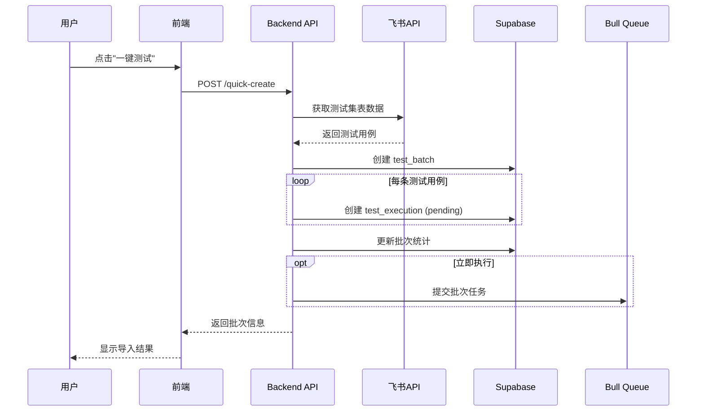
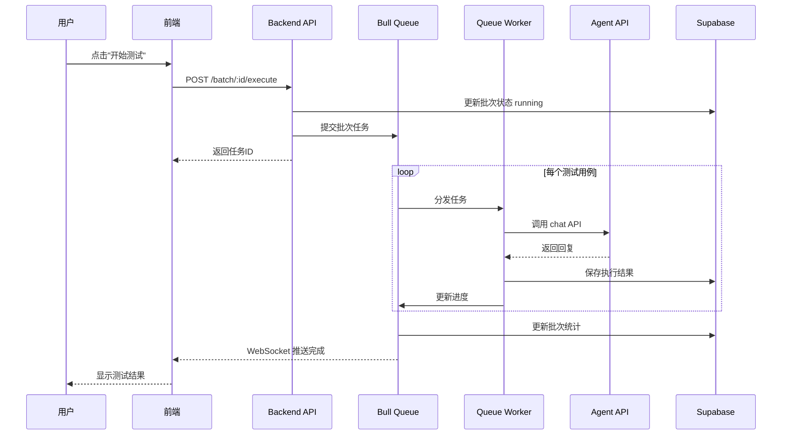
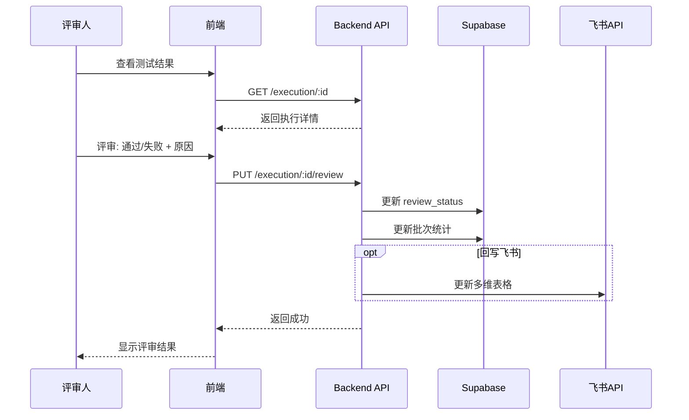

# 场景测试工作流程

> 本文档描述场景测试功能的完整数据流、执行流程和设计决策

## 目录

- [概述](#概述)
- [数据模型](#数据模型)
- [工作流程](#工作流程)
- [API 接口](#api-接口)
- [评审机制](#评审机制)
- [飞书集成](#飞书集成)
- [配置说明](#配置说明)

## 概述

### 功能定位

场景测试是测试套件的核心功能之一,用于:
- 基于预设的测试用例验证 AI Agent 的回复质量
- 从飞书多维表格导入标准化的测试场景
- 人工评审 Agent 回复,标注通过/失败
- 将评审结果回写到飞书,形成闭环

### 核心概念

| 概念 | 说明 | 示例 |
|------|------|------|
| **测试批次 (Batch)** | 一次导入的完整测试集 | "场景测试 2026/1/16" |
| **测试用例 (Case)** | 单个预设的测试场景 | "候选人咨询Java岗位" |
| **测试分类 (Category)** | 用例的功能分类 | "岗位咨询", "薪资问题" |
| **人工评审 (Review)** | 对 Agent 回复的质量判断 | 通过/失败 + 失败原因 |

### 与对话验证的区别

| 维度 | 场景测试 (Scenario Test) | 对话验证 (Conversation Test) |
|------|-------------------------|------------------------------|
| **数据来源** | 人工编写的标准测试用例 | 真实客户对话记录 |
| **测试目标** | 验证特定场景的处理能力 | 验证整体对话质量 |
| **评估方式** | 人工评审 (通过/失败) | LLM 自动评分 (0-100) |
| **典型用途** | 功能回归测试 | 质量基准测试 |
| **测试轮次** | 单轮问答 | 多轮对话 |

### 技术栈

- **后端**: NestJS + TypeScript + Supabase (PostgreSQL)
- **前端**: React + TypeScript + Ant Design
- **任务队列**: Bull Queue (Redis)
- **数据源**: 飞书多维表格 API

## 数据模型

### ER 关系图

```
┌─────────────────┐
│  test_batches   │  测试批次
│  ─────────────  │
│  id             │  UUID (PK)
│  name           │  批次名称
│  test_type      │  'scenario'
│  source         │  'feishu' | 'manual'
│  total_cases    │  用例总数
│  executed_count │  已执行数
│  pass_rate      │  通过率
│  status         │  批次状态
└────────┬────────┘
         │ 1:N
         ▼
┌────────────────────┐
│ test_executions    │  测试执行记录
│ ────────────────── │
│ id                 │  UUID (PK)
│ batch_id           │  UUID (FK)
│ case_id            │  用例ID (飞书)
│ case_name          │  用例名称
│ category           │  分类
│ test_input         │  测试输入 JSONB
│ expected_output    │  期望输出
│ actual_output      │  实际输出
│ execution_status   │  执行状态
│ review_status      │  评审状态
│ failure_reason     │  失败原因
│ tool_calls         │  工具调用
│ duration_ms        │  执行耗时
│ token_usage        │  Token 用量
└────────────────────┘
```

### 表结构详解

#### test_batches (测试批次表)

| 字段 | 类型 | 说明 | 示例 |
|------|------|------|------|
| `id` | UUID | 主键 | `batch-001` |
| `name` | TEXT | 批次名称 | "场景测试 2026/1/16 14:30" |
| `test_type` | TEXT | 测试类型 | `'scenario'` |
| `source` | TEXT | 来源 | `'feishu'` \| `'manual'` |
| `status` | TEXT | 批次状态 | `'created'` \| `'running'` \| `'reviewing'` \| `'completed'` |
| `total_cases` | INTEGER | 用例总数 | `50` |
| `executed_count` | INTEGER | 已执行数 | `30` |
| `pass_rate` | NUMERIC | 通过率 | `85.5` |
| `feishu_app_token` | TEXT | 飞书 App Token | `bascn...` |
| `feishu_table_id` | TEXT | 飞书 Table ID | `tbl...` |
| `created_at` | TIMESTAMP | 创建时间 | - |
| `updated_at` | TIMESTAMP | 更新时间 | - |

#### test_executions (测试执行记录表)

| 字段 | 类型 | 说明 | 数据示例 |
|------|------|------|----------|
| `id` | UUID | 主键 | `exec-001` |
| `batch_id` | UUID | 所属批次 | `batch-001` |
| `case_id` | TEXT | 用例ID (飞书) | `rec123` |
| `case_name` | TEXT | 用例名称 | "候选人咨询Java岗位薪资" |
| `category` | TEXT | 分类 | "岗位咨询" |
| `test_input` | JSONB | 测试输入 | 见下方示例 |
| `expected_output` | TEXT | 期望输出 | "薪资范围15-25K..." |
| `actual_output` | TEXT | 实际输出 | "Java开发岗位薪资..." |
| `execution_status` | TEXT | 执行状态 | `'pending'` \| `'success'` \| `'failure'` |
| `review_status` | TEXT | 评审状态 | `'pending'` \| `'passed'` \| `'failed'` |
| `failure_reason` | TEXT | 失败原因 | "工具调用错误" |
| `agent_request` | JSONB | Agent 请求 | API 请求参数 |
| `agent_response` | JSONB | Agent 响应 | API 完整响应 |
| `tool_calls` | JSONB | 工具调用 | `[]` 或工具调用数组 |
| `duration_ms` | INTEGER | 执行耗时 | `3500` (ms) |
| `token_usage` | JSONB | Token 用量 | `{inputTokens, outputTokens, totalTokens}` |
| `error_message` | TEXT | 错误信息 | - |
| `review_comment` | TEXT | 评审评论 | "回复内容不准确" |
| `reviewed_by` | TEXT | 评审人 | "张三" |
| `reviewed_at` | TIMESTAMP | 评审时间 | - |

**test_input JSONB 结构**:

```json
{
  "message": "你好,我想了解Java岗位的薪资范围",
  "history": [
    {
      "role": "user",
      "content": "我想找Java开发工作"
    },
    {
      "role": "assistant",
      "content": "好的,我们有多个Java开发岗位..."
    }
  ],
  "scenario": "candidate-consultation"
}
```

## 工作流程

### 阶段 1: 数据导入 (飞书同步)

**触发方式**: 用户点击"一键测试"或调用导入 API

**API 端点**: `POST /test-suite/import/feishu` 或 `POST /test-suite/quick-create`

**执行步骤**:



**详细流程**:

1. **读取飞书数据**

```typescript
// 从预配置的测试集表读取
const tableConfig = FEISHU_BITABLE_CONFIG.testSuite;
const records = await feishuBitableApi.getRecords({
  appToken: tableConfig.appToken,
  tableId: tableConfig.tableId,
});
```

2. **解析测试用例**

```typescript
// 解析飞书记录
const cases = records.map(record => ({
  caseId: record.record_id,
  caseName: record.fields['用例名称'],
  category: record.fields['分类'],
  message: record.fields['用户消息'],
  history: parseHistory(record.fields['对话历史']),  // 可选
  expectedOutput: record.fields['预期回复'],
}));
```

**飞书字段映射**:

| 飞书字段 | 数据库字段 | 必填 | 说明 |
|---------|-----------|------|------|
| `用例名称` | `case_name` | ✅ | 测试用例的描述性名称 |
| `分类` | `category` | ❌ | 用例分类 (如"岗位咨询") |
| `用户消息` | `test_input.message` | ✅ | 用户的输入消息 |
| `对话历史` | `test_input.history` | ❌ | JSON 格式的历史消息 |
| `预期回复` | `expected_output` | ❌ | 期望的 Agent 回复 |

3. **创建测试批次**

```typescript
const batch = await testBatchRepository.create({
  name: batchName || `场景测试 ${new Date().toLocaleString('zh-CN')}`,
  test_type: TestType.SCENARIO,
  source: BatchSource.FEISHU,
  status: BatchStatus.CREATED,
  feishu_app_token: tableConfig.appToken,
  feishu_table_id: tableConfig.tableId,
});
```

4. **保存测试用例**

```typescript
for (const testCase of cases) {
  await testExecutionRepository.create({
    batch_id: batch.id,
    case_id: testCase.caseId,
    case_name: testCase.caseName,
    category: testCase.category,
    test_input: {
      message: testCase.message,
      history: testCase.history,
      scenario: 'candidate-consultation',
    },
    expected_output: testCase.expectedOutput,
    execution_status: ExecutionStatus.PENDING,
    review_status: ReviewStatus.PENDING,
  });
}
```

5. **更新批次统计**

```typescript
await testBatchRepository.update(batch.id, {
  total_cases: cases.length,
  status: BatchStatus.CREATED,
});
```

### 阶段 2: 执行测试 (批量运行)

**触发方式**:
- 导入时立即执行 (`executeImmediately: true`)
- 手动点击"开始测试"按钮

**API 端点**: `POST /test-suite/batch/:batchId/execute`

**执行步骤**:



**详细流程**:

1. **提交批次任务**

```typescript
// test-suite.service.ts
async executeBatch(batchId: string, parallel = false) {
  // 更新批次状态
  await this.batchService.updateBatchStatus(batchId, BatchStatus.RUNNING);

  // 提交到 Bull Queue
  const job = await this.testQueue.add('execute-batch', {
    batchId,
    parallel,
  }, {
    attempts: 2,
    backoff: { type: 'exponential', delay: 5000 },
  });

  return { jobId: job.id };
}
```

2. **Queue Worker 处理**

```typescript
// test-suite.processor.ts
@Process('execute-batch')
async handleBatchExecution(job: Job<{ batchId: string; parallel: boolean }>) {
  const { batchId, parallel } = job.data;

  // 获取待执行的用例
  const executions = await this.executionRepository.findByBatchId(batchId, {
    status: ExecutionStatus.PENDING,
  });

  this.logger.log(`批次 ${batchId} 共 ${executions.length} 个用例待执行`);

  if (parallel) {
    // 并行执行 (谨慎使用,可能触发 API 限流)
    await Promise.all(
      executions.map(exec => this.executeSingleCase(exec.id))
    );
  } else {
    // 串行执行 (推荐)
    for (const exec of executions) {
      await this.executeSingleCase(exec.id);
      await job.progress((executions.indexOf(exec) + 1) / executions.length * 100);
    }
  }

  // 更新批次状态
  await this.batchService.updateBatchStatus(batchId, BatchStatus.REVIEWING);
}
```

3. **执行单个测试用例**

```typescript
async executeSingleCase(executionId: string) {
  const execution = await this.executionRepository.findById(executionId);
  const startTime = Date.now();

  try {
    // 调用 Agent API
    const response = await this.agentService.chat({
      conversationId: `test-${executionId}`,
      userMessage: execution.test_input.message,
      messages: execution.test_input.history || [],
      scenario: execution.test_input.scenario,
      model: 'anthropic/claude-sonnet-4-5',
    });

    const actualOutput = extractText(response.data.messages);
    const durationMs = Date.now() - startTime;

    // 保存执行结果
    await this.executionRepository.update(executionId, {
      actual_output: actualOutput,
      agent_request: { conversationId, userMessage, messages },
      agent_response: response,
      tool_calls: response.data.tool_calls || [],
      execution_status: ExecutionStatus.SUCCESS,
      duration_ms: durationMs,
      token_usage: response.data.usage,
    });

    this.logger.log(`用例 ${execution.case_name} 执行成功, 耗时 ${durationMs}ms`);
  } catch (error) {
    // 记录失败
    await this.executionRepository.update(executionId, {
      execution_status: ExecutionStatus.FAILURE,
      error_message: error.message,
      duration_ms: Date.now() - startTime,
    });

    this.logger.error(`用例 ${execution.case_name} 执行失败:`, error);
  }
}
```

4. **更新批次统计**

```typescript
async updateBatchStatistics(batchId: string) {
  const executions = await this.executionRepository.findByBatchId(batchId);

  const stats = {
    total_cases: executions.length,
    executed_count: executions.filter(e =>
      e.execution_status !== ExecutionStatus.PENDING
    ).length,
    passed_count: executions.filter(e =>
      e.review_status === ReviewStatus.PASSED
    ).length,
    failed_count: executions.filter(e =>
      e.review_status === ReviewStatus.FAILED
    ).length,
  };

  await this.testBatchRepository.update(batchId, {
    executed_count: stats.executed_count,
    pass_rate: stats.executed_count > 0
      ? (stats.passed_count / stats.executed_count) * 100
      : null,
  });
}
```

### 阶段 3: 人工评审 (质量判断)

**触发方式**: 测试执行完成后,人工逐条评审

**API 端点**: `PUT /test-suite/execution/:executionId/review`

**执行步骤**:



**评审数据结构**:

```typescript
// 评审请求
{
  "reviewStatus": "failed",  // 'passed' | 'failed' | 'skipped'
  "reviewComment": "回复内容不准确,未提及薪资范围",
  "failureReason": "wrong_answer",  // 失败原因分类
  "reviewedBy": "张三"
}

// 失败原因枚举
enum FailureReason {
  WRONG_ANSWER = 'wrong_answer',        // 回答错误
  INCOMPLETE = 'incomplete',            // 回答不完整
  HALLUCINATION = 'hallucination',      // 产生幻觉
  TOOL_ERROR = 'tool_error',            // 工具调用错误
  FORMAT_ISSUE = 'format_issue',        // 格式问题
  TONE_ISSUE = 'tone_issue',            // 语气问题
  OTHER = 'other',                      // 其他原因
}
```

### 阶段 4: 结果回写 (飞书同步)

**触发方式**: 评审完成后,自动或手动回写

**API 端点**: `POST /test-suite/execution/:executionId/write-back`

**飞书字段映射**:

| 飞书字段 | 数据来源 | 示例 |
|---------|---------|------|
| `测试结果` | `review_status` | "通过" / "失败" / "跳过" |
| `Agent回复` | `actual_output` | "Java开发岗位薪资..." |
| `测试时间` | `created_at` | "2026-01-16 14:30:25" |
| `错误原因` | `failure_reason` + `review_comment` | "回答不完整: 未提及..." |
| `执行耗时` | `duration_ms` | "3500ms" |

## API 接口

### 导入接口

```typescript
// 1. 一键创建批次 (推荐)
POST /test-suite/quick-create
Content-Type: application/json

{
  "batchName": "场景测试 2026/1/16",  // 可选
  "parallel": false,                   // 是否并行执行
  "testType": "scenario"
}

// 响应
{
  "success": true,
  "data": {
    "batchId": "batch-001",
    "name": "场景测试 2026/1/16 14:30:17",
    "totalImported": 50,
    "cases": [
      {
        "caseId": "exec-001",
        "caseName": "候选人咨询Java岗位",
        "category": "岗位咨询",
        "message": "你好,我想了解Java岗位..."
      }
    ]
  }
}

// 2. 从指定飞书表导入
POST /test-suite/import/feishu
Content-Type: application/json

{
  "appToken": "bascn...",
  "tableId": "tbl...",
  "batchName": "自定义批次名称",
  "executeImmediately": false,  // 是否立即执行
  "testType": "scenario"
}
```

### 执行接口

```typescript
// 1. 执行整个批次
POST /test-suite/batch/:batchId/execute
Content-Type: application/json

{
  "parallel": false  // 是否并行执行
}

// 响应
{
  "success": true,
  "data": {
    "jobId": "job-123",
    "batchId": "batch-001",
    "status": "running"
  }
}

// 2. 执行单个用例
POST /test-suite/test-chat
Content-Type: application/json

{
  "message": "你好,我想了解Java岗位",
  "history": [
    { "role": "user", "content": "..." },
    { "role": "assistant", "content": "..." }
  ],
  "scenario": "candidate-consultation",
  "saveExecution": true,
  "batchId": "batch-001",
  "caseId": "rec123",
  "caseName": "候选人咨询Java岗位",
  "expectedOutput": "薪资范围15-25K..."
}

// 响应
{
  "success": true,
  "data": {
    "executionId": "exec-001",
    "actualOutput": "Java开发岗位薪资范围...",
    "status": "success",
    "metrics": {
      "durationMs": 3500,
      "tokenUsage": {
        "inputTokens": 120,
        "outputTokens": 80,
        "totalTokens": 200
      }
    }
  }
}
```

### 评审接口

```typescript
// 更新评审状态
PUT /test-suite/execution/:executionId/review
Content-Type: application/json

{
  "reviewStatus": "failed",
  "reviewComment": "回复内容不准确,未提及薪资范围",
  "failureReason": "incomplete",
  "reviewedBy": "张三"
}

// 响应
{
  "success": true,
  "data": {
    "executionId": "exec-001",
    "reviewStatus": "failed",
    "reviewedAt": "2026-01-16T14:30:25.000Z"
  }
}
```

### 查询接口

```typescript
// 1. 获取批次列表
GET /test-suite/batches?test_type=scenario

// 响应
{
  "success": true,
  "data": [
    {
      "id": "batch-001",
      "name": "场景测试 2026/1/16",
      "testType": "scenario",
      "totalCases": 50,
      "executedCount": 30,
      "passedCount": 25,
      "passRate": 83.3,
      "status": "reviewing",
      "createdAt": "2026-01-16T06:30:17.000Z"
    }
  ]
}

// 2. 获取批次详情
GET /test-suite/batch/:batchId

// 响应
{
  "success": true,
  "data": {
    "batch": {
      "id": "batch-001",
      "name": "场景测试 2026/1/16",
      "testType": "scenario",
      "status": "reviewing"
    },
    "stats": {
      "totalCases": 50,
      "executedCount": 30,
      "passedCount": 25,
      "failedCount": 5,
      "pendingReviewCount": 20,
      "passRate": 83.3,
      "avgDurationMs": 3200,
      "avgTokenUsage": 185
    }
  }
}

// 3. 获取执行记录列表
GET /test-suite/batch/:batchId/executions

// 响应
{
  "success": true,
  "data": [
    {
      "id": "exec-001",
      "caseName": "候选人咨询Java岗位",
      "category": "岗位咨询",
      "executionStatus": "success",
      "reviewStatus": "failed",
      "failureReason": "incomplete",
      "durationMs": 3500,
      "createdAt": "2026-01-16T06:35:20.000Z"
    }
  ]
}

// 4. 获取执行详情
GET /test-suite/execution/:executionId

// 响应
{
  "success": true,
  "data": {
    "id": "exec-001",
    "caseName": "候选人咨询Java岗位",
    "category": "岗位咨询",
    "testInput": {
      "message": "你好,我想了解Java岗位",
      "history": [],
      "scenario": "candidate-consultation"
    },
    "expectedOutput": "薪资范围15-25K...",
    "actualOutput": "Java开发岗位薪资...",
    "executionStatus": "success",
    "reviewStatus": "failed",
    "failureReason": "incomplete",
    "reviewComment": "回复内容不准确,未提及薪资范围",
    "toolCalls": [],
    "durationMs": 3500,
    "tokenUsage": {
      "inputTokens": 120,
      "outputTokens": 80,
      "totalTokens": 200
    }
  }
}
```

## 评审机制

### 评审流程

```
测试执行完成 → 人工查看回复 → 判断质量 → 标记通过/失败 → 填写失败原因 → 回写飞书
```

### 评审标准

评审人应基于以下维度判断:

| 维度 | 说明 | 权重 |
|------|------|------|
| **准确性** | 回复内容是否正确 | 40% |
| **完整性** | 是否覆盖必要信息 | 30% |
| **相关性** | 是否与用户问题相关 | 20% |
| **专业性** | 语言表达是否专业 | 10% |

### 失败原因分类

| 原因代码 | 说明 | 示例 |
|---------|------|------|
| `wrong_answer` | 回答错误 | 薪资范围说错 |
| `incomplete` | 回答不完整 | 未提及关键信息 |
| `hallucination` | 产生幻觉 | 编造不存在的岗位 |
| `tool_error` | 工具调用错误 | 错误触发搜索工具 |
| `format_issue` | 格式问题 | 未按要求格式输出 |
| `tone_issue` | 语气问题 | 语气不专业 |
| `other` | 其他原因 | 自定义原因 |

### 评审状态流转

```
执行完成 (execution_status=success)
  ↓
待评审 (review_status=pending)
  ↓
人工评审
  ├→ 通过 (review_status=passed)
  ├→ 失败 (review_status=failed) + failure_reason
  └→ 跳过 (review_status=skipped)
```

## 飞书集成

### 测试集表结构

**表名**: "测试集"

**必填字段**:

| 字段名 | 字段类型 | 说明 | 示例 |
|--------|---------|------|------|
| `用例名称` | 单行文本 | 测试用例描述 | "候选人咨询Java岗位薪资" |
| `用户消息` | 多行文本 | 用户输入 | "你好,我想了解Java岗位的薪资范围" |

**可选字段**:

| 字段名 | 字段类型 | 说明 | 示例 |
|--------|---------|------|------|
| `分类` | 单选 | 用例分类 | "岗位咨询" |
| `对话历史` | 多行文本 | JSON 格式的历史消息 | `[{"role":"user","content":"..."}]` |
| `预期回复` | 多行文本 | 期望的 Agent 回复 | "薪资范围15-25K,根据经验调整..." |
| `测试结果` | 单选 | 回写字段 | "通过" / "失败" / "跳过" |
| `Agent回复` | 多行文本 | 回写字段 | Agent 的实际回复 |
| `错误原因` | 多行文本 | 回写字段 | "回答不完整: 未提及薪资范围" |
| `测试时间` | 日期时间 | 回写字段 | "2026-01-16 14:30:25" |
| `执行耗时` | 单行文本 | 回写字段 | "3500ms" |

### 数据同步流程

**导入方向**: 飞书 → 系统

```
飞书多维表格
  ↓ (读取)
系统数据库 (test_executions)
  ↓ (执行测试)
Agent API
  ↓ (人工评审)
飞书多维表格 (回写结果)
```

### 配置方式

```typescript
// src/core/feishu/constants/feishu-bitable.config.ts
export const FEISHU_BITABLE_CONFIG = {
  testSuite: {
    appToken: process.env.FEISHU_TEST_SUITE_APP_TOKEN,
    tableId: process.env.FEISHU_TEST_SUITE_TABLE_ID,
  },
  // ... 其他配置
};
```

**环境变量**:

```bash
# .env.local
FEISHU_TEST_SUITE_APP_TOKEN=bascn...
FEISHU_TEST_SUITE_TABLE_ID=tbl...
```

## 配置说明

### 环境变量

```bash
# 飞书 API 配置
FEISHU_APP_ID=cli_xxx
FEISHU_APP_SECRET=xxx
FEISHU_TEST_SUITE_APP_TOKEN=bascn...
FEISHU_TEST_SUITE_TABLE_ID=tbl...

# Agent API 配置
AGENT_API_KEY=your-key
AGENT_API_BASE_URL=https://huajune.duliday.com/api/v1
AGENT_API_TIMEOUT=600000

# Redis 配置 (Bull Queue)
UPSTASH_REDIS_REST_URL=https://...
UPSTASH_REDIS_REST_TOKEN=...
```

### 代码常量

```typescript
// src/test-suite/test-suite.module.ts
BullModule.registerQueue({
  name: 'test-suite',
  defaultJobOptions: {
    attempts: 2,                          // 失败重试次数
    backoff: {
      type: 'exponential',
      delay: 5000,                        // 重试延迟 5s
    },
    timeout: 120000,                      // 任务超时 2min
    removeOnComplete: true,               // 完成后删除
    removeOnFail: false,                  // 失败保留
  },
});
```

### 批次状态管理

```typescript
enum BatchStatus {
  CREATED = 'created',       // 已创建,待执行
  RUNNING = 'running',       // 执行中
  REVIEWING = 'reviewing',   // 评审中
  COMPLETED = 'completed',   // 已完成
  CANCELLED = 'cancelled',   // 已取消
}

// 状态转换规则
created → running → reviewing → completed
   ↓         ↓          ↓
cancelled  cancelled  cancelled
```

## 最佳实践

### 1. 测试用例设计

**✅ 推荐**:
- 用例名称清晰描述测试场景
- 按功能分类组织用例
- 覆盖常见和边界场景
- 预期输出具体明确

**❌ 避免**:
- 用例名称过于笼统 ("测试1", "测试2")
- 缺少分类标签
- 只测试正常流程
- 预期输出模糊不清

### 2. 执行策略

**串行执行 (推荐)**:
- 适合大批量测试 (>20 个用例)
- 避免 API 限流
- 稳定可靠

**并行执行 (谨慎)**:
- 适合小批量测试 (<10 个用例)
- 注意 API 限流风险
- 快速验证

### 3. 评审规范

**评审时应**:
- 仔细对比实际输出与预期输出
- 选择准确的失败原因分类
- 填写清晰的评审评论
- 及时回写飞书

**评审时不应**:
- 仅凭主观感受判断
- 漏填失败原因
- 评论过于简单 ("不行", "错了")
- 忘记回写飞书

## 常见问题

### Q1: 如何组织测试用例?

**A**: 建议按功能模块分类:
- 岗位咨询类
- 薪资福利类
- 简历投递类
- 面试安排类
- 通用问答类

每个分类创建独立的飞书表格或使用分类字段标记。

### Q2: 执行失败如何处理?

**A**:
1. 查看 `error_message` 字段定位问题
2. 检查 Agent API 是否正常
3. 验证测试输入是否合法
4. 使用"失败重试"功能重新执行

### Q3: 如何提高评审效率?

**A**:
1. 优先评审失败的用例
2. 使用批量评审功能 (如果实现)
3. 设置评审模板快速填写
4. 定期导出评审报告分析

### Q4: 批次统计如何计算?

**A**:
- `totalCases`: test_executions 表记录数
- `executedCount`: `execution_status != 'pending'` 的记录数
- `passedCount`: `review_status = 'passed'` 的记录数
- `failedCount`: `review_status = 'failed'` 的记录数
- `passRate`: `passedCount / executedCount * 100`

### Q5: 如何处理历史消息?

**A**: 在飞书的"对话历史"字段填写 JSON 格式:

```json
[
  {
    "role": "user",
    "content": "我想找Java开发工作"
  },
  {
    "role": "assistant",
    "content": "好的,我们有多个Java开发岗位..."
  }
]
```

系统会自动解析并传递给 Agent API。

## 相关文档

- [对话验证工作流程](./conversation-test-workflow.md)
- [测试套件架构设计](./test-suite-architecture.md)
- [飞书 API 集成指南](../integrations/feishu-integration.md)
- [Bull Queue 使用文档](../technical/bull-queue-guide.md)
